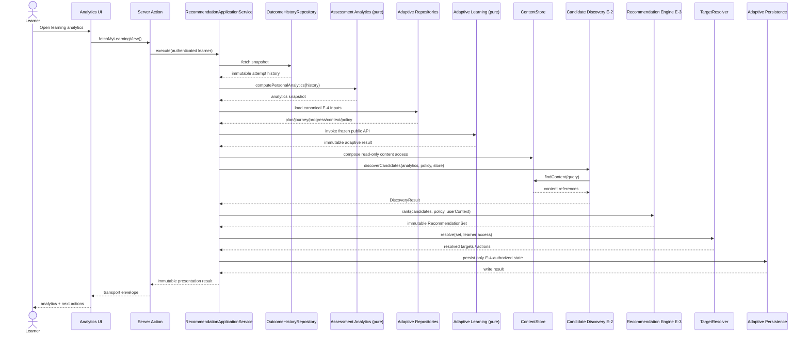

# Domain B — Legacy Migration and Integration Architecture v1

**Status:** Proposed for architecture review; architecture is complete and not blocked by unimplemented E-4 code  
**Scope:** Legacy flow migration, adaptive contract review, and Application Layer integration  
**Non-goals:** No redesign of Recommendation Candidate Discovery (E-2), Recommendation Engine (E-3), or Adaptive Learning (E-4); no implementation

## Executive decision

Domain B integration architecture is ready for review. Implementation remains intentionally deferred until that review is approved.

E-2 and E-3 are present, isolated, immutable at their public contract boundaries, and covered by passing focused tests. The production learner flow does not call them. It still calls the legacy `recommend(PersonalAnalytics)` path from a server-action module that also owns persistence, history retrieval, analytics orchestration, target lookup, and transport DTOs.

The migration should introduce one Application Service as the only recommendation use-case entry point, preserve `fetchMyRecommendations()` as a temporary transport adapter, and keep both frozen engines free of authentication, Supabase, persistence, routing, and UI DTO concerns.

The frozen E-4 architecture is canonical even though its contracts are not implemented in this repository yet. `LearningPlan`, `LearningJourney`, `LearningProgress`, `AdaptiveContext`, `ReviewPolicy`, and `ReviewScheduler` are therefore treated as future immutable integration boundaries. This plan fixes their ownership and placement without inventing their fields or redesigning their behavior.

## 1. Legacy Flow Audit

### 1.1 Current live flow

```text
ExamRuntime
  -> computeOutcome()                         pure Runtime handoff
  -> persistOutcome()                        server action / exam_attempts insert
  -> fetchMyAttemptHistory()                 server action / exam_attempts read
  -> computePersonalAnalytics()              pure analytics
  -> recommend(analytics)                    legacy pure recommender
  -> enrichWithTargets()                     server action / Summary lookup
  -> legacy RecommendationSet
  -> app/assessment/analytics/page.tsx       summary-only link rendering
```

The runtime produces one in-memory outcome and invokes persistence at submit. The analytics page independently calls `fetchMyAnalytics()` and `fetchMyRecommendations()` in parallel; the latter calls `fetchMyAnalytics()` again. One page request therefore reads and computes analytics twice.

### 1.2 Current-to-target gap matrix

| Concern | Current | Frozen target | Gap / migration consequence |
|---|---|---|---|
| Recommendation decision | `lib/assessment/recommendation.ts::recommend(PersonalAnalytics)` | E-2 `discoverCandidates()` then E-3 `rank()` | Live path bypasses both frozen modules. |
| Candidate discovery | Not present in live flow | Injected `ContentStore` feeding immutable candidates | E-2 has test callers only. |
| RecommendationSet | Mutable legacy set with `recommendations` and `isEmpty` | Immutable E-3 set with `stats`, scores, evidence, and trace IDs | Needs an Application Layer presentation adapter during migration. |
| Server action | `app/assessment/actions.ts` owns persistence, reads, analytics, recommendation orchestration, target lookup, and DTOs | Thin authenticated transport calling an Application Service | Current module crosses multiple boundaries and is the principal seam to split. |
| Analytics | Pure computation exists; retrieval wrapper is in the server-action module | Load once, derive once, pass the immutable snapshot through the use case | Current page computes the same analytics twice. Analytics contracts themselves are mutable TypeScript shapes. |
| Runtime | `computeOutcome()` then fire-and-forget `persistOutcome()` | Runtime remains upstream; integration begins from persisted immutable outcomes | No recommendation/adaptive execution should move into `ExamRuntime`. Persist failure remains invisible to subsequent analytics unless explicitly surfaced. |
| Target enrichment | Published Summary lookup by matching topic/subject; package slug lookup | Target Resolver after E-3, with content-type routing and access-aware resolution | Claimed simulation enrichment is absent. Query ordering is not explicit. Ownership is not checked before selecting a Summary. |
| UI | One consumer; constructs only Summary URLs; uses array index as key | UI consumes a stable presentation DTO with resolved action/href | Question, exam-set, and package targets render as non-clickable cards. |
| Application services | Existing assessment-assembly service pattern only | Dedicated Domain B orchestration service | No recommendation/adaptive Application Service exists. |
| Persistence | `exam_attempts` is the immutable source for analytics; no recommendation/adaptive repository exists | Persistence ports owned by Application Layer; derived engine output stays non-authoritative | Future adapters must implement the frozen E-4 persistence boundary without leaking storage concerns into E-4. |

### 1.3 Verified E-2/E-3 boundaries

- E-2 receives analytics, policy, and an injected `ContentStore`; it does not import Supabase.
- E-3 receives readonly candidates and policy and synchronously returns an immutable `RecommendationSet`; it does not discover content or perform I/O.
- E-3 assigns priority only during final assembly.
- Focused verification passed: 11 contract tests, 12 discovery tests, and 22 engine tests.
- Repository-wide TypeScript checking passed with `npx tsc --noEmit`.

### 1.4 Frozen-architecture integration gaps

These are integration or conformance issues, not requests to redesign the engines:

1. **No production composition root.** `createContentStore`, `discoverCandidates`, `DEFAULT_RECOMMENDATION_POLICY`, and `rank` have no production caller.
2. **Provider coverage mismatch.** The policy enables `summary`, `question`, `exam_set`, and `package`, while the production store registers only Summary and Question providers. Unsupported types silently produce no candidates.
3. **Signal-to-content routing mismatch.** The frozen E-2 table scopes retry/continue signals to Exam Sets, but the current discovery loop queries every enabled supported content type for every signal. This can discover an arbitrary Summary or Question for a retry signal.
4. **Seen-content mismatch.** Discovery collects recent `exam_set_id` values but supplies them as `excludeCodes`; the Question provider compares them with `question_code`.
5. **Question exclusion is inverted.** The Question provider uses `.in(...)` while its comment states the intent is NOT IN. It consequently selects seen values rather than excluding them.
6. **Target resolver incompleteness.** Legacy enrichment says retry simulations are resolved “below,” but no such query exists.
7. **Non-deterministic database selection.** Legacy Summary enrichment uses `.limit()` without an explicit `.order()` before choosing the first client-side match.
8. **Access mismatch.** Enrichment can select a published Summary from a package the learner does not own; the destination page subsequently blocks access.
9. **Transport/UI contract mismatch.** The UI knows only Summary route construction, while E-3 can emit Summary, Question, Exam Set, and Package targets.
10. **Error collapse.** Provider query errors are logged and returned as empty results. At the use-case boundary, “no candidate” is indistinguishable from partial dependency failure unless the Application Service adds operational status without altering engine output.
11. **E-4 is not implemented yet.** There are no E-4 contracts, scheduler, policy, repositories, tests, or integration callers in this repository. This is an expected implementation gap, not an architecture gap.

## 2. Legacy Flow Migration Plan

### 2.1 Current

```text
UI -> server action -> analytics server action -> legacy recommend()
   -> inline Summary enrichment -> legacy DTO -> UI
```

### 2.2 Target

```text
UI / server action
  -> RecommendationApplicationService
       -> OutcomeHistoryRepository
       -> pure Analytics
       -> Adaptive state repositories (read)
       -> pure Adaptive Learning API (canonical E-4 contracts unchanged)
       -> E-2 ContentStore / discoverCandidates
       -> pure E-3 rank
       -> TargetResolver
       -> Adaptive persistence ports (only artifacts authorized by E-4)
       -> PresentationMapper
  -> immutable UI DTO
```

The Application Service owns the canonical E-4 orchestration and all sequencing between E-4 and E-2/E-3. Neither pure subsystem may import or call the other. When E-4 is implemented, its frozen public operations are inserted at these prepared seams without changing this integration architecture.

### 2.3 Migration steps

1. **Reserve the frozen E-4 seams.** Establish Application Layer ports using the canonical E-4 contract names as future boundaries. Do not invent fields, translate the contracts, or implement adaptive behavior during the migration foundation.
2. **Freeze transport contracts.** Snapshot the current server-action result and the analytics-page rendering behavior as characterization tests.
3. **Define Application Layer ports.** Define read-only ports for outcome history, adaptive state, content discovery composition, and target resolution; define write ports only for E-4-authorized state.
4. **Add a presentation contract.** Use an immutable UI DTO that carries a pre-resolved `href: string | null` or typed action. Route construction belongs outside E-3.
5. **Compose E-2/E-3 behind the service.** The service loads analytics once, calls discovery, handles `DiscoveryResult`, calls `rank`, and passes the exact E-3 set onward without mutation.
6. **Extract Target Resolver.** Move DB lookup and entitlement checks out of the server action. Resolve all supported target kinds deterministically.
7. **Add adaptive orchestration.** Load E-4 inputs, invoke only its frozen public API, and persist only its specified durable outputs. Keep the recommendation and adaptive engines unaware of repositories and one another.
8. **Introduce a shadow path.** For authenticated internal/test traffic, execute legacy and new paths from the same analytics snapshot; return legacy output while recording a redacted structural comparison.
9. **Switch the server action.** Preserve `fetchMyRecommendations()` as a thin compatibility adapter but route it to the Application Service.
10. **Migrate the UI.** Consume the immutable presentation DTO and its resolved action; stop constructing target URLs in React.
11. **Retire legacy internals.** Remove `recommend()` and inline `enrichWithTargets()` only after parity criteria and rollback soak time are satisfied.

### 2.4 Backward compatibility

- Keep the public server-action name and `{ data, error }` envelope during the first release.
- Map E-3 output to the current visible fields: `category`, `priority`, `title`, `reason`, `subject`, `topic`, evidence accuracy/count, and target.
- Do not discard E-3 identity. Use `recommendation.id` as the UI key and preserve `candidateId`/score in server-side diagnostics or the new DTO where allowed.
- Treat E-3 `stats` as additive. The current UI may ignore it.
- Preserve linkless-card behavior for unresolved targets.
- Preserve empty-state behavior for zero attempts.
- Preserve authentication behavior and RLS-backed ownership.
- Do not map `reinforce_strong_subject` to a semantically different legacy category. Extend the compatibility DTO additively; the current UI does not branch on category.

### 2.5 Rollback strategy

- Select the implementation behind a server-side configuration switch at the Application Service composition root: `legacy` or `domain_b_v1`.
- Keep legacy code callable for one rollback window; do not let both paths write adaptive state.
- In shadow mode, both paths are read-only and only the legacy response reaches the UI.
- After cutover, rollback changes only the orchestration selection. `exam_attempts` is untouched and remains the source of truth.
- If E-4 introduces durable state, require idempotency keys and versioned records before enabling writes. Rollback must disable new writes, not delete history.
- Never roll back by rewriting or deleting Assessment Outcomes.

### 2.6 Cutover acceptance criteria

- Same authenticated learner and analytics snapshot are used for both comparison paths.
- New path produces no unauthorized or dead target links.
- Empty, partial-provider, and dependency-error states are distinguishable operationally.
- Recommendation order is deterministic for fixed inputs.
- E-2/E-3 focused suites, Application Service contract tests, target-resolution tests, and UI characterization tests pass.
- No import from Supabase, Next.js, React, or persistence adapters exists under the pure E-3 or E-4 modules.

## 3. Adaptive Contract Review

### 3.1 Repository and architecture result

| Contract | Repository result | Integration treatment |
|---|---|---|
| `LearningPlan` | Future implementation boundary | Canonical immutable E-4 value; Application Layer transports it without deriving or mutating it. Persistence or presentation occurs only if the frozen design authorizes it. |
| `LearningJourney` | Future implementation boundary | Canonical immutable E-4 value; any authorized persistence mapping remains outside the pure adaptive layer. |
| `LearningProgress` | Future implementation boundary | Canonical immutable E-4 value; transitions occur only through frozen E-4 behavior, never Application Layer field mutation. |
| `AdaptiveContext` | Future implementation boundary | Canonical immutable input assembled by the Application Layer from authorized sources. |
| `ReviewPolicy` | Future implementation boundary | Canonical immutable policy input supplied to E-4 without Application Layer interpretation. |
| `ReviewScheduler` | Future implementation boundary | Pure E-4 decision boundary invoked by the Application Service; no database, UI, or target-resolution responsibility. |

No file name, symbol, test, migration, branch, or local git-history entry contains these contracts because E-4 has not been implemented. Their absence does not block migration architecture approval. It means the present audit can verify the planned boundary discipline, while implementation-time conformance tests will verify the concrete TypeScript declarations.

There is no E-4 implementation contract drift to report yet. Drift can only occur when concrete declarations or adapters diverge from the already-frozen architecture.

### 3.2 Verified immutability

- E-2 public data contracts use readonly fields and readonly arrays.
- E-3 inputs, intermediate contracts, targets, recommendations, and sets use readonly fields and readonly arrays.
- E-2/E-3 return new arrays/objects rather than mutating caller input; focused tests cover input non-mutation and deterministic output.

TypeScript `readonly` is compile-time shallow immutability. Nested structures are readonly because their own contracts are readonly, but runtime objects and `ReadonlyMap` instances are not frozen. No redesign is proposed; this distinction should be captured in the freeze record.

### 3.3 Confirmed contract drift around the boundary

- Legacy `Recommendation`, `RecommendationTarget`, and `RecommendationSet` are mutable.
- `PersonalAnalytics` and its nested analytics types expose mutable fields and mutable arrays.
- `AssessmentOutcome`, `AttemptHistoryItem`, `AnsweredQuestion`, `WeakTopic`, and `SubjectBreakdownEntry` are described as immutable but do not use `readonly`.
- The database blocks user update/delete of `exam_attempts`, so persisted Outcome immutability is stronger than the in-memory TypeScript contracts.
- E-3 adds `reinforce_strong_subject`, which the legacy recommendation category does not contain.
- E-3 target fields are explicit nullable values and include Question targets through `RecommendationContentType`; the legacy target uses optional properties and excludes Question.
- E-3 `RecommendationSet` adds stats and traceability absent from the legacy set.
- The E-2 document is marked frozen. The E-3 document says frozen at the top but ends with “Awaiting Architecture Review and Freeze”; the code and user direction treat it as frozen. The document status line should be reconciled without changing architecture.

### 3.4 Adaptive implementation acceptance criteria

When E-4 implementation begins:

1. Implement the canonical frozen E-4 specification/version without adding Application Layer concerns.
2. Verify every property of all six contracts is `readonly`.
3. Verify every collection is `readonly T[]`, `ReadonlyArray<T>`, `ReadonlyMap`, or `ReadonlySet` as appropriate.
4. Verify discriminated-union branches are readonly.
5. Verify scheduler methods return new state/results and do not mutate plan, journey, progress, context, or policy.
6. Verify persistence records are distinct from pure domain values and are mapped only in the Application Layer.
7. Bind the frozen E-4 public operations to the reserved service seams and confirm the dependency direction remains Application Service → E-4.

Failure of any criterion is implementation contract drift and must be corrected against the frozen design; it does not reopen E-4 architecture.

## 4. Application Service Design

### 4.1 Boundary model

```text
Pure domain                         Application / infrastructure

Recommendation Candidate Discovery <- ContentStore adapter (read-only)
Recommendation Engine              <- RecommendationApplicationService
Adaptive Learning                  <- RecommendationApplicationService
                                      -> TargetResolver
                                      -> repositories
                                      -> PresentationMapper
                                      -> server action / UI
```

### 4.2 RecommendationApplicationService responsibilities

The service is the use-case coordinator, not a business-decision engine.

It may:

- authenticate and authorize the learner through transport-supplied identity;
- load one consistent Outcome history snapshot;
- invoke pure analytics once;
- load the active versioned Recommendation Policy;
- load the exact adaptive inputs required by frozen E-4;
- invoke frozen E-4, E-2, and E-3 public APIs in the approved sequence;
- convert E-2 failure into an Application Layer error/status;
- pass optional E-3 `UserContext` without making it mandatory;
- call Target Resolver after E-3;
- persist only E-4-authorized durable changes;
- map domain output to an immutable presentation DTO;
- attach correlation/version metadata for observability;
- enforce idempotency for any adaptive write.

It must not:

- score, rank, deduplicate, cap, or construct recommendation reasons;
- derive adaptive scheduling decisions;
- query Supabase directly;
- construct routes inside E-2, E-3, or E-4;
- mutate any engine or adaptive input/output;
- persist `RecommendationSet` as authoritative Assessment data;
- silently substitute legacy decisions after the new path has been selected.

### 4.3 Ports and adapters

| Port | Direction | Responsibility |
|---|---|---|
| `OutcomeHistoryRepository` | input/read | Fetch owned immutable attempt history, with a bounded snapshot. |
| `RecommendationPolicyProvider` | input/read | Return the active versioned frozen policy. |
| `ContentStore` | input/read | Existing E-2 port; production adapter composes content providers. |
| Adaptive repositories | input/read and output/write | Future adapters load and persist canonical E-4 state. Their concrete methods mirror the frozen contracts when implemented. |
| `TargetResolver` | output/read | Convert engine targets to accessible, deterministic application targets. |
| `RecommendationPresenter` | output/pure | Convert enriched results to the stable transport/UI contract. |
| `DomainBTelemetry` | output/write | Emit structural metrics and failures without learner-answer payloads. |

### 4.4 Target Resolver responsibilities

- Accept the immutable E-3 `RecommendationSet` and learner access context.
- Batch-resolve package slugs and route metadata by target kind.
- Verify publication status and learner entitlement before emitting an actionable link.
- Apply explicit stable ordering to any fallback lookup.
- Preserve recommendation identity, order, score, evidence, and reason.
- Return a new enriched value; never mutate the engine set.
- Return `href: null` with a reason code for unresolved, unsupported, unpublished, or unauthorized targets.
- Never re-rank, replace a target with different content, or choose a new candidate. If fallback content selection is required, that belongs in E-2, not the resolver.

### 4.5 Persistence boundary

- `exam_attempts` remains the immutable authority for completed outcomes.
- Analytics and RecommendationSet remain derived and regenerable.
- Adaptive persistence is permitted only to the extent explicitly required by E-4.
- Application persistence maps domain values to rows; pure adaptive types do not import database row types.
- Every adaptive write must include contract/policy version, causal input identity, and idempotency identity if those fields exist in the frozen contract. If they do not, this becomes an architecture-review question rather than an inferred field addition.

### 4.6 UI boundary

The UI receives display-ready immutable data. It renders; it does not resolve ownership, content IDs, slugs, or recommendation policy.

The presentation contract should retain stable recommendation identity and expose either a resolved application action or no action. The exact DTO name and fields are an Application Layer choice and do not alter E-3.

## 5. Integration Sequence Diagram



The diagram shows the fixed ownership boundary, not a redesign of E-4 internals: the Application Service supplies canonical E-4 inputs, invokes the pure frozen boundary, and persists only authorized adaptive results through adapters. Concrete method calls will mirror the frozen contracts when they are implemented.

## 6. Risks

| Priority | Risk | Control |
|---|---|---|
| Critical | Developers invent E-4 fields while creating integration adapters | Permit only opaque seam declarations until canonical contracts are implemented; reject any adapter-owned adaptive decision or field extension. |
| High | Parallel legacy/new paths produce different learner advice | Single Application Service selection, shadow comparison, explicit cutover switch. |
| High | E-2 signal/content routing does not conform to its frozen table | Add conformance characterization before production wiring; fix only as frozen-spec alignment. |
| High | Unauthorized or unusable recommendation links | Access-aware Target Resolver; never emit href before entitlement and publication checks. |
| High | Fire-and-forget Outcome persistence fails, causing stale analytics/adaptive state | Preserve runtime UX, but add observable persistence status and define retry outside Runtime before adaptive writes depend on freshness. |
| High | Adaptive writes duplicate on retries or shadow execution | Shadow mode must be read-only; production writes require idempotency. |
| Medium | Mutable analytics/outcome TypeScript inputs are changed accidentally | Treat them as readonly at service ports/adapters and add non-mutation tests; contract changes need separate approval. |
| Medium | Provider failure appears as a legitimate empty result | Carry dependency health in Application Layer status/telemetry without modifying E-2/E-3 output. |
| Medium | Duplicate analytics query creates inconsistent snapshots and extra load | One use case loads and computes analytics once. |
| Medium | UI ignores non-Summary targets | Presentation mapper resolves typed actions; roll out target kinds behind UI capability. |
| Medium | `ReadonlyMap` and readonly types imply runtime immutability they do not enforce | Document compile-time guarantee and test non-mutation at public boundaries. |
| Low | Legacy array-index keys cause unstable React identity | Use E-3 stable recommendation ID after UI migration. |

## 7. Recommended Implementation Order

Implementation must wait for architecture approval. E-4 code does not need to exist for this integration architecture to be frozen.

1. Approve and freeze this migration architecture.
2. Add legacy characterization and E-2 frozen-conformance tests.
3. Define immutable Application Layer result/error contracts and repository ports, reserving opaque E-4 seams by canonical contract name.
4. Implement Target Resolver with deterministic, access-aware batch resolution.
5. Implement `RecommendationApplicationService` with one analytics snapshot and E-2/E-3 composition.
6. Add the thin server-action compatibility adapter.
7. Run a read-only shadow comparison and review differences.
8. Migrate the analytics UI to display-ready actions and stable IDs.
9. Cut over the E-2/E-3 recommendation path behind the configuration switch.
10. Implement E-4 separately from its frozen architecture.
11. Bind the E-4 implementation and persistence adapters to the reserved Application Service seams.
12. Run adaptive contract-immutability and integration conformance tests.
13. After the rollback window, remove legacy `recommend()` and inline enrichment.

## Architecture review decisions required

No E-4 design decision is required. The following migration-policy approvals remain; none redesigns a frozen engine:

1. Approve the Application Service as the sole integration owner for E-2, E-3, and future E-4 boundaries.
2. Approve provider/routing alignment to the frozen E-2 signal table as migration conformance work.
3. Approve access-aware target resolution as an Application Layer responsibility.
4. Set the shadow parity threshold and rollback window that authorize legacy retirement.
