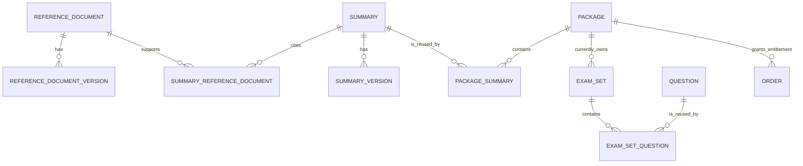
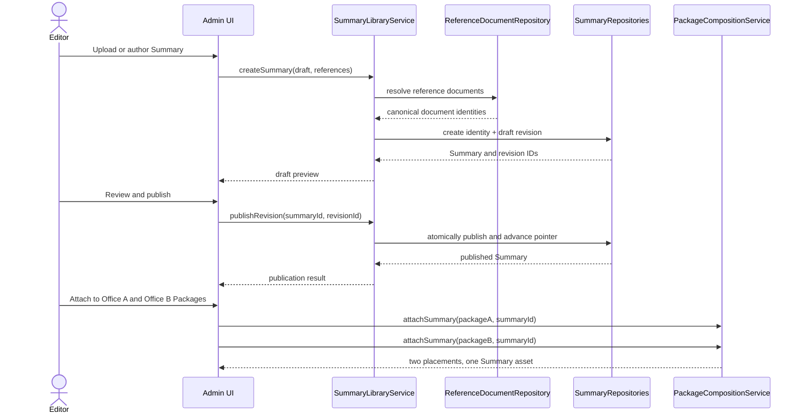
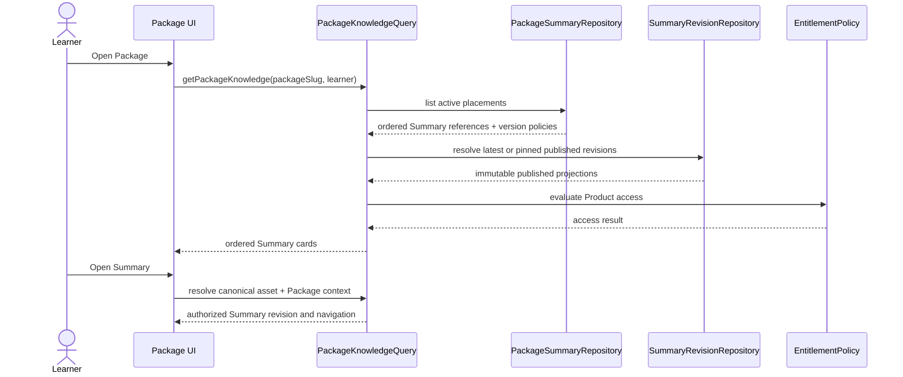

# Sobdai Knowledge Platform Architecture v1

**Status:** Proposed for architecture review  
**Scope:** Reference Documents, reusable Knowledge Assets, Product composition, publishing, admin workflow, SEO, and migration  
**Implementation status:** Design only; no schema or application changes are authorized by this document  
**Frozen dependencies:** Assessment Engine, Recommendation Engine, and Recommendation Candidate Discovery remain unchanged

## Executive decision

Sobdai should separate source authority, reusable knowledge, and commercial composition:

```text
Reference Documents
        ↓ evidence / provenance
Knowledge Assets
        ↓ referenced through placements
Products
```

A Summary is one stable Knowledge Asset in a central Summary Library. Its Markdown is authored and versioned once. Packages reference that Summary through `package_summaries`; they do not own or copy it.

The first delivery should establish the reusable Summary model without forcing all asset types into one physical table. `Summary`, `Question`, and future asset types implement a common Application Layer concept, but retain type-safe stores and relationships. This preserves the existing reusable Question Bank and avoids a polymorphic database design with unenforceable foreign keys.

## Architecture principles

1. **Reference, do not duplicate.** A Product references Knowledge Assets.
2. **Stable identity, immutable revisions.** The asset identity survives edits; published content revisions are never overwritten.
3. **Product composition is contextual.** Ordering, visibility, and revision selection belong to the Package↔Summary placement, not the Summary.
4. **Publishing is layered.** Asset readiness, placement visibility, and Package publication are separate decisions.
5. **Source provenance is normalized.** Reference Documents are entities, not repeated free text.
6. **Application Layer owns integration.** UI, server actions, access control, persistence, cache invalidation, and frozen-engine adapters do not enter the domain model.
7. **No automatic semantic deduplication.** Migration may detect duplicates, but a human approves merges.
8. **Public URLs follow asset identity.** Package context must not create indexable duplicate copies of the same Summary.

# 1. Current Codebase Audit

## 1.1 Current Package model

Verified database facts:

- `packages.id` is a UUID primary key.
- `packages.slug` is globally unique.
- `package_code`, `name`, prices, difficulty, feature JSON, description, `seo_title`, and `seo_description` are stored on the Package.
- `organization_id`, `position_id`, `exam_year`, and `version` were added later; the former `org_name` column was dropped.
- Publication is a single `is_published boolean`, default false.
- Homepage merchandising is separate through `featured_homepage` and `homepage_order`.
- Orders point directly to `packages`, making Package the commercial entitlement boundary.
- Deleting a Package currently cascades to owned Summaries, Exam Sets, Orders, and Assessment Outcomes according to their foreign keys.

Verified application facts:

- Package create/update actions build `package_code` from Organization, Position, exam year, and version.
- The same form save can set `is_published`; there is no Package publish-readiness service or validation transaction.
- The “Save Draft” control in the Package create UI has no distinct persistence path; both state and wording are driven by the submitted checkbox.
- Public Package pages permit staff preview of drafts and return not-found to ordinary users.
- Public Package metadata uses Package name/description and cover/logo, but does not read the stored `seo_title` or `seo_description`.

Contract drift:

- `lib/types.ts::Package` uses `code`, while storage and application actions use `package_code`.
- The TypeScript contract uses numeric `exam_year` and `version`, while the migration stores text.
- Several current fields used by UI/actions are absent from the Package interface.

## 1.2 Current Summary implementation

The current `summaries` table is Package-owned:

```text
summaries
  id
  package_id NOT NULL -> packages ON DELETE CASCADE
  title
  slug
  subject / document / law / topic
  content_md
  read_time_minutes
  sort_order / display_order / released_at
  is_published
  created_at / updated_at
  UNIQUE(package_id, slug)
```

Consequences:

- A Summary cannot exist without a Package.
- The same logical Summary attached to two Packages requires two rows and two Markdown bodies.
- Deleting a Package deletes its Summary rows.
- Summary slug identity is Package-scoped rather than asset-scoped.
- Ordering and publication are stored on the Summary row even though ordering is Product context and publication has both asset and placement concerns.

The code calls the admin surface “Summary Bank,” but the physical model is not yet a shared library.

## 1.3 Markdown storage and rendering

- Markdown source is stored directly in `summaries.content_md`.
- Admin supports direct editing and `.md`/`.markdown` browser upload.
- Import parsing uses `gray-matter`.
- Current Summary frontmatter requires `title`, `slug`, and a Package reference (`package_slug`, `package`, or `package_code`).
- Import duplicate detection is `(package_id, slug)`.
- “Replace” overwrites the existing Summary row and Markdown body in place.
- Read time is computed from whitespace-separated word count at roughly 200 words per minute.
- Admin preview and learner rendering both use `react-markdown`, GFM, and raw HTML support.
- Learner rendering additionally uses GitHub alerts and a richer component map.
- Markdown images may reference arbitrary remote URLs and render as plain lazy-loaded `` elements.
- There is no immutable Markdown revision store, content checksum, media ownership record, or published snapshot.

Security implication: `rehypeRaw` permits HTML embedded in authored Markdown. The current trust model relies on privileged content authors; no sanitization step is visible in the Summary pipeline.

## 1.4 Package rendering

The public Package page:

1. Resolves Package by global slug.
2. Checks Package publication or staff preview.
3. Queries published Summaries with `summaries.package_id = package.id`.
4. Applies database ordering: `display_order`, `released_at`, `updated_at`, `created_at`, all descending.
5. Queries published Exam Sets separately.
6. Determines entitlement from completed-order statuses.
7. Passes Summary rows to `SummaryNavigation`.

`SummaryNavigation` groups by Subject, searches title/topic/subject client-side, and builds Package-scoped Summary links.

The Summary page:

1. Resolves Package by slug.
2. Resolves Summary using `(package_id, summarySlug)`.
3. Requires the Summary to be published.
4. Grants staff access or checks purchase of that Package.
5. Loads previous/next Summaries from that Package.
6. Renders the stored Markdown body.

This means navigation, access, URL identity, and previous/next context all assume one owning Package.

## 1.5 Current admin workflow

Manual workflow:

```text
Create/Edit Summary
  -> choose exactly one Package
  -> enter Summary metadata
  -> edit one Markdown body
  -> optionally publish in the same form
```

Import workflow:

```text
Upload Markdown
  -> parse Package reference from frontmatter
  -> resolve Package
  -> detect duplicate inside that Package
  -> replace in place or create a suffixed slug
  -> optionally publish
```

List workflow:

- Admin list joins each Summary to exactly one Package.
- Package, publication, Subject, and free-text Document filters are supported.
- Publication can be toggled directly from the list.
- Delete permanently removes the Summary.
- There is no impact view showing Product consumers before edit, unpublish, or delete.
- There is no Summary Picker because Package association happens inside the Summary editor.

## 1.6 Package publishing flow

- Package publication is a boolean edited in the Package form.
- Summary publication is an independent boolean edited or toggled directly.
- Exam Sets use a richer `draft | published | archived` lifecycle and have publish validation.
- A published Package may have zero Summaries or may later lose content through unpublish/delete.
- There is no validation that every attached asset is published, accessible, or metadata-complete.
- Cache invalidation is path-based and inconsistent: several actions use Package IDs where public routes require Package slugs.

## 1.7 Current metadata

Package metadata:

- Product identity: ID, slug, package code, name.
- Market context: Organization, Position, exam year, version.
- Commercial: current/original prices and generated discount.
- Presentation: description, logo, cover, difficulty, features.
- SEO: stored title and description.
- Merchandising: homepage feature flag and order.
- Lifecycle: `is_published`, created/updated timestamps.

Summary metadata:

- Identity: ID and Package-scoped slug.
- Classification: curated-or-legacy Subject plus free-text Document, Law, and Topic.
- Content: Markdown and computed read time.
- Placement mixed into asset: `sort_order`, `display_order`, `released_at`.
- Lifecycle: `is_published`, created/updated timestamps.

Reference Document facts:

- `questions.document` and `summaries.document` are nullable free-text columns.
- Migration comments explicitly defer a normalized Documents table.
- No Document identity, code, source URL, issuer, effective date, amendment lineage, or version record exists.

Template/specification metadata such as SummaryCode, DocumentCode, provenance, knowledge coverage, and review flags appears in design documents, but is not implemented for Summaries in the current schema.

## 1.8 Existing reusable-content precedent

Questions are already reusable:

```text
questions
  ↑
exam_set_questions
  ↓
exam_sets
```

`exam_set_questions` is a many-to-many junction with contextual order. News also references Summaries through `news_summaries`, demonstrating another junction-based content relationship even though the Summary itself still belongs to one Package.

These are verified precedents for reference-based composition.

## 1.9 SEO implications

Current facts:

- Package pages emit canonical metadata but ignore stored Package SEO overrides.
- Summary pages are always `noindex`.
- Summary metadata lookup filters only by Summary slug, not Package; duplicate package-scoped slugs can make `.single()` fail.
- Summary pages use Package-scoped canonical URLs.
- Dynamic Packages and Summaries are absent from the sitemap.
- `robots.ts` allows crawling generally; page metadata controls Summary non-indexing.
- There is no Summary-specific SEO title, description, social image, schema type, or public visibility policy.

If the same shared Summary were rendered under several Package URLs and made indexable, Sobdai would create duplicate-content and canonical ambiguity. The target platform must give each asset one canonical URL.

# 2. Knowledge Platform Architecture

## 2.1 Layer model

```text
┌─────────────────────────────────────────────────────────────┐
│ Reference Layer                                             │
│ ReferenceDocument + ReferenceDocumentVersion                │
│ Source identity, authority, effective dates, source files   │
└──────────────────────────────┬──────────────────────────────┘
                               │ supports / is summarized by
┌──────────────────────────────▼──────────────────────────────┐
│ Knowledge Layer                                             │
│ Summary | Question | future Flashcard | LearningAsset       │
│ Stable asset identity + immutable published revisions       │
└──────────────────────────────┬──────────────────────────────┘
                               │ product placements / collections
┌──────────────────────────────▼──────────────────────────────┐
│ Product Layer                                               │
│ Package | ExamSet | future LearningPath                     │
│ Commercial/access context, composition, ordering, release   │
└──────────────────────────────┬──────────────────────────────┘
                               │ resolved by
┌──────────────────────────────▼──────────────────────────────┐
│ Application Layer                                           │
│ access, queries, publishing, pickers, URLs, cache, adapters │
└─────────────────────────────────────────────────────────────┘
```

## 2.2 Logical relationship model



Exam Set ownership is shown as the verified current state. Generalizing Exam Sets into reusable Product assets is not required for the Summary Library migration and must be a separate reviewed change.

## 2.3 Domain boundaries

### Reference Layer owns

- identity of authoritative source material;
- source editions/versions;
- issuer, jurisdiction, effective dates, and provenance;
- source files or trusted external locations;
- relationships between superseding/amending source versions.

It does not own Summary Markdown, Package pricing, learner access, or recommendation ranking.

### Knowledge Layer owns

- stable asset identity;
- asset type;
- canonical classification and provenance;
- immutable content revisions;
- editorial lifecycle and quality state;
- relationships to Reference Documents.

It does not own Product order, Package visibility, price, entitlement, or learner-specific decisions.

### Product Layer owns

- commercial identity and access boundary;
- Package composition;
- contextual ordering and presentation;
- Product publication and release;
- revision-following policy for attached assets.

It does not own or copy Knowledge Asset content.

Product roles are type-specific:

- Package references Summary assets through `package_summaries`.
- Exam Set references Question assets through the existing `exam_set_questions`.
- A future Learning Path may reference ordered Knowledge Assets or Product steps through its own typed placements.

The current `exam_sets.package_id` relationship remains unchanged in this proposal because changing Assessment Runtime identity or routing would exceed the Summary Library scope. A future Product-to-Product reuse proposal may address it independently.

# 3. Knowledge Asset Model

## 3.1 Common domain contract

`KnowledgeAsset` is an Application Layer/domain concept implemented by type-specific stores:

```text
KnowledgeAsset
  stable id
  stable asset code
  type
  canonical slug
  canonical title
  lifecycle status
  classification metadata
  provenance metadata
  current published revision reference
```

Supported types:

- `summary`
- `question`
- future `flashcard`
- future `learning_asset`

This common concept must not become a JSON “god table.” Each asset type retains schema appropriate to its content and validation rules. Generic consumers receive immutable references through an Application Layer union.

## 3.2 Summary identity

The target `Summary` represents a logical work, not one saved Markdown body:

```text
Summary
  id                         stable UUID
  summary_code               stable unique business identifier
  canonical_slug             globally unique
  canonical_title
  subject                    current compatible classification
  topic
  law
  lifecycle_status           active | archived
  current_published_version_id
  created_at / updated_at
```

Rules:

- Package ID is absent.
- Markdown is absent from the identity row.
- Product ordering is absent.
- `summary_code` and `id` never change.
- Changing title or canonical slug requires redirect/alias handling.
- Archiving the asset does not delete historical versions or placement history.

## 3.3 Summary revisions

```text
SummaryVersion
  id
  summary_id
  revision_number            monotonic per Summary
  content_md
  content_checksum
  title_snapshot
  metadata_snapshot
  editorial_status           draft | in_review | published | retired
  source_schema_version
  change_note
  created_by
  reviewed_by / reviewed_at
  published_by / published_at
  created_at
  UNIQUE(summary_id, revision_number)
```

Rules:

- Draft revisions may be edited according to the editorial workflow.
- Once published, a revision is immutable.
- Publishing creates or promotes a revision and atomically updates the Summary’s current published pointer.
- Corrections create a new revision; they do not overwrite the published Markdown.
- Checksums support exact-duplicate detection and audit, not semantic identity by themselves.

# 4. Summary Library

The Summary Library is the administrative read/write surface over reusable Summary assets.

Capabilities:

- create a Summary without choosing a Package;
- upload or author Markdown once;
- search by title, code, Subject, Topic, Reference Document, lifecycle, and consumer Package;
- preview a draft revision;
- submit for review and publish a revision;
- view revision history and compare changes;
- view all Package and News consumers;
- archive with impact analysis;
- identify exact and probable duplicates;
- open Package attachment workflow from the asset, without moving ownership into the asset.

The current `/admin/summaries` concept evolves from “rows owned by Packages” to a true library. Package becomes a filter/consumer facet, not a required Summary field.

# 5. Package ↔ Summary Mapping

## 5.1 Placement model

```text
PackageSummary
  package_id
  summary_id
  placement_status           draft | active | hidden
  version_policy             latest_published | pinned
  pinned_summary_version_id  nullable; required only when pinned
  sort_order                 stable manual sequence
  display_order              optional promotional precedence
  released_at                contextual release time
  navigation_label           optional Product-specific label
  legacy_slug                nullable migration/route compatibility
  attached_by / attached_at
  updated_at
  PRIMARY KEY(package_id, summary_id)
```

Constraints:

- A Summary may be attached to many Packages.
- A Package may attach many Summaries.
- Junction deletion detaches; it never deletes the Summary.
- `pinned_summary_version_id` must belong to `summary_id`.
- `latest_published` resolves at read time to the current published Summary version.
- `pinned` gives a Package controlled update timing.
- Product-specific fields must not duplicate canonical Summary meaning or Markdown.

## 5.2 Ordering

Ordering moves from `summaries` to `package_summaries` because the same Summary can occupy different positions in different Packages.

The existing public ordering behavior can be preserved using placement fields:

1. `display_order DESC`
2. `released_at DESC NULLS LAST`
3. placement `updated_at DESC`
4. placement `attached_at DESC`
5. stable Summary ID tie-breaker

## 5.3 Detach and delete behavior

- Detaching affects one Package only.
- Deleting a Package cascades only through placement rows.
- Summary deletion is not a normal workflow.
- An unreferenced draft Summary may be permanently deleted under explicit policy.
- A published or referenced Summary is archived, not deleted.
- Database foreign keys prevent deleting a Summary while live placements or historical references require it.

# 6. Reference Document Relationship

## 6.1 Reference Document identity

```text
ReferenceDocument
  id
  document_code              stable unique code
  canonical_title
  short_title
  document_type
  issuer
  jurisdiction
  source_url
  lifecycle_status           active | superseded | repealed | archived
  created_at / updated_at
```

## 6.2 Source versions

```text
ReferenceDocumentVersion
  id
  reference_document_id
  version_label
  effective_from / effective_to
  publication_date
  source_file_uri or trusted_url
  source_checksum
  supersedes_version_id
  created_at
```

The Document identity remains stable across amendments or editions. Source versions preserve what was authoritative at a point in time.

## 6.3 Asset relationship

Use an explicit junction:

```text
SummaryReferenceDocument
  summary_id
  reference_document_id
  reference_document_version_id nullable
  role                         primary | supporting
  coverage_note nullable
  sort_order
```

Reasons for a junction:

- a Summary may synthesize several source documents;
- many Summaries may interpret one document;
- a Summary may cite a specific source version or follow the current document identity;
- provenance must not be encoded in free text.

Current `summaries.document` remains a migration fallback until normalized links are complete. Question normalization can later use the same Reference Document entities through a Question-specific junction without altering the Assessment Engine.

# 7. Metadata Model

## 7.1 Metadata ownership

| Metadata | Owner |
|---|---|
| Package name, price, Organization, Position, exam year, product version | Package |
| Summary canonical title, code, canonical slug, classification | Summary |
| Markdown, revision note, editorial provenance | SummaryVersion |
| Package order, visibility, release, navigation override, version policy | PackageSummary |
| Source title, type, issuer, legal/effective state | ReferenceDocument |
| Source edition, checksum, source file, effective interval | ReferenceDocumentVersion |
| Access entitlement | Order / Product access policy |
| Recommendation score and reason | Frozen Recommendation Engine output |

## 7.2 Classification

Phase 1 preserves the curated Subject compatibility surface and current Topic/Law values. Normalized Reference Documents are introduced now because they are essential to provenance and deduplication.

Subject/Topic normalization may remain an additive taxonomy migration. It must not block Summary reuse, and legacy values must continue to round-trip until backfilled.

## 7.3 Provenance

Revision-level provenance should record:

- author/editor identity;
- review identity and time;
- publication identity and time;
- AI assistance and human-review state if required by the frozen content standard;
- source schema/template version;
- change note;
- content checksum.

Provenance belongs to the revision that was reviewed, not only the mutable Summary identity row.

## 7.4 SEO metadata

Canonical Summary SEO fields belong to the Summary or its published revision:

- SEO title;
- SEO description;
- social image;
- indexability policy (`public_indexable`, `authenticated`, or `product_entitled`);
- canonical slug and aliases;
- published/modified timestamps from revisions.

Package placement may provide navigation wording, but it must not create competing canonical SEO metadata for the same asset.

# 8. Versioning Strategy

## 8.1 Three separate versions

Do not overload the existing Package `version` field:

1. **Product version** — commercial Package edition.
2. **Reference Document version** — authoritative source edition/amendment.
3. **Summary revision** — Sobdai editorial content revision.

They may correlate, but they are distinct identities and clocks.

## 8.2 Default revision policy

- New Package attachments default to `latest_published`.
- A new published Summary revision becomes visible automatically in those Packages.
- Sensitive exam editions may choose `pinned`.
- Pinned placements require an explicit Package-content update to advance.
- A revision impact view lists every following and pinned Package before publication.

## 8.3 Slug versioning

- Canonical Summary slug is stable across revisions.
- Slug changes create permanent aliases.
- Package-scoped legacy slugs are retained on placement records during migration.
- Slug is not the primary key and never substitutes for `summary_code`.

# 9. Publishing Model

## 9.1 Independent lifecycle gates

### Asset revision

```text
draft -> in_review -> published -> retired
```

Publishing asserts that a specific revision is editorially ready.

### Summary identity

```text
active -> archived
```

Archiving stops new use while preserving history and existing policy-controlled access.

### Package placement

```text
draft -> active -> hidden
```

This controls whether the asset appears in one Product.

### Package

The current boolean remains backward-compatible initially, but publication moves behind a Package Publication Application Service. A later storage migration may adopt `draft | published | archived`.

## 9.2 Package publish readiness

A Package may publish only when:

- required commercial and SEO metadata is valid;
- every active Summary placement resolves to a published revision;
- every pinned revision belongs to the attached Summary and is published;
- public routes are resolvable;
- Exam Sets satisfy their existing frozen validation;
- no active placement points to an archived/unavailable asset;
- entitlement configuration is valid.

The Package publication service reports failures; it does not modify Knowledge Assets to make the Package pass.

## 9.3 Unpublish and archive impact

- Retiring a published Summary revision does not mutate it.
- Archiving a Summary requires an impact preview listing every active Package, News link, and recommendation-discovery dependency.
- Existing entitled learners follow the approved retention policy; the architecture must not silently remove paid content.
- Emergency withdrawal is an explicit Application Layer operation with audit and a replacement/notice policy.

# 10. Admin Workflow

## 10.1 Summary-first workflow

```text
Create or locate Reference Document
  -> Create Summary identity
  -> Author/upload draft revision
  -> Link source document(s)
  -> Validate metadata and Markdown
  -> Review
  -> Publish revision
  -> Attach through Package Summary Picker
```

Package selection is optional after creation, never required to establish the Summary.

## 10.2 Package-first workflow

```text
Edit Package
  -> Open Summary Picker
  -> Search Summary Library
  -> Preview published revision and consumers
  -> Attach
  -> choose latest/pinned policy
  -> order placement
  -> validate Package
  -> publish Package
```

## 10.3 Markdown import

Target import behavior:

- Package reference is no longer required frontmatter.
- Stable `summary_code` or explicit import identity resolves updates.
- Package references, when present, become optional post-import attachment instructions.
- Import creates a new draft revision rather than overwriting a published body.
- Exact checksum matches are reported.
- Probable semantic duplicates are review warnings, never automatic merges.
- Publication remains a separate permissioned action.

# 11. Summary Picker

The Picker is a Package-composition tool, not a Summary editor.

Required capabilities:

- server-side search by title, Summary code, canonical slug, Subject, Topic, and Reference Document;
- filters for lifecycle, published revision availability, and already attached state;
- preview Markdown and essential metadata;
- show current revision, last published time, and update policy;
- show other Package consumers as impact context;
- multi-select attach;
- prevent duplicate attachment;
- choose `latest_published` or a published pinned revision;
- reorder attached items;
- detach without deleting;
- identify unavailable or archived assets;
- preserve unsaved-change protection.

The Picker returns selected stable IDs and placement configuration. It never copies Markdown into the Package.

# 12. Application Layer Boundaries

## 12.1 Commands

### `SummaryLibraryService`

- create Summary identity;
- create/update draft revision;
- submit for review;
- publish a revision atomically;
- archive with impact analysis;
- manage aliases;
- attach Reference Documents through validated commands.

### `PackageCompositionService`

- attach/detach Summary;
- set placement visibility;
- select revision policy;
- reorder placements;
- validate placement invariants.

### `PackagePublicationService`

- evaluate Package readiness;
- publish/unpublish Product state;
- return structured failures;
- trigger path/tag revalidation after successful state change.

### `ReferenceDocumentService`

- create and update document identity;
- register source versions;
- manage supersession relationships;
- prevent duplicate document codes.

## 12.2 Queries

### `SummaryLibraryQuery`

Searches assets and returns revision, provenance, and consumer summaries for admin.

### `PackageKnowledgeQuery`

Returns resolved active Summary placements for a Package, including the selected published version and contextual navigation fields.

### `SummaryReaderQuery`

Resolves canonical or legacy URL, access policy, selected revision, Package contexts, and navigation.

### `KnowledgeImpactQuery`

Returns all Packages, News, and other consumers affected by publish/archive/merge operations.

## 12.3 Infrastructure adapters

- Summary repository
- Summary revision repository
- Package Summary placement repository
- Reference Document repository
- entitlement/access policy adapter
- Markdown validation/rendering adapter
- cache invalidation adapter
- SEO/sitemap projection
- audit/observability adapter

Server actions and pages call Application Layer use cases. They do not compose table queries or lifecycle rules directly.

## 12.4 Frozen-system integration

### Recommendation Candidate Discovery

Its existing `ContentStore` remains unchanged. The Summary provider adapter reads:

```text
active Summary
  + published selected revision
  + eligible Product placement/access context
  -> existing ContentRef
```

Candidate Discovery still discovers. Recommendation Engine still scores and ranks. Target Resolver still builds actionable Product-aware links.

### Assessment Engine

No dependency is introduced. Questions and Exam Sets continue through their frozen contracts.

### Analytics and adaptive consumers

Use stable Summary IDs/codes rather than Package-owned copies. Application adapters translate platform data; no frozen engine is redesigned.

# 13. Sequence Diagrams

## 13.1 Author once, attach many



## 13.2 Learner reads shared Summary



# 14. Migration from Package-Owned Markdown

## 14.1 Migration invariants

- No Summary Markdown is lost.
- No existing Package route breaks during compatibility phases.
- No current published Summary becomes visible in a new Product accidentally.
- No automatic merge occurs from title or content similarity alone.
- Existing Package entitlements continue to authorize the content they purchased.
- Assessment and Recommendation contracts remain unchanged.

## 14.2 Staged migration

### Phase 0 — Characterize and inventory

- Snapshot row counts, Package associations, publication state, slugs, and checksums.
- Detect exact Markdown duplicates.
- Produce probable-duplicate groups using normalized title, Document, Subject, and content similarity.
- Inventory Package-scoped slug collisions.
- Record all News→Summary references.

### Phase 1 — Additive platform foundation

- Add Reference Document structures.
- Add stable Summary identity fields and alias capability.
- Add Summary revision storage.
- Add Package↔Summary placements.
- Keep the current `summaries.package_id` and `content_md` path operational.

### Phase 2 — One-to-one backfill

For every current Summary row:

- preserve or map its stable ID;
- create revision 1 from `content_md`;
- copy classification and publication state;
- create one Package placement with current ordering/release fields;
- store the current slug as canonical or legacy alias;
- link a provisional Reference Document only after verified mapping; otherwise retain free-text fallback.

At this phase, no deduplication is required. It creates a lossless reusable representation.

### Phase 3 — Human-reviewed consolidation

- Present exact/probable duplicate groups to an admin.
- Select a canonical Summary.
- Compare metadata and Markdown.
- Merge only with explicit approval.
- Repoint Package placements and News references.
- Preserve retired IDs/slugs as aliases or redirect records.
- Record merge audit provenance.

### Phase 4 — Dual-read and shadow verification

- New Application queries read the Knowledge Platform projection.
- Existing pages continue returning the legacy result.
- Compare counts, order, publication, routes, and checksums.
- Resolve all mismatches before cutover.

### Phase 5 — Application cutover

- Package pages use `PackageKnowledgeQuery`.
- Summary pages resolve placements and canonical asset identity.
- Admin Summary editor becomes Package-independent.
- Package editor gains Summary Picker.
- Import creates revisions and optional placements.
- Recommendation Summary provider reads the new projection.

### Phase 6 — Legacy retirement

After the rollback window:

- stop writing Package ownership and Markdown on the legacy row;
- remove direct page/server-action table composition;
- remove `summaries.package_id`, Package-owned ordering, and mutable `content_md` only in a separately approved destructive migration;
- change Package deletion to affect placements, not assets.

# 15. Backward Compatibility

## 15.1 Application compatibility

- Preserve existing Package list and learner navigation DTOs through an Application Layer mapper.
- Keep current Summary fields available in a compatibility projection during migration.
- Preserve empty-state and access-denied behavior.
- Preserve current ordering by backfilling placement ordering fields exactly.
- Keep current Subject fallback behavior.

## 15.2 URL compatibility and canonical SEO

Target canonical route:

```text
/knowledge/summaries/{canonicalSlug}
```

Legacy route:

```text
/package/{packageSlug}/summary/{legacySlug}
```

Migration policy:

- Initially retain the legacy route and resolve it through Package placement.
- Emit the canonical asset URL in metadata once canonical routing is live.
- Keep paid/authenticated content `noindex`.
- Canonical-route access is granted when the asset is public, the caller is staff, or the learner owns at least one eligible published Package with an active placement for that Summary.
- For public-indexable assets, only the canonical Knowledge route is indexable.
- After route and entitlement parity, issue permanent redirects from legacy paths where Package context is not required.
- Preserve Package context in the reader UI through an explicit context parameter/session, not through content identity.

## 15.3 Database rollback

- Additive phases retain legacy columns and rows.
- Cutover is selected through Application Layer configuration.
- Rollback switches reads/writes back before destructive retirement.
- Shadow and backfill processes never delete legacy Markdown.
- Consolidation keeps aliases and audit records so merged identities remain resolvable.

# 16. SEO Architecture

- One logical Summary has one canonical Knowledge URL.
- Gated Product content remains `noindex, nofollow` under current policy.
- Public-indexable Summaries enter the sitemap only when the active revision is published and visibility policy permits indexing.
- Package-context pages never claim a competing canonical URL.
- Summary metadata is resolved by stable identity, not an unscoped slug query.
- Summary Open Graph type may be `article` when editorial dates and public visibility support it.
- Published and modified timestamps come from revision publication, not arbitrary Package attachment dates.
- Package metadata should honor stored `seo_title`/`seo_description` with name/description fallback.
- Dynamic published Packages should be included in the sitemap when the existing public URL policy is approved.
- Structured data may represent a public Summary as `Article`/`LearningResource`; paid content should avoid leaking protected body text.

# 17. Risks

| Priority | Risk | Architectural control |
|---|---|---|
| Critical | Updating one shared Summary unintentionally changes many Products | Immutable revisions, impact preview, latest/pinned placement policy. |
| Critical | Package deletion destroys shared content | Junction-only cascade; restrict/archive asset deletion. |
| Critical | Migration auto-merges different legal/editorial works | Lossless one-to-one backfill first; human-approved consolidation only. |
| High | Published Package resolves no usable Summary revision | Package publish-readiness gate and placement constraints. |
| High | Paid content disappears after archive/unpublish | Entitlement retention and emergency-withdrawal policy with impact audit. |
| High | Duplicate public URLs dilute SEO | One canonical Knowledge URL and noindex/redirect policy for contextual routes. |
| High | Raw HTML in Markdown introduces unsafe output | Explicit trusted-author policy plus sanitization/validation decision before public indexing. |
| High | Reference Document amendment makes Summary stale | Source version lineage, impact query, and revision workflow. |
| High | Frozen Recommendation discovery receives inaccessible assets | Product-aware ContentStore adapter and post-engine Target Resolver checks. |
| Medium | “Latest” updates are operationally surprising | Clear placement policy, impact list, publish notification, optional pinning. |
| Medium | Free-text Subject/Topic/Document data produces bad matches | Preserve fallback, normalize Documents first, review taxonomy migration separately. |
| Medium | Dual-write paths drift during migration | Application services become the only writers; shadow comparisons and checksums. |
| Medium | Current cache invalidation uses IDs instead of public slugs | Central cache invalidation adapter resolves affected canonical and Product routes. |
| Medium | Generic Knowledge Asset abstraction becomes over-engineered | Common immutable domain union; type-specific tables and repositories. |
| Low | Read-time joins add latency | Indexed junctions, batch revision resolution, server-side query projections, caching. |

# 18. Recommended Implementation Order

Implementation begins only after architecture approval and freeze.

1. Characterization tests and content inventory.
2. Reference Document identity/version model.
3. Summary stable identity and immutable revision model.
4. Package↔Summary placement model and constraints.
5. Lossless one-to-one backfill with checksums and legacy aliases.
6. Application Layer repositories, commands, and queries.
7. Package publish-readiness service.
8. Summary Library admin workflow.
9. Package Summary Picker.
10. Dual-read shadow verification.
11. Public Package/Summary query cutover.
12. Recommendation `ContentStore` adapter cutover.
13. Canonical URL, metadata, sitemap, and redirect rollout.
14. Human-reviewed duplicate consolidation.
15. Rollback soak period.
16. Separately approved destructive retirement of Package-owned Summary columns.

# 19. Architecture Review Decisions

The following decisions should be approved before freeze:

1. Summary identity and published revisions are global, not Package-owned.
2. Package composition uses `package_summaries`.
3. New placements default to `latest_published`, with optional pinning.
4. Reference Documents and their source versions are normalized.
5. Package ordering/publication context lives on the placement.
6. Published Summary revisions are immutable.
7. Duplicate consolidation always requires human approval.
8. Canonical Summary URLs are asset-level; Package routes are compatibility/context routes.
9. Paid Summary content remains non-indexable unless product policy changes.
10. Application services are the only integration and lifecycle boundary.
