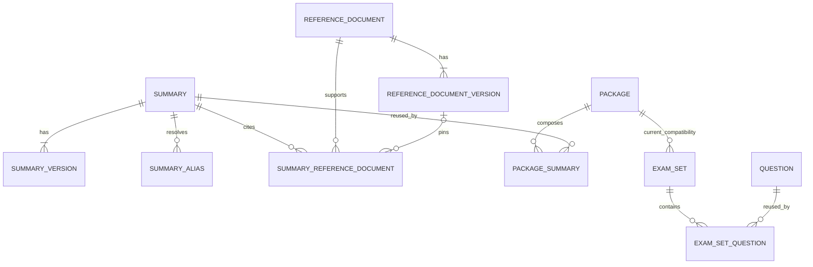

# Sobdai Knowledge Platform — Production Data Model v1

**Status:** Proposed for data-model review  
**Architecture:** Knowledge Platform Architecture v1, frozen  
**Scope:** Database/domain model only  
**Excluded:** SQL, migrations, application code, UI implementation, and architectural redesign

## 0. Decision summary

The production model has three layers and five primary aggregate families:

```text
Reference Layer
  ReferenceDocument
    └── ReferenceDocumentVersion

Knowledge Layer
  Summary
    ├── SummaryVersion
    ├── SummaryAlias
    └── SummaryReferenceDocument

  Question                         existing compatibility aggregate
  Flashcard                       future compatible aggregate
  LearningAsset                   future compatible aggregate

Product Layer
  Package
    └── PackageSummary

  ExamSet
    └── ExamSetQuestion           existing compatibility aggregate

  LearningPath                    future compatible aggregate
```

Core production rules:

1. UUIDs are internal relational identities.
2. Business IDs are stable, unique, generated once, and never reused.
3. A Summary is a stable logical asset.
4. Summary Markdown exists only on SummaryVersion.
5. A published SummaryVersion is immutable.
6. Package-specific order, visibility, release, navigation label, and version policy exist only on PackageSummary.
7. A ReferenceDocument represents a stable source identity; its editions/amendments exist as ReferenceDocumentVersion.
8. Archive is the normal end-of-life operation. Hard delete is exceptional and limited to never-published, unreferenced drafts.
9. Read models may denormalize but never become authoritative.
10. Frozen Assessment and Recommendation contracts receive compatible projections through Application Layer adapters.

## 0.1 Relationship map



The model permits an active Summary identity with no published revision, but every Summary must have at least one revision after creation. A new ReferenceDocument is created with at least one verified source version.

# 1. Current Schema Audit

## 1.1 Current Package

Verified storage identity and relationships:

| Concern | Current fact |
|---|---|
| Primary identity | UUID `packages.id` |
| URL identity | Globally unique Package slug |
| Business label | `package_code` exists but is not declared unique in the founding schema |
| Market context | Organization and Position foreign keys; exam year and product version are text |
| Commercial ownership | Orders reference Package |
| Lifecycle | `is_published` boolean |
| SEO | Package has SEO title and description fields |
| Merchandising | Homepage feature flag and homepage order |
| Summary relationship | Summary owns mandatory Package foreign key |
| Exam Set relationship | Exam Set owns mandatory Package foreign key |
| Current delete effect | Package deletion cascades through several dependent records, including owned Summaries and Exam Sets |

## 1.2 Current Summary

| Concern | Current fact |
|---|---|
| Primary identity | UUID `summaries.id` |
| Ownership | Mandatory `package_id`, cascading on Package delete |
| Slug | Unique only within one Package |
| Content | Mutable Markdown stored directly on Summary |
| Classification | Subject, Document, Law, and Topic stored on Summary |
| Publication | `is_published` boolean |
| Ordering | `sort_order`, `display_order`, and `released_at` stored on Summary |
| Versioning | No revision entity or immutable published snapshot |
| Update behavior | Admin edit/import replaces row content in place |
| External relationships | News may reference Summary through `news_summaries` |

## 1.3 Current Reference Document representation

- No ReferenceDocument entity exists.
- Question and Summary each carry nullable free-text `document`.
- No business key, source version, issuer, source checksum, effective interval, or supersession relationship exists.

## 1.4 Current Question and Exam Set compatibility

- Question is already reusable through `exam_set_questions`.
- Question has a UUID and optional immutable `question_code`.
- Question lifecycle is `Draft | Review | Published`.
- Frozen assessment metadata exists directly on Question.
- Exam Set has UUID identity, mandatory Package association, status `draft | published | archived`, and reusable Question membership.
- This data model does not move or reinterpret frozen Question/Exam Set fields.

## 1.5 Current junction precedent

- `exam_set_questions` proves reusable asset composition with contextual order.
- `news_summaries` proves Summary references can exist independently from Summary ownership.
- The future PackageSummary follows the same reference principle but carries the richer placement state required by the frozen Knowledge Platform architecture.

# 2. Naming and Modeling Conventions

## 2.1 Entity names

Domain names are singular:

- ReferenceDocument
- ReferenceDocumentVersion
- Summary
- SummaryVersion
- SummaryReferenceDocument
- SummaryAlias
- Package
- PackageSummary
- Question
- ExamSet
- ExamSetQuestion

Physical naming is deferred to implementation review. This document defines meaning, not SQL identifiers.

## 2.2 Nullability

Fields are classified as:

- **Required at creation** — identity cannot exist without them.
- **Required before activation/publication** — draft may omit them.
- **Optional** — legitimate absence has defined meaning.
- **Derived** — computed from authoritative fields and not independently editable.

Null must mean “unknown/not supplied,” not “not applicable,” unless the field definition says otherwise.

## 2.3 Time

- All timestamps represent instants in UTC.
- Display timezone is an Application Layer concern.
- Lifecycle timestamps are distinct from general `updatedAt`.
- Effective dates on legal sources are domain dates and must not be inferred from row creation.

## 2.4 Text normalization

Business IDs and slugs use a canonical normalized form. Titles and Thai content preserve authored Unicode. Search normalization is a read-model concern and must not alter authoritative text.

# 3. Identity Model

## 3.1 UUID identity

Every aggregate root uses an opaque UUID as its primary relational identity.

UUID rules:

- generated once;
- never exposed as a semantic code;
- never changed;
- used for foreign-key relationships;
- preserved during migration where an existing entity already has a UUID.

Child entities that require independent audit/reference also receive UUIDs. Pure junctions may use composite identity where the relationship itself has no lifecycle beyond its two parents.

## 3.2 Business IDs

Business IDs are stable external identifiers for support, import, audit, and cross-system references.

| Entity | Business ID | Rule |
|---|---|---|
| ReferenceDocument | `documentCode` | Globally unique, immutable, generated once, never reused |
| Summary | `summaryCode` | Globally unique, immutable, generated once, never reused |
| Question | Existing `questionCode` | Preserve existing `Q-……` contract and immutability |
| Package | Existing `packageCode` | Becomes unique and stable; changes in Organization/year/version do not silently rewrite an established Product identity |
| ExamSet | UUID compatibility identity | No new business ID required by this model |
| SummaryVersion | `(summaryId, revisionNumber)` | Revision address; not a second asset identity |
| ReferenceDocumentVersion | `(referenceDocumentId, versionLabel)` | Source-edition address; version label is unique within the document |
| PackageSummary | `(packageId, summaryId)` | One placement per Summary per Package |
| Future Flashcard | Reserved `flashcardCode` policy | Assigned only when the type is implemented |
| Future LearningAsset | Reserved `learningAssetCode` policy | Assigned only when the type is implemented |
| Future LearningPath | Reserved `learningPathCode` policy | Assigned only when the Product is implemented |

Recommended human-readable prefixes are `DOC-` for ReferenceDocument and `SUM-` for Summary. Allocation format and sequence width are implementation policy; semantic metadata such as Subject or year must not be encoded into identity because it can change.

## 3.3 Stable identifiers

Stable identifiers:

- UUID;
- business ID;
- published revision address;
- source-version address.

Non-stable locators:

- title;
- slug;
- Package navigation label;
- source URL;
- file URI.

External integrations should store UUID or business ID, never title or slug.

## 3.4 Slug strategy

### Package slug

- remains globally unique;
- addresses the Product;
- changes create Package route redirects under the existing SEO policy.

### Summary canonical slug

- globally unique across Summary assets;
- addresses `/knowledge/summaries/{canonicalSlug}`;
- independent from Package;
- points to the Summary identity, not a revision;
- may change only through an explicit rename operation.

### Package legacy slug

- PackageSummary preserves the migrated Package-scoped Summary slug as `legacySlug`;
- uniqueness is scoped to Package;
- resolves the compatibility route;
- is not a second canonical identity.

## 3.5 Alias strategy

### SummaryAlias

Represents a former global canonical Summary slug.

Attributes:

| Attribute | Requirement | Meaning |
|---|---|---|
| Alias ID | Required | Opaque audit identity |
| Summary ID | Required | Target Summary |
| Slug | Required, globally unique | Former canonical slug |
| Redirect type | Required | Permanent or temporary |
| Created at | Required | Alias creation time |
| Reason | Required | Rename, merge, correction, or migration |

Rules:

- canonical slug and alias namespace cannot collide;
- alias chains are forbidden;
- every alias resolves directly to the current Summary;
- aliases never grant access;
- merged Summary identities preserve old canonical slugs as aliases.

### Package compatibility aliases

Active Package-scoped legacy slugs remain owned by PackageSummary. Historical route aliases may be projected for redirects after detach, but they do not restore an inactive placement or entitlement.

# 4. Reference Layer

## 4.1 ReferenceDocument

### Purpose

ReferenceDocument is the stable identity of an authoritative source work, independent of edition, amendment, source file, or URL.

Examples:

- one Act across amendments;
- one official regulation across published source files;
- one policy framework across released editions.

### Attributes

| Attribute | Requirement | Ownership/meaning |
|---|---|---|
| ID | Required | Internal UUID |
| Document code | Required | Stable global business ID |
| Canonical title | Required before activation | Official full title |
| Short title | Optional | Editorial display abbreviation |
| Document type | Required before activation | Controlled Reference Layer vocabulary |
| Issuer | Optional in draft; readiness-controlled | Issuing authority |
| Jurisdiction | Optional in draft; readiness-controlled | Legal/administrative scope |
| Source homepage URL | Optional | Stable official landing page, not edition file |
| Lifecycle status | Required | Active, superseded, repealed, archived |
| Superseded by document ID | Required only when superseded | Replacement ReferenceDocument |
| Created at / updated at | Required | Audit timestamps |

### Business invariants

- Document code is globally unique and immutable.
- A document cannot supersede itself.
- Supersession chains are acyclic.
- `supersededBy` is populated only for `superseded`.
- `repealed` means the authority ended without necessarily having a replacement.
- A new ReferenceDocument is established atomically with its first verified ReferenceDocumentVersion.
- Archive is administrative removal from new editorial selection, not a statement of legal repeal.

## 4.2 ReferenceDocumentVersion

### Purpose

Represents one identifiable source edition, amendment consolidation, or official release of a ReferenceDocument.

### Attributes

| Attribute | Requirement | Ownership/meaning |
|---|---|---|
| ID | Required | UUID child identity |
| Reference Document ID | Required | Parent aggregate |
| Version label | Required | Official/editorial edition label, unique within parent |
| Lifecycle status | Required | Draft, verified, superseded, withdrawn |
| Publication date | Optional | Date authority published this source version |
| Effective from | Optional | Legal/effective start |
| Effective to | Optional | Legal/effective end |
| Trusted source URL | Optional | Edition-specific official URL |
| Source file URI | Optional | Controlled stored source |
| Source checksum | Required when a file is stored | Exact source-byte identity |
| Media type | Optional | Source representation type |
| Supersedes version ID | Optional | Previous version within same document |
| Verification provenance | Required before verified | Who verified, when, and against what source |
| Created at | Required | Audit timestamp |

### Business invariants

- Version label is unique within one ReferenceDocument.
- Supersedes-version must belong to the same ReferenceDocument.
- Version supersession graph is acyclic.
- Effective intervals for simultaneously authoritative versions require explicit jurisdiction/scope justification; accidental overlap is invalid.
- A verified version is immutable except lifecycle transition and administrative annotations that do not alter source identity.
- Changing a stored source file or checksum creates a new version or returns the draft to verification; it never silently alters a verified version.
- Withdrawn means the recorded source version is invalid/untrusted for new editorial use; it is retained for audit.

## 4.3 Reference relationships

Cardinality:

```text
ReferenceDocument 1 ── 0..N ReferenceDocumentVersion
ReferenceDocument 0..1 ── 0..N superseding ReferenceDocument
ReferenceDocumentVersion 0..1 ── 0..N superseding versions
Summary N ── M ReferenceDocument
```

Summary relationships are represented by SummaryReferenceDocument, defined in the Knowledge Layer.

## 4.4 Reference lifecycle

### ReferenceDocument transitions

```text
active -> superseded
active -> repealed
active -> archived
superseded -> archived
repealed -> archived
```

`draft` is not a durable ReferenceDocument lifecycle state in the frozen model. A new ReferenceDocument and its first verified version are established in one transaction. Draft ReferenceDocumentVersions represent proposed later editions of an already-established document; incomplete first-document intake may remain in an Application Layer review workspace until it satisfies creation requirements.

### ReferenceDocumentVersion transitions

```text
draft -> verified
draft -> withdrawn
verified -> superseded
verified -> withdrawn
superseded -> withdrawn
```

No transition returns a verified/superseded/withdrawn source version to draft.

# 5. Knowledge Layer

## 5.1 KnowledgeAsset compatibility contract

KnowledgeAsset is a domain union, not a mandatory shared physical table.

Common projection:

| Field | Meaning |
|---|---|
| Asset ID | Stable type-owned UUID |
| Business ID | Stable type-owned code |
| Asset type | Summary, Question, Flashcard, Learning Asset |
| Canonical title/label | Type-owned display identity |
| Lifecycle | Type-owned lifecycle projected into common availability |
| Subject / Topic | Compatible discovery metadata |
| Current published representation | Type-owned version/reference |

This avoids a polymorphic “all content” table while giving Application Layer consumers one immutable reference shape.

## 5.2 Summary

### Purpose

Summary is the stable identity and canonical metadata of one logical reusable Summary.

### Attributes

| Attribute | Requirement | Ownership/meaning |
|---|---|---|
| ID | Required | UUID aggregate identity; preserve migrated Summary UUID where possible |
| Summary code | Required before activation | Stable global business ID |
| Canonical slug | Required | Global canonical URL key |
| Canonical title | Required | Asset title |
| Subject | Optional in draft; readiness policy may require | Canonical compatible classification |
| Topic | Optional | Canonical compatible classification |
| Law | Optional | Canonical law label during compatibility period |
| Lifecycle status | Required | Active or archived |
| Visibility policy | Required | Public indexable, authenticated, or Product-entitled |
| Current published version ID | Nullable | Published SummaryVersion selected for current use |
| Created by | Required | Creator identity |
| Created at / updated at | Required | Audit timestamps |

### Excluded attributes

Summary does not own:

- Markdown;
- read time;
- Package ID;
- Package ordering;
- Package visibility;
- Package release time;
- draft/published editorial status;
- Product-specific navigation wording.

### Business invariants

- Summary code and UUID are immutable.
- Canonical slug is globally unique across canonical slugs and aliases.
- Current published version, when present, belongs to the same Summary and has status `published`.
- Active does not mean published; an active Summary may have only a draft revision.
- Archived Summary cannot receive new active Package placements.
- Product-entitled visibility requires at least one eligible active placement before learner access is possible.

## 5.3 SummaryVersion

### Purpose

SummaryVersion owns the editorial content and revision-specific metadata of one Summary revision.

### Attributes

| Attribute | Requirement | Ownership/meaning |
|---|---|---|
| ID | Required | UUID revision identity |
| Summary ID | Required | Parent Summary |
| Revision number | Required | Monotonic positive integer within Summary |
| Markdown | Required before review | Authoritative Summary body |
| Content checksum | Required when Markdown exists | Exact normalized content identity |
| Title snapshot | Required before publish | Audit snapshot of canonical title |
| Classification snapshot | Required before publish | Audit snapshot, not canonical ownership |
| Source relationship snapshot | Required before publish when sources apply | Referenced document/version IDs, roles, and coverage as reviewed; audit-only |
| SEO title | Optional | Revision-specific search/social title |
| SEO description | Optional | Revision-specific search/social description |
| Social image reference | Optional | Revision-specific presentation media |
| Read time | Derived, persisted on revision | Computed from this Markdown using a versioned calculation policy |
| Editorial status | Required | Draft, in review, published, retired |
| Source schema version | Required | Authoring/template contract used |
| Change note | Required after first revision | Human explanation |
| Author identity | Required | Revision creator |
| Reviewer identity/time | Required before publish | Review provenance |
| Publisher identity/time | Required before publish | Publication provenance |
| Created at / updated at | Required | Draft audit timestamps |

### Business invariants

- `(Summary ID, revision number)` is unique.
- Revision number never changes or gets reused.
- At most one open editorial revision (`draft` or `in_review`) may exist per Summary in v1. Parallel draft branches are outside this model.
- Published revisions are immutable.
- Published timestamp, publisher, reviewer, checksum, and Markdown are inseparable publication evidence.
- Retired revisions remain readable for audit and pinned historical Product access according to retention policy.
- Read time is never edited independently from Markdown; recalculation records the calculation-policy version.
- Title/classification snapshots preserve what was reviewed but do not become competing canonical metadata owners.

## 5.4 SummaryReferenceDocument

### Purpose

Connects a Summary to one or more authoritative sources.

### Identity

The relationship is uniquely identified by:

```text
Summary ID + Reference Document ID + optional Reference Document Version ID + role
```

An implementation may use a UUID for audit/event addressing, but logical uniqueness remains the relationship above.

### Attributes

| Attribute | Requirement | Ownership/meaning |
|---|---|---|
| Summary ID | Required | Summary endpoint |
| Reference Document ID | Required | Source identity endpoint |
| Reference Document Version ID | Optional | Pin to a source version; null means document-level relationship |
| Role | Required | Primary or supporting |
| Coverage note | Optional | Human-readable scope; not canonical source metadata |
| Sort order | Required | Citation/presentation order within Summary |
| Linked by / linked at | Required | Audit |

### Business invariants

- Version, when supplied, belongs to the referenced ReferenceDocument.
- A Summary has at most one primary relationship to the same ReferenceDocument/version combination.
- Publishing policy requires at least one primary verified source for source-bound Summary types.
- Archived/withdrawn sources remain linked for provenance but may block a new Summary publication until reviewed.
- Relationship changes do not mutate previously published SummaryVersion provenance; published revision snapshots retain their source relationship set for audit.

## 5.5 SummaryAlias

SummaryAlias is a child of the Summary aggregate and implements the global alias strategy defined in section 3.5.

It owns redirect history only. It does not own title, content, SEO, access, or Product placement.

## 5.6 Question compatibility

Question remains its existing aggregate root.

Preserved authoritative fields include:

- UUID;
- immutable Question code;
- question content and answers;
- difficulty and status;
- Subject, Topic, Document compatibility text;
- frozen assessment metadata;
- current Question publication contract.

Question participates in the Knowledge Platform through:

- the existing ExamSetQuestion relationship;
- an Application Layer `KnowledgeAssetRef`;
- future ReferenceDocument normalization using a Question-specific relationship;
- Recommendation ContentStore projections.

No SummaryVersion field or lifecycle is imposed on Question. Question versioning, if later required, needs its own approved model and does not alter this Summary-focused data model.

## 5.7 Future Flashcard compatibility

Flashcard is a future Knowledge Asset aggregate with:

- independent UUID and business ID;
- type-owned content model;
- type-owned revision/lifecycle rules;
- ReferenceDocument relationships where applicable;
- typed Product placement relationships.

It will implement the common KnowledgeAsset projection. It will not reuse SummaryVersion or store Flashcard content in Summary tables.

## 5.8 Future LearningAsset compatibility

LearningAsset is a future family for assets such as video, article, downloadable resource, or learning note.

Compatibility requirements:

- stable identity;
- explicit type discriminator;
- type-owned representation/version metadata;
- source/provenance relationship;
- typed Product placement;
- common KnowledgeAsset projection.

Binary/media storage location is a version attribute/reference, not Product ownership.

# 6. Product Layer

## 6.1 Package

Package remains the commercial Product and entitlement aggregate.

### Preserved attributes

- UUID;
- Package code;
- global slug;
- Product name and description;
- Organization and Position;
- exam year and Product version;
- prices and discount derivation;
- difficulty and feature configuration;
- logo and cover;
- Package SEO;
- homepage merchandising;
- current publication compatibility state;
- audit timestamps.

### Target identity rules

- Package code becomes unique and stable.
- Package slug remains unique but is a route locator, not the business ID.
- Price, year, Organization, Position, or Product version changes do not change UUID.
- Reissuing a meaningfully distinct commercial Product may require a new Package rather than mutating historical identity; that decision belongs to Product policy.

## 6.2 PackageSummary

### Purpose

PackageSummary is the Product placement of one reusable Summary.

### Identity

Logical primary identity:

```text
Package ID + Summary ID
```

One Summary appears at most once in a Package. Multiple sections pointing to the same Summary would require a future section-placement concept and are outside v1.

### Attributes

| Attribute | Requirement | Ownership/meaning |
|---|---|---|
| Package ID | Required | Parent Product |
| Summary ID | Required | Referenced Knowledge Asset |
| Placement status | Required | Draft, active, hidden |
| Version policy | Required | Latest published or pinned |
| Pinned SummaryVersion ID | Conditional | Required only for pinned |
| Sort order | Required | Stable manual order |
| Display order | Required/defaulted | Promotional precedence |
| Released at | Optional | Product-context release time |
| Navigation label | Optional | Package-specific display wording |
| Legacy slug | Optional | Package-scoped migration route key |
| Attached by / attached at | Required | Audit |
| Updated by / updated at | Required after change | Audit |

### Business invariants

- Package and Summary must exist.
- `(Package, Summary)` is unique.
- Pinned revision belongs to Summary and is published or retained under an explicit historical-access policy.
- `latest published` has no pinned revision.
- `pinned` requires a pinned revision.
- Active placement requires active Summary and a resolvable published revision.
- Draft placement may reference an active Summary without a published revision.
- Hidden placement remains attached but does not appear in normal Product navigation.
- Archived Summary prevents transition to active.
- Legacy slug is unique within Package.
- Navigation label never replaces canonical Summary title outside this Product context.

## 6.3 ExamSet current compatibility

ExamSet remains its current Product/delivery aggregate:

- UUID identity;
- mandatory current Package association;
- name/description;
- duration;
- sample flag;
- ordering/release metadata;
- passing score;
- exam type;
- status `draft | published | archived`;
- Subject/Document compatibility fields.

ExamSet references reusable Questions through ExamSetQuestion. The Assessment Engine and Runtime continue to resolve the same IDs and fields.

This model does not introduce PackageExamSet or make Exam Set globally reusable because that change was not required to translate the frozen Summary architecture.

## 6.4 ExamSetQuestion

Preserved relationship:

```text
ExamSet N ── M Question
```

It owns membership and contextual question order. It does not own Question content or Question publication.

## 6.5 Future LearningPath compatibility

LearningPath will be a Product aggregate with:

- UUID and stable business ID;
- Product lifecycle and access policy;
- ordered typed steps;
- references to Knowledge Assets and/or Product activities through explicit step relationships.

LearningPath must not copy Summary, Question, Flashcard, or LearningAsset content. Its detailed step model is deferred until the Product is designed.

# 7. Metadata Ownership

## 7.1 Authoritative ownership matrix

| Metadata | Sole authoritative owner | Clarification |
|---|---|---|
| Reference Document title | ReferenceDocument | Version may snapshot the official title for provenance |
| Reference source file/version | ReferenceDocumentVersion | Never Summary or Package |
| Summary canonical title | Summary | SummaryVersion title snapshot is audit-only |
| Summary Markdown | SummaryVersion | No Markdown on Summary or PackageSummary |
| Summary Subject | Summary | Version snapshot is audit-only |
| Summary Topic | Summary | Version snapshot is audit-only |
| Summary Law | Summary | Compatibility classification until later taxonomy normalization |
| Question Subject/Topic/law-equivalent | Question | Frozen current model |
| Summary SEO title/description/image | SummaryVersion | Published SEO travels with reviewed content revision |
| Summary indexability/access class | Summary | Stable asset visibility policy |
| Package SEO | Package | Applies only to Product page |
| Read time | SummaryVersion | Derived from that revision’s Markdown |
| Package Summary order | PackageSummary | No ordering on Summary |
| Package Summary visibility | PackageSummary | Draft/active/hidden placement |
| Summary asset lifecycle | Summary | Active/archived |
| Summary editorial publication | SummaryVersion | Draft/in review/published/retired |
| Product publication | Package | Current `isPublished` compatibility state |
| Placement publication/availability | PackageSummary | Placement status |
| Source publication date | ReferenceDocumentVersion | Date authority published the source |
| Summary publication date | SummaryVersion | `publishedAt` |
| Package-context Summary release date | PackageSummary | `releasedAt` |
| Package release/merchandising | Package | Product-specific |
| Package navigation label | PackageSummary | Optional display override only |
| Legacy Package Summary slug | PackageSummary | Compatibility locator |
| Canonical Summary slug | Summary | Global asset locator |

## 7.2 Snapshot rule

A snapshot is not duplicated ownership.

SummaryVersion snapshots canonical title, classification, and source relationships solely to prove what reviewers approved at publication time. Application writes to canonical metadata occur through Summary commands; snapshots of published revisions never update afterward.

## 7.3 Derived metadata

Derived fields must identify their source and calculation policy:

- read time derives from Markdown plus calculation-policy version;
- content checksum derives from normalized Markdown bytes;
- Package discount derives from prices;
- consumer counts derive from placements;
- current revision availability derives from Summary lifecycle and SummaryVersion state.

Derived values can be cached or persisted for performance but cannot be independently edited.

# 8. Lifecycle Model

## 8.1 Summary lifecycle

States:

- **active** — available for authoring and eligible for placement.
- **archived** — unavailable for new placement or new publication; retained for history.

Transitions:

```text
active -> archived
archived -> active
```

Reactivation requires validation that business ID, slug, sources, and at least one usable revision remain consistent. Reactivation does not automatically reactivate hidden/draft Product placements.

## 8.2 SummaryVersion lifecycle

States:

- **draft** — mutable editorial work.
- **in_review** — review candidate; content changes return it to draft or create a corrected review candidate according to workflow.
- **published** — immutable approved revision; it may be current or retained for pinning/history.
- **retired** — no longer selected for new latest-version resolution, retained for pinned/history policy.

Transitions:

```text
draft -> in_review
draft -> retired
in_review -> draft
in_review -> published
in_review -> retired
published -> retired
```

No retired or published revision returns to mutable draft.

Publication consistency boundary:

1. validate review/provenance;
2. mark the revision published;
3. leave the previous published revision immutable and available for existing pins/history;
4. advance Summary.currentPublishedVersion;
5. record audit/outbox intent;
6. commit atomically.

Retirement is a separate explicit withdrawal decision. Publishing a successor does not automatically retire its predecessor.

## 8.3 PackageSummary lifecycle

States:

- **draft** — attached for Product preparation, not learner-visible.
- **active** — learner-visible when Package and selected Summary revision are available.
- **hidden** — retained attachment intentionally omitted from normal navigation.

Transitions:

```text
draft -> active
draft -> hidden
active -> hidden
hidden -> active
hidden -> draft
```

Detach deletes the relationship after impact validation. Detach is not an archive state and never deletes Summary.

## 8.4 ReferenceDocument lifecycle

States:

- **active**
- **superseded**
- **repealed**
- **archived**

Semantics and transitions are defined in section 4.4.

## 8.5 ReferenceDocumentVersion lifecycle

States:

- **draft**
- **verified**
- **superseded**
- **withdrawn**

Semantics and transitions are defined in section 4.4.

## 8.6 Lifecycle interaction rules

- A published SummaryVersion can cite a source version that later becomes superseded; the Summary becomes review-due but its published history is not rewritten.
- A withdrawn primary source version blocks new SummaryVersion publication until a reviewer resolves the source.
- An archived Summary cannot activate a PackageSummary.
- Hiding a PackageSummary does not change Summary lifecycle.
- Unpublishing a Package does not hide, archive, or retire its Summary assets.
- Retiring a SummaryVersion does not delete it and does not silently rewrite pinned historical placements.

# 9. Aggregate Boundaries

## 9.1 ReferenceDocument aggregate

### Root

ReferenceDocument.

### Owned children

- ReferenceDocumentVersion.

### Consistency boundary

- document business identity;
- source-version uniqueness;
- current legal/source lineage;
- version supersession;
- activation readiness.

### Transaction boundary

One transaction may:

- create a document and initial version;
- verify a source version;
- supersede a version and establish successor;
- change document lifecycle and replacement pointer.

Summary relationships are cross-aggregate references and are not rewritten inside this transaction.

## 9.2 Summary aggregate

### Root

Summary.

### Owned children

- SummaryVersion;
- SummaryAlias;
- SummaryReferenceDocument association records, whose targets are external ReferenceDocument aggregates.

### External references

- PackageSummary references Summary from Package aggregate.
- NewsSummary references Summary from News aggregate.

### Consistency boundary

- Summary identity;
- global slug/alias resolution;
- revision numbering;
- revision lifecycle;
- current published pointer;
- uniqueness and role rules for source relationships;
- published revision immutability.

### Transaction boundary

Publishing a SummaryVersion and advancing current published pointer is atomic inside the Summary aggregate. Cross-aggregate impact notifications and cache updates occur after commit through reliable application integration.

## 9.3 Package aggregate

### Root

Package.

### Owned children

- PackageSummary placements.

Orders reference Package but remain their own commercial aggregate. Exam Sets retain current compatibility association and are not folded into the Package transaction.

### Consistency boundary

- Product identity and publication;
- placement uniqueness;
- placement ordering;
- placement version policy;
- Package publish readiness snapshot.

### Transaction boundary

Attach/detach/reorder operations affecting one Package commit atomically. Publishing a Package validates resolved external Summary/ExamSet state, then commits Product publication without modifying those external aggregates.

Cross-aggregate changes may occur immediately after validation. Therefore public reads always enforce current availability rather than trusting a stale Package readiness result.

## 9.4 Question aggregate

Question remains an independent aggregate root. ExamSetQuestion holds references; neither ExamSet nor Package owns Question content.

## 9.5 ExamSet aggregate

ExamSet is an independent aggregate root with ExamSetQuestion memberships. Its current Package foreign key remains compatibility context, but Assessment generation/execution contracts remain unchanged.

## 9.6 Why PackageSummary belongs to Package

PackageSummary is Product composition:

- its order is meaningful only inside one Package;
- its visibility is Product-specific;
- its pinned/latest policy is a Product release decision;
- its legacy slug is a Product route concern.

It references Summary but is not owned by Summary.

## 9.7 Cross-aggregate consistency

Operations spanning aggregates use:

- precondition reads;
- optimistic concurrency/version checks;
- one aggregate transaction;
- reliable post-commit events/outbox for projections and cache invalidation;
- compensating administrative action rather than distributed rollback.

No cross-aggregate operation may mutate a frozen engine’s state or contract.

# 10. Referential Integrity and Retention

## 10.1 Relationship rules

| Relationship | Parent deletion behavior | Child/target deletion behavior |
|---|---|---|
| ReferenceDocument → ReferenceDocumentVersion | ReferenceDocument hard delete is not a normal production operation; archive instead | Draft later versions may be discarded if unreferenced; verified versions cannot be hard-deleted |
| Summary → SummaryVersion | Cascade only for eligible never-published hard delete | Published/retired version deletion prohibited |
| Summary → SummaryAlias | Cascade only with eligible Summary hard delete | Alias cannot exist without Summary |
| Summary ↔ ReferenceDocument | Remove relationship only through explicit unlink command | Referenced active/history entities use restrict, not silent cascade |
| Package → PackageSummary | Cascade placements when an eligible Package is hard-deleted | Placement detach never deletes Summary |
| Summary ← PackageSummary | Summary hard delete restricted while any placement/history requires it | Package deletion removes only placement |
| Summary ← NewsSummary | Summary hard delete restricted by published/history use | News deletion may remove its junction |
| Package ← Order/Assessment history | Package hard delete restricted after commercial or learner history exists | Unpublish/archive Product under Product policy |
| Package → ExamSet | Preserve current compatibility relationship in v1 | Package hard-delete guard prevents accidental history loss; broader Exam Set reuse is outside scope |
| ExamSet → ExamSetQuestion | Preserve current cascade membership behavior | Question content remains independent |
| Question ← ExamSetQuestion | Hard delete policy must account for usage; frozen behavior remains until separately changed | Membership deletion does not delete Question |

## 10.2 Archive versus soft delete

The Knowledge Platform uses explicit lifecycle archive, not a generic `deletedAt`, for durable content.

Reasons:

- archive has business meaning;
- archived assets remain auditable and referenceable;
- a generic soft-delete flag obscures lifecycle invariants;
- public/read projections can reason from named states.

## 10.3 Hard-delete eligibility

Hard delete is permitted only when all are true:

- entity/revision has never been published, verified, sold, or used in learner history;
- no active or historical placement/reference requires it;
- no alias/redirect must remain;
- audit policy permits removal;
- requester has destructive-content permission;
- impact query returns no protected consumer.

Otherwise:

- Summary is archived;
- SummaryVersion is retired;
- ReferenceDocument is archived/superseded/repealed;
- ReferenceDocumentVersion is withdrawn/superseded;
- PackageSummary is hidden or detached;
- Package follows Product retirement policy.

## 10.4 No destructive cascades from Product to Knowledge

The future model explicitly forbids:

```text
Package deletion -> Summary deletion
```

Only PackageSummary placements cascade from Package. Shared Knowledge Assets survive.

## 10.5 Historical references

Published revision provenance, purchases, learner history, audit events, and redirects retain stable IDs even after archive. If privacy/security requires body withdrawal, access is blocked while identity and audit metadata remain.

# 11. Read Models

Read models are denormalized projections or optimized query results. They are disposable and rebuildable from domain entities.

## 11.1 Summary Library read model

### Purpose

Admin search, filtering, lifecycle management, and impact visibility.

### Projection

| Field group | Contents |
|---|---|
| Identity | Summary UUID, code, canonical slug, title |
| Classification | Subject, Topic, Law |
| Lifecycle | Summary status |
| Revision | Current draft/review ID, current published revision ID/number/status |
| Publication | Last published at/by |
| Source | Primary Reference Document code/title/version/status |
| Quality | Missing metadata/source/review indicators |
| Consumers | Active/draft/hidden Package counts, News count |
| Search | Normalized title/code/slug/document terms |
| Duplicate signals | Current content checksum and probable-match group |
| Audit | Updated at/by |

### Optimization requirements

- keyset pagination for large libraries;
- search by code/title/slug/document;
- selective filters without loading Markdown;
- reverse-relationship counts;
- no N+1 source or consumer queries.

## 11.2 Summary Picker read model

### Purpose

Select reusable published assets for one Package.

### Projection

| Field group | Contents |
|---|---|
| Summary | ID, code, title, canonical slug, Subject, Topic |
| Availability | Active/archived, current published revision |
| Preview | Safe excerpt, read time, last published time |
| Source | Primary Reference Document |
| Attachment | Already attached, placement status, selected version policy |
| Impact context | Number/list summary of other Package consumers |
| Eligibility | Attachable flag and structured reason |

### Optimization requirements

- scoped anti-join/attachment marker for current Package;
- text/filter indexes on searchable metadata;
- no full Markdown in result list;
- batched preview only on demand;
- deterministic ordering and keyset pagination.

## 11.3 Public Package read model

### Purpose

Render a Package and its ordered learner-visible Summary cards.

### Projection

```text
Package public metadata
  + entitlement/publication result
  + ordered active PackageSummary
      + resolved selected SummaryVersion
      + canonical Summary identity
      + contextual navigation label and legacy route
```

Resolution:

- Package must be published or staff-previewable.
- Placement must be active.
- Summary must be active.
- `latest published` resolves current published version.
- `pinned` resolves pinned retained/published version according to access policy.
- inaccessible/unresolvable items do not leak protected metadata and surface operational diagnostics.

Ordering:

1. placement display order descending;
2. placement release time descending, null last;
3. placement updated time descending;
4. attached time descending;
5. Summary UUID stable tie-breaker.

## 11.4 Public Summary read model

### Purpose

Resolve canonical Summary page and legacy Package-context route.

### Projection

| Group | Contents |
|---|---|
| Canonical identity | Summary ID/code/slug/title |
| Content | Selected immutable SummaryVersion Markdown and read time |
| SEO | Version SEO plus Summary visibility/canonical URL |
| Provenance | Public-safe primary source details |
| Access | Public, authenticated, staff, or entitled decision |
| Context | Optional Package placement and previous/next navigation |
| Redirect | Canonical/alias/legacy resolution |

Access rule:

- public-indexable asset: published active revision;
- authenticated asset: authenticated caller;
- Product-entitled asset: staff or ownership of at least one eligible published Package with an active placement;
- Package-context navigation never creates content ownership.

## 11.5 Recommendation ContentStore read model

### Purpose

Implement the frozen `ContentStore` Summary provider without changing Candidate Discovery or Recommendation Engine contracts.

### Projection to existing ContentRef

| Existing contract field | Source |
|---|---|
| `contentId` | Summary UUID |
| `contentType` | `summary` |
| `title` | Summary canonical title |
| `slug` | Summary canonical slug or compatible resolved route slug |
| `packageId` | Deterministically selected eligible Product context, nullable for directly actionable public asset |
| `subject` | Summary Subject |
| `topic` | Summary Topic |
| `difficulty` | Null unless a future approved Summary field supplies it |

Eligibility:

- Summary active;
- resolvable published version;
- matching requested metadata filters;
- actionable public or learner-entitled context;
- not excluded by the frozen query contract.

When one Summary belongs to many eligible Packages, the read model selects one deterministic actionable Product context. Candidate identity remains the Summary UUID, so E-3 deduplication behavior is unchanged.

The projection excludes Markdown and revision internals.

## 11.6 Projection freshness

- Command success is authoritative.
- Public reads requiring immediate correctness may query normalized entities directly or use transactionally advanced projection versions.
- Search/count projections may be eventually consistent within a declared service objective.
- Access and publication checks may not rely on stale cache alone.
- Every projection records source aggregate version/high-water mark for rebuild and diagnostics.

# 12. Migration Compatibility Matrix

## 12.1 Summary mapping

| Current schema | Future owner | Compatibility treatment | Data-loss risk |
|---|---|---|---|
| `summaries.id` | Summary.ID | Preserve UUID for one-to-one backfill; merged duplicates retain aliases/audit | Low if preserved |
| `summaries.package_id` | PackageSummary.PackageID | Create one placement per current row; later remove ownership field | High if removed before placement verification |
| `summaries.title` | Summary.canonicalTitle | Copy to canonical title and SummaryVersion title snapshot | Low |
| `summaries.slug` | Summary.canonicalSlug and/or PackageSummary.legacySlug | Preserve Package-scoped route; resolve global collisions before canonical assignment | High due current cross-Package collisions |
| `summaries.subject` | Summary.subject | Copy exactly, including legacy values | Medium normalization ambiguity |
| `summaries.topic` | Summary.topic | Copy exactly | Medium free-text drift |
| `summaries.law` | Summary.law | Copy exactly as compatibility metadata | Medium free-text drift |
| `summaries.document` | SummaryReferenceDocument after review | Preserve raw fallback; do not auto-create/merge normalized source without review | High semantic matching risk |
| `summaries.content_md` | SummaryVersion.markdown | Create revision 1 with checksum | Low if checksum verified |
| `summaries.read_time_minutes` | SummaryVersion.readTime | Preserve original for parity; mark calculation policy; later recalculate only by policy | Low |
| `summaries.sort_order` | PackageSummary.sortOrder | Copy | Low |
| `summaries.display_order` | PackageSummary.displayOrder | Copy | Low |
| `summaries.released_at` | PackageSummary.releasedAt | Copy as Product-context release | Low |
| `summaries.is_published=true` | SummaryVersion published + Summary current pointer + active placement | Preserve exact learner visibility after entitlement checks | High if lifecycle mapping is partial |
| `summaries.is_published=false` | Draft SummaryVersion + draft/hidden placement based on audited behavior | Preserve admin access only | Medium |
| `summaries.created_at` | Summary/Version/Placement audit | Preserve original creation as appropriate | Low |
| `summaries.updated_at` | Revision and migration audit | Preserve source timestamp; new entities receive migration provenance | Low |
| `UNIQUE(package_id, slug)` | Global canonical slug + Package legacy uniqueness | Compatibility route retains composite uniqueness; canonical conflicts resolved explicitly | High |

## 12.2 Package mapping

| Current schema | Future model | Compatibility treatment |
|---|---|---|
| Package UUID | Package UUID | Unchanged |
| Package slug | Package slug | Unchanged; aliases if renamed |
| `package_code` | Package business ID | Preserve, validate uniqueness, stop silent rewriting after identity establishment |
| Organization/Position | Package market context | Unchanged |
| exam year/Product version | Package | Unchanged; not Summary/source revision |
| prices/orders | Package/commercial aggregates | Unchanged |
| `is_published` | Package publication compatibility | Retained for initial model; Application service owns readiness |
| SEO fields | Package SEO | Retained; public read model must honor them |
| homepage fields | Package merchandising | Unchanged |

## 12.3 Reference Document mapping

| Current schema | Future model | Compatibility treatment |
|---|---|---|
| Summary free-text Document | ReferenceDocument relationship | Preserve raw text until human mapping |
| Question free-text Document | Future QuestionReferenceDocument | No change to frozen Question contract; normalize later through adapter |
| No source versions | ReferenceDocumentVersion | Create only from verified authoritative evidence |
| No document business ID | ReferenceDocument.documentCode | Allocate during reviewed normalization |

## 12.4 Question/Exam Set mapping

| Current schema | Future model | Compatibility treatment |
|---|---|---|
| Question UUID/code | Question | Unchanged |
| Question content/status/axes | Question | Unchanged |
| ExamSet UUID/package/status | ExamSet | Unchanged |
| ExamSetQuestion membership/order | ExamSetQuestion | Unchanged |
| Assessment Engine contracts | Frozen adapters/contracts | No change |

## 12.5 External relationship mapping

| Current relationship | Future behavior |
|---|---|
| NewsSummary → current Summary UUID | Preserve UUID where possible; repoint only during human-approved merges |
| Recommendation SummaryProvider → current Summary row | Replace implementation with ContentStore read projection; contract unchanged |
| Package page direct Summary query | Replace with Public Package read model |
| Summary page `(package, slug)` resolution | Resolve PackageSummary legacy slug, then canonical Summary |
| Admin Summary Bank Package join | Replace with consumer projection |

## 12.6 Publication mapping truth table

| Current Summary state | Future Summary | Future revision | Future placement |
|---|---|---|---|
| Published and visible in published Package | Active | Revision 1 published/current | Active |
| Published but Package draft | Active | Revision 1 published/current | Active; Product gate still prevents public visibility |
| Draft Summary | Active | Revision 1 draft | Draft |
| Published row with invalid/missing content | Active but migration-blocked | Draft/quarantined pending review | Hidden or draft |
| Duplicate row approved as non-canonical | Archived after merge | Revision retained for audit | Placement repointed to canonical Summary |

# 13. Concurrency and Transaction Rules

## 13.1 Revision publication

Concurrent publication must prevent:

- duplicate revision numbers;
- two current published pointers;
- pointer to a non-published revision;
- lost review evidence.

Use aggregate version/optimistic concurrency. A stale publisher receives a conflict and re-reads; it never overwrites the winner.

## 13.2 Package composition

Concurrent attach/reorder operations use Package aggregate versioning.

Rules:

- duplicate `(Package, Summary)` is rejected;
- reorder submits the expected placement set/version;
- attaching during Summary archive fails at activation validation;
- Package publish validates a consistent placement snapshot.

## 13.3 Source verification

Verification locks/checks ReferenceDocument aggregate version so two editors cannot establish conflicting source lineage.

# 14. Index and Access-Path Model

No physical indexes are specified here, but production implementation must support these access paths:

## Reference Layer

- ReferenceDocument by UUID and document code;
- active document by normalized title/type/issuer;
- versions by document and version label;
- current/effective version by date;
- reverse Summary references.

## Knowledge Layer

- Summary by UUID, Summary code, canonical slug, or alias;
- active/published Summary by Subject/Topic;
- SummaryVersion by Summary/revision number and status;
- current published version resolution;
- exact checksum duplicate lookup;
- reverse Package/News/source consumers;
- library full-text/prefix search.

## Product Layer

- Package by UUID, slug, or Package code;
- PackageSummary by Package in display order;
- reverse Packages by Summary;
- Package legacy slug resolution;
- active placement by Package/Summary;
- pinned revision reverse usage.

Indexes and materialized projections must follow measured query plans during implementation review; they do not change ownership.

# 15. Risks

## 15.1 Normalization risks

| Risk | Impact | Control |
|---|---|---|
| Free-text Document names collapse distinct legal sources | Incorrect provenance and stale-content alerts | Human-reviewed mapping; retain raw value |
| One legal work is split into several ReferenceDocuments | Fragmented reuse and impact analysis | Business-code governance and duplicate review |
| Subject/Topic normalization changes frozen discovery matching | Recommendation candidates change unexpectedly | Preserve compatible projection values and contract tests |
| Snapshot metadata is mistaken for canonical ownership | Conflicting edits | Mark snapshots immutable/audit-only in model and APIs |

## 15.2 Over-normalization risks

| Risk | Impact | Control |
|---|---|---|
| Generic KnowledgeAsset table becomes a polymorphic god table | Weak integrity and type-specific JSON | Domain union plus type-owned aggregates |
| Every label becomes a separate entity | Excess joins and admin friction | Normalize authoritative sources first; preserve compatible Subject/Topic fields |
| Version every minor Product placement edit | History noise | Version content revisions; audit placement changes without Summary revision |
| Force Question into Summary revision lifecycle | Frozen-contract breakage | Keep Question compatibility aggregate |

## 15.3 Migration risks

| Risk | Impact | Control |
|---|---|---|
| Global slug collisions | Broken canonical routes | Inventory first; legacy scoped slugs; explicit canonical resolution |
| Auto-dedup merges semantically different content | Data loss | One-to-one backfill, human-approved merge only |
| Published boolean maps incompletely | Visibility regression | Publication truth table and shadow parity |
| Existing News links break after merge | Broken acquisition paths | Preserve UUID where possible; repoint transactionally with aliases |
| Package cascade remains active too long/removed too early | Asset loss or rollback failure | Additive coexistence; destructive change only after soak |
| Mutable legacy and revision stores diverge | Conflicting truth | Single Application writer and checksum comparison |

## 15.4 Performance risks

| Risk | Impact | Control |
|---|---|---|
| Version/placement joins slow Package pages | Learner latency | Public Package projection, batch resolution, measured indexes |
| Picker searches load Markdown | High payload and database load | Metadata-only list projection; preview on demand |
| Consumer counts cause N+1 queries | Slow library | Reverse-count projection |
| Entitlement-aware recommendation projection is expensive | Slow recommendations | Learner-scoped eligible-package projection and deterministic selection |
| Alias resolution adds repeated queries | Route latency | Unified slug/alias projection and cache |

## 15.5 Operational risks

| Risk | Impact | Control |
|---|---|---|
| Shared Summary publication affects many Products | Large blast radius | Impact query, latest/pinned policy, audit |
| Source becomes repealed/superseded | Stale learning content | Source lifecycle events and review-due projection |
| Editors hard-delete durable assets | Irrecoverable history loss | Archive-first permissions and restrictive references |
| Cached public content outlives archive | Unauthorized/stale display | Reliable post-commit invalidation plus read-time state enforcement |
| Parallel editors publish conflicting revisions | Lost work | Aggregate version checks |
| Product-entitled canonical route leaks content | Access breach | Authoritative entitlement read, never cache-only decision |

# 16. Data-Model Review Checklist

The model is ready to freeze when reviewers confirm:

1. Summary UUID and Summary code represent the stable asset identity.
2. Markdown and revision SEO belong only to SummaryVersion.
3. Published SummaryVersion is immutable.
4. Package context belongs only to PackageSummary.
5. ReferenceDocument and ReferenceDocumentVersion meanings are distinct.
6. SummaryReferenceDocument supports document-level and version-pinned provenance.
7. Business IDs are immutable and never reused.
8. Canonical and legacy slug namespaces are explicit.
9. Aggregate roots and transaction boundaries are accepted.
10. Product deletion cannot delete shared Knowledge Assets.
11. Archive is the normal durable-content end state.
12. All five required read models are projections, not new authorities.
13. Current Question, Exam Set, Candidate Discovery, Recommendation Engine, Assessment Engine, and Domain B contracts remain unchanged.
14. The compatibility matrix preserves existing IDs, access, ordering, routes, publication, and Markdown.

# 17. Recommended Next Workflow

```text
Data-model review
  -> resolve only model-level objections
  -> freeze entity definitions and invariants
  -> produce implementation/migration plan
  -> design SQL and RLS separately
  -> implement additive foundation
```

No SQL or migration should be authored until this data model is approved and frozen.
