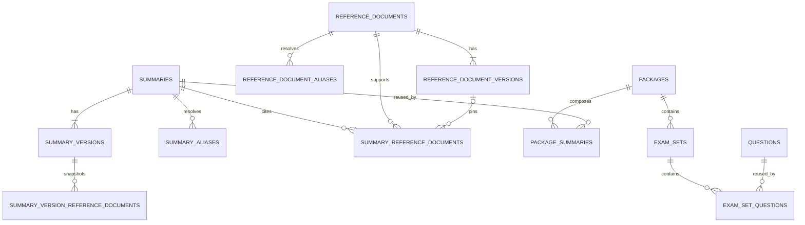

# Sobdai Knowledge Platform — Production Database Schema v1

**Status:** Proposed for database-schema review  
**Source of truth:** Knowledge Platform Architecture v1 and Production Data Model v1, both frozen  
**Scope:** Relational schema specification only  
**Excluded:** SQL, migrations, backfill scripts, application code, UI changes, and architecture redesign

## 0. Decision summary

The production schema preserves the approved three-layer model:

The key database decisions are:

1. Existing UUIDs remain internal primary keys.
2. `document_code`, `summary_code`, `package_code`, and existing `question_code` are stable business identifiers.
3. Markdown moves from `summaries` to immutable published rows in `summary_versions`.
4. Package-specific Summary state moves from `summaries` to `package_summaries`.
5. Product deletion may remove placements but may not delete shared knowledge.
6. Publishing pointers use same-parent composite foreign keys so a Summary cannot point to another Summary's revision.
7. Cross-row publication invariants are enforced by one Application Service transaction and database constraint validation; clients do not manipulate pointers directly.
8. Flashcard, LearningAsset, and LearningPath remain reserved future aggregate contracts. No speculative production tables are introduced in v1.
9. Existing Question, ExamSet, and frozen engine schemas are not remodeled.

# 1. Current database audit

## 1.1 Packages

Verified current facts:

| Concern | Current schema |
|---|---|
| Table | `public.packages` |
| Primary key | UUID `id`, generated with `uuid_generate_v4()` |
| URL identity | Globally unique, required `slug` |
| Business label | Required `package_code`; not currently unique |
| Product metadata | Name, description, difficulty, features, prices, cached counts |
| Organization context | Nullable Organization and Position foreign keys after the core refactor |
| Product coordinates | `exam_year` and `version` text |
| SEO | `seo_title`, `seo_description` |
| Publishing | Required `is_published` boolean |
| Merchandising | `featured_homepage`, `homepage_order`, logo and cover URLs |
| Relationships | One-to-many to ExamSet, current Summary, orders, and other product records |
| Current deletion | Several dependents use `ON DELETE CASCADE` |
| RLS | Enabled; policies evolved from admin-only mutation toward owner/admin/editor conventions |

## 1.2 Summaries and Markdown

Verified current facts:

| Concern | Current schema |
|---|---|
| Table | `public.summaries` |
| Primary key | UUID `id` |
| Ownership | Required `package_id` with `ON DELETE CASCADE` |
| Slug | Required and unique only as `(package_id, slug)` |
| Markdown | Required mutable `content_md` on the Summary row |
| Classification | `subject`, `topic`, `law`, and later nullable free-text `document` |
| Read time | Required mutable `read_time_minutes` |
| Publishing | Required `is_published` boolean |
| Product presentation | `sort_order`, `display_order`, and `released_at` on Summary |
| Versioning | No revision table, immutable snapshot, checksum, or publishing pointer |
| External reuse | `news_summaries` already references Summary by UUID |
| RLS | Public reads published rows; administrative mutation policy exists |

The current row combines four responsibilities: stable asset identity, mutable content, publication state, and Package placement. The frozen model separates those concerns without changing the content semantics.

## 1.3 Reference documents

- No ReferenceDocument or ReferenceDocumentVersion table exists.
- `questions.document` and `summaries.document` are nullable free text.
- There is no stable document code, source edition, issuer, effective interval, verification record, checksum, alias, or supersession relationship.
- Current free text can seed candidate records, but must not be converted automatically without editorial review.

## 1.4 Package rendering and publishing implications

- Public Package/Summary reads currently depend directly on `summaries.package_id`, `summaries.slug`, and `summaries.is_published`.
- Package publication is a boolean independent from Summary publication.
- Existing ordering is read from Summary fields, not a placement relation.
- Existing public routes therefore cannot switch atomically to the target joins without a compatibility projection or dual-read release.

## 1.5 Question and ExamSet compatibility

- `public.questions` remains a reusable aggregate with UUID identity, an existing unique immutable `question_code`, and `Draft | Review | Published` lifecycle.
- `public.exam_sets` remains Package-owned and has `draft | published | archived` lifecycle plus `document` and `subject` compatibility metadata.
- `public.exam_set_questions` is the existing many-to-many relationship with composite identity and contextual order.
- No Question, ExamSet, or assessment metadata is moved by this schema.

## 1.6 Current Supabase conventions

- Tables use the `public` schema.
- UUID v4 values currently come from `uuid-ossp`.
- Timestamps use `timestamp with time zone`, are initialized in UTC, and use an `updated_at` trigger.
- Lifecycle values generally use text plus check constraints rather than database enum types.
- RLS is enabled per table and role checks are based on `profiles` and `auth.uid()`.
- Storage references currently mix URL-style fields and bucket-specific conventions; knowledge assets need stable object references rather than expiring signed URLs.

# 2. Physical conventions

## 2.1 Naming

- Tables and columns use `snake_case`.
- Tables use plural nouns.
- Foreign-key columns use `{entity}_id`.
- Instants use `_at`; domain calendar dates use `_date`.
- Statuses use lowercase text plus check constraints for new tables.
- All new tables live in `public`, consistent with the current application.

## 2.2 Identity

- Aggregate roots and independently audited children use UUID primary keys.
- Existing UUIDs are preserved during migration.
- Business codes are required, globally unique, immutable, case-normalized, and never reused.
- Codes contain no mutable subject, year, Organization, or title meaning.
- Revision identities are `(parent_id, revision_number)` or `(parent_id, version_label)`.
- Pure placement identity is composite `(package_id, summary_id)`.

The schema should normalize business codes and slugs before persistence. Uniqueness applies to that canonical stored form. Display labels preserve authored Unicode.

## 2.3 Time and audit

Every mutable aggregate/root or relationship carries `created_at` and `updated_at`. Editorial records additionally carry the actor and lifecycle timestamps required by their workflow. All instants are `timestamptz` and represent UTC. Effective legal dates remain date values.

Actor references point to `public.profiles(id)` and use `ON DELETE SET NULL`: removal of a profile must not erase editorial history. The displayable actor name/email needed for long-term audit belongs in the audit log, not duplicated across domain tables.

## 2.4 Archive policy

Archive is lifecycle state, not a universal `deleted_at` flag.

- Published or externally referenced records are archived/retired, never hard-deleted.
- Hard delete is allowed only for never-published, unreferenced drafts.
- Archiving a root does not cascade a status mutation into historical versions.
- Archived rows retain business codes, slugs, aliases, references, and audit history.
- Storage objects remain until a separately verified retention job proves they are unreachable.

# 3. Reference Layer

## 3.1 `reference_documents`

**Purpose:** Stable identity for one authoritative source across editions, amendments, or stored representations.  
**Aggregate ownership:** ReferenceDocument aggregate root; owns versions and aliases.

### Columns

| Column | Requirement | Meaning |
|---|---|---|
| `id` | Required | UUID primary key |
| `document_code` | Required | Immutable business identifier, recommended `DOC-…` |
| `canonical_title` | Required | Current authoritative display title |
| `short_title` | Optional | Recognizable short display title |
| `document_type` | Required | Controlled source category |
| `issuer` | Required before activation | Issuing authority |
| `jurisdiction` | Required before activation | Applicable jurisdiction |
| `source_homepage_url` | Optional | Canonical publisher landing page, not a version file |
| `lifecycle_status` | Required | `active`, `superseded`, `repealed`, or `archived` |
| `superseded_by_document_id` | Conditional | Successor ReferenceDocument when identity changes |
| `created_by` | Required | Creating profile |
| `created_at`, `updated_at` | Required | Audit instants |
| `archived_at`, `archived_by` | Conditional | Archive audit |

### Keys and constraints

- Primary key: `id`.
- Business identifier: `document_code`.
- Unique: `document_code`.
- Foreign keys:
  - `superseded_by_document_id → reference_documents.id`, `ON DELETE RESTRICT`.
  - actor fields → `profiles.id`, `ON DELETE SET NULL`.
- Checks:
  - lifecycle value is in the approved set;
  - a row cannot supersede itself;
  - `superseded_by_document_id` is required only when lifecycle is `superseded`;
  - archive fields are present together when lifecycle is `archived`;
  - an active row has no archive fields.
- A new ReferenceDocument must be created atomically with its first verified ReferenceDocumentVersion. This is a transaction invariant, not a nullable-column shortcut.

### Indexes

- Unique index on `document_code`.
- Index on `(lifecycle_status, document_type)`.
- Index on `(issuer, lifecycle_status)`.
- Index on `superseded_by_document_id` when non-null.
- Search index for canonical/short title is justified for the admin document picker; it is a search optimization, not identity.

### Lifecycle and archive

Active documents may become superseded, repealed, or archived. Those transitions preserve all versions and references. A hard delete is allowed only before any publication/reference and is normally unavailable through product UI.

## 3.2 `reference_document_versions`

**Purpose:** One verified or proposed edition/representation of a ReferenceDocument.  
**Aggregate ownership:** Child of ReferenceDocument; verified versions are immutable.

### Columns

| Column | Requirement | Meaning |
|---|---|---|
| `id` | Required | UUID primary key |
| `reference_document_id` | Required | Parent document |
| `version_label` | Required | Edition/revision label unique within parent |
| `status` | Required | `draft`, `verified`, `superseded`, or `withdrawn` |
| `publication_date` | Optional | Publisher's publication date |
| `effective_from_date` | Optional | Legal/domain effective start |
| `effective_to_date` | Optional | Legal/domain effective end |
| `source_url` | Optional | Authoritative URL for this version |
| `storage_bucket` | Conditional | Supabase bucket for a stored copy |
| `storage_path` | Conditional | Immutable object path/key |
| `media_type` | Required when stored | MIME type |
| `byte_size` | Optional | Stored object size |
| `content_checksum` | Required before verification | Content digest and algorithm-qualified value |
| `supersedes_version_id` | Optional | Prior version within the same parent |
| `verification_method` | Required before verification | Editorial/source verification method |
| `verified_by`, `verified_at` | Required when verified | Verification audit |
| `created_by`, `created_at`, `updated_at` | Required | Audit |
| `withdrawn_by`, `withdrawn_at`, `withdrawal_reason` | Conditional | Withdrawal audit |

### Keys and constraints

- Primary key: `id`.
- Business address: `(reference_document_id, version_label)`.
- Unique:
  - `(reference_document_id, version_label)`;
  - `(reference_document_id, id)` to support same-parent composite references.
- Foreign keys:
  - parent → `reference_documents.id`, `ON DELETE RESTRICT`;
  - `(reference_document_id, supersedes_version_id)` → the same table's `(reference_document_id, id)`, `ON DELETE RESTRICT`;
  - actor fields → `profiles.id`, `ON DELETE SET NULL`.
- Checks:
  - status is in the approved set;
  - end date is not before start date;
  - bucket and path are both null or both present;
  - stored versions include media type and checksum;
  - verified/superseded versions have checksum, verification method, verifier, and verification time;
  - a version cannot supersede itself;
  - withdrawal fields are complete only for `withdrawn`.
- Verified content and provenance columns are immutable. Later status change to superseded does not permit content mutation.

### Indexes

- Unique index on `(reference_document_id, version_label)`.
- Index on `(reference_document_id, status, effective_from_date)`.
- Index on `supersedes_version_id` when present.
- Index on `content_checksum` for duplicate detection, not uniqueness.
- Index on `(status, verified_at)` for editorial operations.

### Lifecycle and archive

Draft may become verified or withdrawn. Verified may become superseded or withdrawn only through a reasoned editorial operation. Versions are not archived separately; root archival hides the source operationally while retaining version history.

## 3.3 `reference_document_aliases`

**Purpose:** Alternate code/title/legacy-key resolution for a ReferenceDocument. It supports import matching and stable redirects without overloading canonical identity.  
**Aggregate ownership:** Child of ReferenceDocument.

### Columns

| Column | Requirement | Meaning |
|---|---|---|
| `id` | Required | UUID audit identity |
| `reference_document_id` | Required | Alias target |
| `alias_type` | Required | `code`, `title`, or `legacy_key` |
| `alias_value` | Required | Authored/display value |
| `normalized_value` | Required | Canonical match key |
| `status` | Required | `active` or `retired` |
| `reason` | Required | Creation reason |
| `created_by`, `created_at`, `updated_at` | Required | Audit |
| `retired_by`, `retired_at` | Conditional | Retirement audit |

### Keys and constraints

- Primary key: `id`.
- Business identifier: none; the alias value is a locator, not a new document identity.
- Foreign key: `reference_document_id → reference_documents.id`, `ON DELETE RESTRICT`.
- Unique: `(alias_type, normalized_value)` across active and retired aliases. Retired locators are not reusable.
- Checks validate alias type/status, non-empty normalized value, and paired retirement fields.
- Alias targets are direct; alias chains are not representable.

### Indexes

- Unique index on `(alias_type, normalized_value)`.
- Index on `(reference_document_id, status)`.

### Lifecycle and archive

Aliases are retired, not deleted, after they have been used externally. Root archival retains all aliases.

# 4. Knowledge Layer

## 4.1 `summaries`

**Purpose:** Stable reusable Summary identity and canonical metadata.  
**Aggregate ownership:** Summary aggregate root; owns revisions, aliases, and live source relationships.

### Columns

| Column | Requirement | Meaning |
|---|---|---|
| `id` | Required | Existing/new UUID primary key |
| `summary_code` | Required after backfill | Immutable business identifier, recommended `SUM-…` |
| `canonical_slug` | Required after backfill | Globally unique public asset locator |
| `canonical_title` | Required | Current canonical display title |
| `subject` | Optional | Canonical classification |
| `topic` | Optional | Canonical classification |
| `law` | Optional | Canonical legal classification |
| `visibility` | Required | `public_indexable`, `authenticated`, or `product_entitled` |
| `lifecycle_status` | Required | `active` or `archived` |
| `current_published_version_id` | Optional | Published revision selected for unpinned reads |
| `created_by`, `created_at`, `updated_at` | Required | Audit |
| `archived_by`, `archived_at` | Conditional | Archive audit |

### Keys and constraints

- Primary key: `id`; migrated rows preserve their current UUID.
- Business identifier: `summary_code`.
- Unique:
  - `summary_code`;
  - `canonical_slug`;
  - `(id, current_published_version_id)` is not itself an identity, but the parent/revision pairing is validated by a composite foreign key.
- Foreign keys:
  - `(id, current_published_version_id)` → `summary_versions(summary_id, id)`, `ON DELETE RESTRICT`, deferred within the publish transaction;
  - actors → `profiles.id`, `ON DELETE SET NULL`.
- Checks validate visibility/status and archive field pairing.
- Cross-row invariant: the current pointer is null or targets a `published` revision of the same Summary. The same-parent part is structural; published status is checked by the publishing operation and database constraint validation.
- An active Summary may have no current published version while still in editorial preparation.

### Indexes

- Unique indexes on `summary_code` and `canonical_slug`.
- Index on `(lifecycle_status, visibility)`.
- Index on `(subject, topic, lifecycle_status)`.
- Index on `law` where present.
- Index on `current_published_version_id` where present.
- Search index over canonical title/code/classification is justified for the Library and Picker.

### Lifecycle and archive

Active may become archived. Archive removes the Summary from normal discovery and new placement but preserves revisions, aliases, Package history, and source relationships. A Summary that has ever been published or placed cannot be hard-deleted.

## 4.2 `summary_versions`

**Purpose:** Revisioned Summary content and revision-owned publishing/SEO metadata.  
**Aggregate ownership:** Child of Summary; published revisions are immutable.

### Columns

| Column | Requirement | Meaning |
|---|---|---|
| `id` | Required | UUID revision identity |
| `summary_id` | Required | Parent Summary |
| `revision_number` | Required | Positive monotonic integer within parent |
| `status` | Required | `draft`, `in_review`, `published`, or `retired` |
| `content_md` | Required before review | Markdown body |
| `content_checksum` | Required before publication | Canonical Markdown digest |
| `title_snapshot` | Required before publication | Canonical title at publication |
| `subject_snapshot`, `topic_snapshot`, `law_snapshot` | Optional | Canonical classifications at publication |
| `seo_title` | Optional | Revision-owned SEO title |
| `seo_description` | Optional | Revision-owned SEO description |
| `social_image_bucket`, `social_image_path` | Optional pair | Revision social asset |
| `read_time_minutes` | Required before publication | Derived read time |
| `read_time_policy_version` | Required before publication | Derivation policy identifier |
| `content_schema_version` | Required | Markdown/content contract version |
| `change_note` | Required before review | Editorial summary |
| `authored_by`, `created_at`, `updated_at` | Required | Authoring audit |
| `submitted_for_review_at` | Conditional | Review transition |
| `reviewed_by`, `reviewed_at` | Conditional | Review audit |
| `published_by`, `published_at` | Conditional | Publication audit |
| `retired_by`, `retired_at`, `retirement_reason` | Conditional | Retirement audit |

### Keys and constraints

- Primary key: `id`.
- Business address: `(summary_id, revision_number)`.
- Unique:
  - `(summary_id, revision_number)`;
  - `(summary_id, id)` to support same-parent publishing and pinning foreign keys;
  - at most one open revision per Summary where status is `draft` or `in_review`.
- Foreign keys:
  - `summary_id → summaries.id`, `ON DELETE RESTRICT`;
  - actors → `profiles.id`, `ON DELETE SET NULL`.
- Checks:
  - revision number is positive;
  - status is approved;
  - bucket/path are paired;
  - read time is positive when present;
  - review fields are consistent with `in_review`/later states;
  - published rows contain Markdown, checksum, snapshots, read-time policy, publisher, and publication time;
  - retirement fields are complete for `retired`.
- Publication is one-way for content: published columns cannot be edited. A replacement requires a new revision. A published row may later be marked retired without changing its content.

### Indexes

- Unique index on `(summary_id, revision_number)`.
- Partial unique index enforcing one `draft`/`in_review` row per Summary.
- Index on `(summary_id, status, revision_number desc)`.
- Index on `(status, published_at desc)`.
- Index on `content_checksum` for duplicate detection.

### Lifecycle and archive

Draft → in-review → published is the normal path. Draft/in-review may be abandoned and hard-deleted if unreferenced. Published may become retired after a replacement or explicit withdrawal, but pinned historical use must be checked first.

## 4.3 `summary_aliases`

**Purpose:** Former global Summary canonical slugs and direct redirects to the current Summary identity.  
**Aggregate ownership:** Child of Summary.

### Columns

| Column | Requirement | Meaning |
|---|---|---|
| `id` | Required | UUID audit identity |
| `summary_id` | Required | Direct alias target |
| `slug` | Required | Former global canonical slug |
| `redirect_type` | Required | `permanent` or `temporary` |
| `status` | Required | `active` or `retired` |
| `reason` | Required | `rename`, `merge`, `correction`, or `migration` |
| `created_by`, `created_at`, `updated_at` | Required | Audit |
| `retired_by`, `retired_at` | Conditional | Retirement audit |

### Keys and constraints

- Primary key: `id`.
- Business identifier: none.
- Foreign key: `summary_id → summaries.id`, `ON DELETE RESTRICT`.
- Unique: `slug`; former slugs are never reassigned.
- Checks validate redirect type, status, reason, and retirement pairing.
- An alias cannot equal its target's canonical slug. Collision between any canonical slug and any alias is guarded by the Summary rename/create transaction and database constraint validation because it spans two tables.
- Alias chains are impossible because aliases target Summary IDs, not other aliases.

### Indexes

- Unique index on `slug`.
- Index on `(summary_id, status)`.

### Lifecycle and archive

Aliases are retired rather than deleted after external use. Archiving a Summary retains its aliases so old URLs resolve to the correct archived/not-available response.

## 4.4 `summary_reference_documents`

**Purpose:** Live source relationship between a Summary and a ReferenceDocument, optionally pinned to a specific verified version.  
**Aggregate ownership:** Child relationship owned by Summary.

### Columns

| Column | Requirement | Meaning |
|---|---|---|
| `id` | Required | UUID relationship identity |
| `summary_id` | Required | Owning Summary |
| `reference_document_id` | Required | Source identity |
| `reference_document_version_id` | Optional | Explicit source-version pin |
| `role` | Required | `primary` or `supporting` |
| `coverage_note` | Optional | Scope/coverage explanation |
| `sort_order` | Required | Source display/order context |
| `created_by`, `created_at`, `updated_at` | Required | Audit |

### Keys and constraints

- Primary key: `id`.
- Business identifier: none.
- Foreign keys:
  - `summary_id → summaries.id`, `ON DELETE RESTRICT`;
  - `reference_document_id → reference_documents.id`, `ON DELETE RESTRICT`;
  - `(reference_document_id, reference_document_version_id)` → `reference_document_versions(reference_document_id, id)`, `ON DELETE RESTRICT`;
  - actor → `profiles.id`, `ON DELETE SET NULL`.
- Unique:
  - one unpinned relationship per `(summary_id, reference_document_id)`;
  - one pinned relationship per `(summary_id, reference_document_id, reference_document_version_id)`.
- Checks validate role and require any pinned version to belong to the selected document through the composite foreign key.

### Indexes

- Index on `(summary_id, sort_order, id)`.
- Reverse index on `(reference_document_id, summary_id)`.
- Index on `reference_document_version_id` where present.
- Index on `(summary_id, role)`.

### Lifecycle and archive

The live relationship can be removed from an active draft aggregate. Published historical meaning is preserved in the version snapshot table. Source/root archival does not delete either live or snapshot relationships.

## 4.5 `summary_version_reference_documents`

**Purpose:** Immutable relational snapshot of source relationships used by a particular SummaryVersion. This implements the frozen revision snapshot requirement without embedding unvalidated JSON.  
**Aggregate ownership:** Child of SummaryVersion inside the Summary aggregate.

### Columns

| Column | Requirement | Meaning |
|---|---|---|
| `id` | Required | UUID snapshot identity |
| `summary_version_id` | Required | Owning revision |
| `reference_document_id` | Required | Snapshotted source |
| `reference_document_version_id` | Optional | Snapshotted source version |
| `role` | Required | Snapshotted primary/supporting role |
| `coverage_note` | Optional | Snapshotted coverage text |
| `sort_order` | Required | Snapshotted order |
| `created_at` | Required | Snapshot creation time |

### Keys and constraints

- Primary key: `id`.
- Business identifier: none.
- Foreign keys:
  - `summary_version_id → summary_versions.id`, `ON DELETE CASCADE` only so an unreferenced draft revision can be discarded;
  - document and same-parent version references use `ON DELETE RESTRICT`.
- Unique follows the same pinned/unpinned rules as the live relation.
- Role is checked against `primary | supporting`.
- Rows are immutable once the parent revision is published.

### Indexes

- Index on `(summary_version_id, sort_order, id)`.
- Reverse indexes on `reference_document_id` and `reference_document_version_id`.

### Lifecycle and archive

The row shares its revision lifecycle. It is never independently archived. Parent hard deletion is allowed only for an eligible draft; published parent deletion remains prohibited.

## 4.6 Current Question compatibility

**Table:** `public.questions`  
**Purpose:** Existing reusable assessment Question aggregate.  
**Ownership:** Independent Question aggregate root; ExamSets reference rather than own it.

- Primary key: UUID `id`.
- Business identifier: existing nullable-during-transition, unique and immutable `question_code`.
- Foreign keys: none added by the Knowledge Platform.
- Unique constraints: existing unique index on non-null `question_code`.
- Check constraints: existing correct-answer, difficulty, `Draft | Review | Published` lifecycle, blueprint type, learning objective, and question pattern vocabularies remain authoritative.
- Indexes: existing question-code and partial frozen-axis indexes remain; current usage-count RPC derives usage from `exam_set_questions` and does not duplicate counts.
- Lifecycle: existing `Draft | Review | Published` contract remains.
- Archive/delete: no new archive state is introduced. Existing usage-aware operational delete guard remains required; Knowledge Platform integration must not cascade-delete Questions.
- Existing free-text `document` remains compatibility metadata; it is not automatically converted into a ReferenceDocument foreign key.

Adding an optional ReferenceDocument association for Questions would be a future approved extension, not part of this schema translation.

## 4.7 Future Flashcard and LearningAsset compatibility

No `flashcards` or `learning_assets` production table is created in v1 because their detailed frozen domain contracts do not yet exist. Premature columns, generic payload JSON, or a polymorphic `knowledge_assets` authority table would redesign the approved type-owned aggregate approach.

Reserved compatibility rules for a later approved schema:

- UUID primary key and immutable business code;
- type-owned lifecycle and versioning;
- reusable independently from Products;
- Product linkage through a typed junction;
- ReferenceDocument linkage through an explicit typed relation;
- no dependency on Summary table identity;
- Application Layer projections may expose a common Knowledge Asset read interface.

# 5. Product Layer

## 5.1 `packages`

**Purpose:** Existing commercial Product aggregate root.  
**Aggregate ownership:** Package owns its placement relationships but not Summaries.

### Target treatment

The current table remains authoritative for existing Package fields. The schema change required by the frozen data model is to make `package_code` a unique, immutable business identifier after collision review and backfill.

### Keys and constraints

- Primary key: existing UUID `id`.
- Business identifier: `package_code`.
- Unique: existing global `slug`; target global `package_code`.
- Existing Organization/Position foreign keys and commercial constraints remain.
- Existing publication boolean remains for compatibility.
- Package code immutability is enforced after the data is clean.

### Indexes

- Unique indexes on `slug` and target `package_code`.
- Indexes on Organization/Position product discovery fields.
- Index on `(is_published, featured_homepage, homepage_order)` for storefront reads.
- Additional Package indexes should follow measured query plans; existing cached counts are not expanded for the Knowledge Platform.

### Lifecycle and archive

The current `is_published` model remains. Historical Packages with orders or published content are unpublished and retained rather than hard-deleted. A later Package lifecycle redesign is out of scope.

## 5.2 `package_summaries`

**Purpose:** Product-owned placement of a reusable Summary in one Package.  
**Aggregate ownership:** Child of Package; Summary is referenced, not owned.

### Columns

| Column | Requirement | Meaning |
|---|---|---|
| `package_id` | Required | Owning Package |
| `summary_id` | Required | Reused Summary |
| `status` | Required | `draft`, `active`, or `hidden` |
| `version_policy` | Required | `latest_published` or `pinned` |
| `pinned_summary_version_id` | Conditional | Required only for pinned policy |
| `sort_order` | Required | Package-local ordering |
| `display_order` | Required | Existing merchandising ordering compatibility |
| `released_at` | Optional | Package-local release instant |
| `navigation_label` | Optional | Package-specific display label |
| `legacy_slug` | Optional | Migrated Package-scoped Summary slug |
| `created_by`, `created_at`, `updated_at` | Required | Audit |
| `activated_by`, `activated_at` | Conditional | Activation audit |
| `hidden_by`, `hidden_at` | Conditional | Hide audit |

### Keys and constraints

- Primary key and business identity: `(package_id, summary_id)`.
- Foreign keys:
  - `package_id → packages.id`, `ON DELETE CASCADE`;
  - `summary_id → summaries.id`, `ON DELETE RESTRICT`;
  - `(summary_id, pinned_summary_version_id)` → `summary_versions(summary_id, id)`, `ON DELETE RESTRICT`;
  - actors → `profiles.id`, `ON DELETE SET NULL`.
- Unique: `(package_id, legacy_slug)` when `legacy_slug` is present.
- Checks:
  - status and version policy are approved;
  - pinned policy requires a pinned revision;
  - latest-published policy requires a null pin;
  - activation/hide audit fields match status.
- Cross-row activation invariants:
  - active placement references an active Summary;
  - latest policy resolves a published current pointer;
  - pinned policy targets a published, non-invalidated revision of the same Summary.
  These are validated in the Application Service transaction and by database constraint validation.

### Indexes

- Primary-key index `(package_id, summary_id)`.
- Ordered public-read index on `(package_id, status, display_order, sort_order, summary_id)`.
- Reverse index on `(summary_id, package_id)`.
- Index on `pinned_summary_version_id` where present.
- Unique partial index on `(package_id, legacy_slug)` where present.
- Index on `(package_id, released_at)` for release-aware Package reads.

### Lifecycle and archive

Draft may become active; active may become hidden; hidden may be reactivated if invariants still hold. Product hard deletion may cascade only this placement. Summary deletion is restricted. Placement history needed for audit should also be recorded in the platform audit log; the row itself is the current Package composition.

## 5.3 Current ExamSet compatibility

### `public.exam_sets`

**Purpose:** Existing Package-owned assessment Product composition.  
**Ownership:** Existing child/product aggregate under Package; contract unchanged.

- Primary key: UUID `id`.
- Business identifier: UUID compatibility identity; no new business code.
- Foreign key: required `package_id → packages.id`, existing `ON DELETE CASCADE`.
- Unique constraints: none added by the Knowledge Platform.
- Check constraints: current `exam_type` is `document | simulation`; status is `draft | published | archived`; existing duration and passing-score rules remain.
- Indexes: current status index and Package lookup path remain; Package/order index changes require measured need.
- Lifecycle/archive: existing `draft | published | archived`. Archived ExamSets and those with user history should be retained; the current cascade is recorded as a compatibility behavior, not extended to knowledge records.

### `public.exam_set_questions`

**Purpose:** Existing ordered many-to-many membership between ExamSet and Question.  
**Ownership:** Relationship owned by ExamSet.

- Primary/business identity: composite `(exam_set_id, question_id)`.
- Foreign keys: ExamSet and Question references both currently use `ON DELETE CASCADE`.
- Unique constraints: composite primary key prevents duplicate membership.
- Check/publish constraints: unique `sort_order` per ExamSet and at least one Question are currently publication validations rather than persistent row checks.
- Indexes: primary-key path serves ExamSet membership; reverse Question usage is derived from this table.
- Lifecycle/archive: no independent status. The relationship follows ExamSet composition; archive of an ExamSet retains membership, while actual parent deletion currently removes it.

This schema does not introduce Summary ownership into ExamSet or alter frozen assessment contracts. If an ExamSet later references knowledge assets, that requires a separately approved typed relationship.

## 5.4 Future LearningPath compatibility

No `learning_paths` table is created in v1. Its future approved schema must follow the Product pattern:

- independent UUID and business code;
- Product-owned typed placement rows;
- references Knowledge Assets without owning them;
- version policy expressed at the placement where required;
- compatibility exposed through Application Layer projections.

# 6. Relationship and referential-action matrix

| Parent | Child/reference | Cardinality | Delete action | Archive behavior |
|---|---|---:|---|---|
| ReferenceDocument | ReferenceDocumentVersion | 1:N, at least one verified at root creation | Restrict | Versions retained |
| ReferenceDocument | ReferenceDocumentAlias | 1:N | Restrict | Aliases retained |
| ReferenceDocument | successor ReferenceDocument | 0..1 successor | Restrict | Supersession retained |
| ReferenceDocument | SummaryReferenceDocument | 1:N referenced by | Restrict | Relationship retained |
| ReferenceDocumentVersion | Summary source pin/snapshot | 1:N referenced by | Restrict | Historical pins retained |
| Summary | SummaryVersion | 1:N | Restrict except eligible draft disposal through service | Revisions retained |
| Summary | SummaryAlias | 1:N | Restrict | Aliases retained |
| Summary | SummaryReferenceDocument | 1:N | Restrict | Live relation retained unless explicitly edited before archive |
| Summary | PackageSummary | 1:N referenced by | Restrict | Placement hidden/retained according to Product action |
| Package | PackageSummary | 1:N | Cascade | Unpublishing does not delete placements |
| SummaryVersion | current pointer | 0..1 selected by Summary | Restrict | Pointer remains until explicit replacement/archive policy |
| SummaryVersion | PackageSummary pin | 1:N referenced by | Restrict | Pin retained |
| SummaryVersion | source snapshots | 1:N | Cascade only for eligible draft deletion | Published snapshots retained |
| Package | ExamSet | Existing 1:N | Existing cascade | Existing behavior |
| ExamSet | ExamSetQuestion | Existing 1:N | Existing cascade | Existing behavior |
| Question | ExamSetQuestion | Existing 1:N | Existing cascade, guarded operationally by usage checks | Existing behavior |

No new `ON DELETE SET NULL` is used for domain relationships where null would destroy meaning. `SET NULL` is limited to actor references.

# 7. Versioning and publishing mechanics

## 7.1 Summary publication

One atomic Application Service transaction:

1. locks the Summary and candidate SummaryVersion;
2. validates required Markdown, checksum, metadata snapshots, source snapshots, and review evidence;
3. changes the candidate revision to `published` and records publisher/time;
4. sets `summaries.current_published_version_id` to that same-parent revision;
5. writes the audit event;
6. commits both changes together.

The previous published revision remains immutable and addressable. It is not silently changed to retired merely because a successor publishes. Retirement is explicit and must first consider Package pins.

## 7.2 Draft revision rules

- Revision number is allocated monotonically within a locked Summary aggregate.
- At most one revision is in `draft` or `in_review` for a Summary.
- Creating a draft copies the current canonical metadata and live sources into editable snapshots.
- Draft edits never mutate the public current pointer.

## 7.3 Package resolution

- `latest_published`: resolve `summaries.current_published_version_id` at read time.
- `pinned`: resolve `package_summaries.pinned_summary_version_id`.
- The composite foreign key prevents cross-Summary pins.
- Activation fails if the resolved revision is not publishable under the frozen rules.

## 7.4 ReferenceDocument versioning

- A new ReferenceDocument and first verified version are committed together.
- Later editions begin as drafts.
- Verification freezes source identity, checksum, dates, storage reference, and provenance.
- `supersedes_version_id` must point inside the same ReferenceDocument.
- Document-level `superseded_by_document_id` is used only when the stable document identity itself changes.
- ReferenceDocument has no generic “current version” pointer in v1. A Summary source relationship either cites the stable document or explicitly pins a verified source version; effective dates and supersession lineage must not be collapsed into a misleading latest-row rule.

## 7.5 “Latest published” is a pointer, not a query heuristic

The database does not infer current content with `max(revision_number)` or most recent timestamp. The explicit parent pointer controls unpinned reads, supports rollback to a prior valid revision, and removes ordering ambiguity.

# 8. Metadata ownership

| Metadata | Sole authority |
|---|---|
| Summary canonical title | `summaries.canonical_title` |
| Summary canonical slug | `summaries.canonical_slug` |
| Summary subject/topic/law | `summaries` |
| Summary visibility and archive | `summaries` |
| Markdown | `summary_versions.content_md` |
| Revision SEO title/description/social image | `summary_versions` |
| Read time and its policy version | `summary_versions` |
| Revision publication status/time | `summary_versions` |
| Package-specific order | `package_summaries` |
| Package-specific visibility/release/navigation label | `package_summaries` |
| Legacy Package-scoped Summary slug | `package_summaries.legacy_slug` |
| Package title, slug, SEO, commercial publishing | `packages` |
| ReferenceDocument identity/title/type/issuer/jurisdiction | `reference_documents` |
| Source dates/file/checksum/verifier | `reference_document_versions` |

Snapshot columns are immutable historical evidence. They do not compete with the current authority.

# 9. Supabase and RLS design

## 9.1 Ownership boundaries

RLS is enabled on every new table. Policies align to aggregate boundaries:

- owner/admin/editor: create and mutate ReferenceDocument, Summary, revisions, aliases, source relations, and placements through approved application commands;
- support: read/preview only where existing RBAC permits;
- public/anonymous: only published projections allowed by Summary visibility and Product state;
- authenticated/product-entitled: body access only when entitlement and active placement resolve to the requested published revision.

Writes that perform publication, pinning, alias changes, or multi-row lifecycle transitions must use a trusted Application Service/RPC or server transaction. Direct client updates to publishing pointers and immutable rows are denied even to normal editorial UI sessions.

## 9.2 Read-policy outline

| Table | Public read rule |
|---|---|
| `reference_documents` | No unrestricted base-table read required; expose approved source metadata through public Summary projection |
| `reference_document_versions` | No unrestricted base-table read; expose verified citation fields only |
| aliases | Resolver may read active aliases through a narrow security-aware function/view |
| `summaries` | Active plus visibility permitted for the route/use case |
| `summary_versions` | Only the resolved published revision when visibility/entitlement permits |
| `summary_reference_documents` | Only through approved Summary projection |
| `package_summaries` | Active placement under a published, visible Package |
| snapshot tables | Only through the parent published Summary projection |

RLS must not depend on user-controlled metadata or on a materialized view that bypasses base-table policy. Security-definer operations use a locked search path and expose only bounded commands.

## 9.3 Storage references

- Store `bucket` plus immutable `path`, not signed URLs.
- Reference source copies use a dedicated private bucket.
- Summary social assets use a controlled media bucket whose public/private mode matches visibility.
- Object paths include stable UUIDs/revision UUIDs, not titles or mutable slugs.
- Checksums are stored in the version row.
- Archiving a database record does not remove its object.
- Object deletion occurs only after a reachability and retention check across current pointers, Package pins, and historical snapshots.

## 9.4 UUID and timestamps

Continue existing UUID v4 generation for compatibility; switching UUID generation technology is not required by this design. New timestamps use `timestamptz` with database-generated UTC instants. Clients do not author lifecycle instants.

# 10. Read optimization

## 10.1 Required relational indexes

The table sections define the initial production indexes. They cover:

- business-code and slug lookup;
- parent/revision lookup;
- active Library/Picker filters;
- Package placement ordering;
- reverse reuse/source lookups;
- current and pinned revision resolution;
- editorial lifecycle queues.

Index creation must be checked against actual query plans and data volume during migration design. Low-selectivity single-column status indexes are avoided unless paired with a useful leading scope.

## 10.2 Read models

Read models are projections, never write authorities:

| Consumer | Projection |
|---|---|
| Summary Library | Summary root + current revision editorial state + Package placement count + source count |
| Summary Picker | Summary ID/code/title/classification/status/current-published availability; no Markdown |
| Public Package | Published Package + active placements + resolved pinned/current revision metadata/body |
| Public Summary | Active Summary + permitted current revision + aliases + approved citations |
| Recommendation ContentStore | Summary UUID as content ID, type `summary`, title, canonical slug, deterministic eligible Package ID or null, subject/topic, difficulty null; no Markdown |

Start with parameterized queries or security-invoker views over normalized tables. Do not create materialized views initially unless measurements demonstrate a problem.

Potential later projections:

- A refreshable Summary Library projection is justified only when aggregate counts/search become expensive.
- A Public Package projection is justified only when high-volume join and RLS costs cannot be solved with indexes/cache.
- Recommendation results are user/context sensitive and should not be globally materialized as entitlement-blind rows.

Any projection stores `refreshed_at`/source revision information, is rebuildable, and cannot be used for mutation or lifecycle decisions.

# 11. Schema compatibility matrix

| Current element | Target element | Compatibility | Backfill/action required | Removal timing |
|---|---|---|---|---|
| `packages.id` | `packages.id` | Non-breaking preservation | None | Never |
| `packages.slug` | Same | Non-breaking | Preserve | Never |
| non-unique `packages.package_code` | unique immutable business code | Tightening/breaking if duplicates exist | Audit, resolve blanks/duplicates, then enforce | Existing column retained |
| `packages.is_published` | Same | Non-breaking preservation | None | No removal in v1 |
| `summaries.id` | `summaries.id` stable asset ID | Non-breaking preservation | Preserve UUID | Never |
| `summaries.package_id` | `package_summaries.package_id` | Additive first, breaking on removal | Create one placement per current Summary | Remove only after all readers cut over |
| `summaries.title` | `summaries.canonical_title` + version snapshot | Compatible rename/copy | Copy canonical title; snapshot revision | Legacy field removed after cutover |
| Package-scoped `summaries.slug` | global canonical slug + `package_summaries.legacy_slug` | Potentially breaking | Copy legacy slug; allocate collision-free canonical slug; create aliases where needed | Legacy slug authority removed after redirects verified |
| `summaries.content_md` | `summary_versions.content_md` | Additive then breaking | Create revision 1 with checksum and provenance | Remove after dual-read validation |
| `summaries.read_time_minutes` | revision read time | Additive then breaking | Copy/recompute with policy version | Remove after cutover |
| `summaries.is_published` | version status + current pointer | Additive then breaking | Published row → published revision/current pointer; unpublished → draft | Remove after publication commands cut over |
| Summary ordering fields | `package_summaries` order/release | Additive then breaking | Copy per placement | Remove after Package readers cut over |
| Summary subject/topic/law | Summary root + revision snapshot | Non-breaking | Preserve root; copy snapshots | Root retained |
| `summaries.document` free text | ReferenceDocument relation | Semantically ambiguous | Inventory, match/review, create source entities only when verified | Keep compatibility field until editorial migration complete |
| `news_summaries.summary_id` | Same Summary UUID | Non-breaking | None if IDs preserved | Never |
| No revision tables | New version tables | Non-breaking addition | Backfill initial versions | N/A |
| No aliases | New alias tables | Non-breaking addition | Backfill legacy/global redirects | N/A |
| No PackageSummary | New junction | Non-breaking addition | Backfill from `summaries.package_id` | N/A |
| Existing direct Summary RLS | Aggregate-aware RLS | Behavior-breaking | Shadow-test public, staff, entitled, and denied cases | Switch with reader cutover |
| Package cascade deleting Summaries | Cascade only placements; restrict knowledge | Intentional behavior change | Stop new destructive path before shared reuse | Old FK removed only after cutover |
| Questions/ExamSets | Same tables/contracts | Non-breaking | None | Never |
| Future Flashcard/LearningAsset/LearningPath | No v1 tables | Compatible boundary | None | Future approved schema |

## 11.1 Required migration phases implied by the schema

This is readiness guidance, not a migration design:

1. Add target tables and nullable target columns.
2. Audit Package codes and Summary slug collisions.
3. Backfill Summary roots, revision 1, pointers, and Package placements while preserving UUIDs.
4. Curate ReferenceDocuments from free text; do not auto-assert source identity.
5. Dual-write through the Application Service and compare old/new read projections.
6. Switch admin publishing and placement commands.
7. Switch public Package/Summary readers and Recommendation ContentStore adapter.
8. Observe, reconcile, and only then retire legacy Summary columns/foreign key.

# 12. Breaking changes and rollback boundary

Intentional breaking changes at final cutover:

- Summary is no longer owned by one Package.
- Summary Markdown is no longer mutable on the root row.
- Summary publication is no longer a boolean on the root row.
- Package-scoped Summary slug is no longer the canonical Knowledge identity.
- Package deletion can no longer cascade into shared Summary deletion.
- Direct table reads must satisfy aggregate-aware RLS.

Before legacy columns are removed, rollback is a reader/writer feature switch back to the legacy projection while target rows remain intact. After legacy column removal, rollback requires a forward corrective release or a separately rehearsed restore; therefore destructive cleanup is a distinct, delayed phase.

# 13. Risks and controls

| Risk | Impact | Control |
|---|---|---|
| Over-normalized public reads | More joins and RLS evaluation | Composite indexes, Application Layer query projections, cache; materialize only after measurement |
| Competing metadata authority | Drift between root, revision, and placement | Ownership matrix; snapshot fields immutable and explicitly named |
| Cross-table slug collision | Canonical and alias routes conflict | One rename/create transaction plus cross-table validation and collision audit |
| Publishing pointer race | Wrong latest revision or duplicate open drafts | Aggregate lock, partial unique open-revision constraint, atomic publish transaction |
| Invalid pinned revision | Package exposes wrong/unpublished content | Same-parent composite FK plus activation validation |
| Source over-claim during migration | Free text becomes falsely authoritative | Editorial matching queue; no automatic verified source creation |
| Package code duplicates | Unique constraint cannot be introduced | Pre-constraint audit and deterministic remediation approval |
| RLS join cost or recursion | Slow/incorrect reads | Narrow indexed predicates, server commands for complex transitions, policy tests by persona |
| RLS/materialized-view leakage | Entitled content exposed | No public entitlement-blind materialization; security-invoker projections or server-only refresh tables |
| Storage/database divergence | Broken citations or leaked files | Bucket/path references, checksum, outbox/reconciliation, reachability-based deletion |
| Cascade loss | Shared/historical data destroyed | Restrict all knowledge-side deletes; cascade only Product-owned placements and eligible draft children |
| Revision growth | Larger tables/indexes | Parent-scoped indexes, retention of immutable history, partition only after measured need |
| Dual-write inconsistency | Legacy and target reads disagree | Idempotent commands, reconciliation reports, cutover gates, delayed legacy removal |
| Future generic-asset pressure | Premature polymorphic schema weakens integrity | Keep future aggregates type-owned; unify only in read/Application Layer contracts |

# 14. Review and freeze checklist

The schema is ready to freeze when reviewers approve:

- physical table and column names;
- business-code uniqueness and immutability;
- lifecycle values and transition invariants;
- same-parent composite foreign-key approach;
- separate live and revision-snapshot source relations;
- PackageSummary pinning and delete behavior;
- actor/audit retention;
- RLS visibility/entitlement boundaries;
- Storage bucket/path policy;
- compatibility matrix and delayed destructive cleanup.

Approval of this document authorizes a later SQL migration design. It does not authorize SQL, migration execution, backfills, or application implementation.
