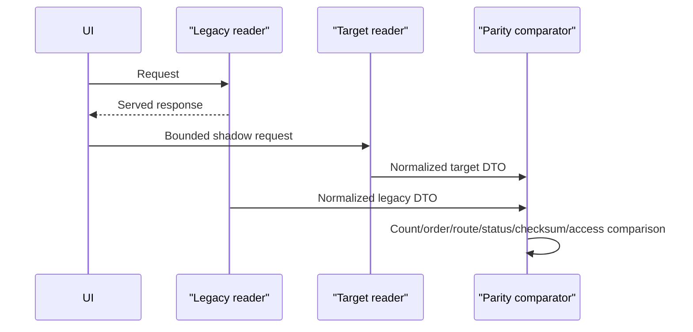

# Sobdai Knowledge Platform — Production Migration Strategy v1

**Status:** Proposed for migration review  
**Inputs:** Knowledge Platform Architecture v1, Data Model v1, and Database Schema v1 — frozen  
**Scope:** Production migration strategy only  
**Excluded:** SQL, migration files, backfill code, application implementation, and architectural redesign

# 0. Executive decision

Use an expand–migrate–contract migration:

1. characterize production and establish recovery;
2. add the frozen schema without removing legacy fields;
3. produce a lossless one-to-one backfill with no automatic deduplication;
4. shadow-read the target while serving legacy results;
5. route every compatible mutation through one atomic dual-write Application Service;
6. cut consumers over independently behind flags;
7. preserve the legacy representation through an observation window;
8. perform destructive cleanup only as a separately approved final operation.

The initial cutover does not enable target-only behavior that the legacy schema cannot represent. In particular, multi-Package reuse, Package-independent creation, and new canonical public routing remain disabled until the read/write rollback window closes.

This provides no application downtime under normal conditions. Short database lock risk must still be assessed during later migration design; high-risk constraint validation and index construction are scheduled separately from the additive table deployment.

# 1. Verified current-state audit

This audit distinguishes repository facts from facts that require a live production inventory. No production row counts, duplicate rates, or deployed-schema drift are assumed.

## 1.1 Current Package storage and relationships

Verified from repository migrations:

- `public.packages` has UUID primary key `id`, globally unique `slug`, required but currently non-unique `package_code`, commercial metadata, Organization/Position foreign keys, SEO title/description, and `is_published`.
- Package has direct one-to-many relationships from current Summaries and ExamSets.
- Current `summaries.package_id` and `exam_sets.package_id` are required and use cascade-on-Package-delete.
- Orders retain user-to-Package purchase facts independently of this migration.
- Knowledge Platform migration does not change `auth.users`, `profiles`, orders, payment data, Question, ExamSet, or attempt/result tables.

## 1.2 Current Summary storage

Verified from `005_summary_bank.sql` and later additive migrations:

- `public.summaries.id` is the UUID identity.
- Each row requires exactly one `package_id`.
- Slug uniqueness is only `(package_id, slug)`.
- Mutable Markdown is stored in `summaries.content_md`.
- Title, subject, topic, law, and free-text document metadata are on the same row.
- Read time is stored in `read_time_minutes`.
- Publication is one boolean, `is_published`.
- Package-local ordering/release is stored as `sort_order`, `display_order`, and `released_at`.
- There is no revision table, checksum, immutable publication snapshot, canonical global slug, business code, or normalized source relationship.
- `news_summaries` references the existing Summary UUID.

## 1.3 Current public Package rendering

Verified from `app/package/[slug]/page.tsx` and `components/SummaryNavigation.tsx`:

- Package resolution uses `packages.slug`.
- Published Summary cards are queried directly from `summaries` using `package_id` plus `is_published = true`.
- Ordering is database-side: `display_order` descending, then `released_at`, `updated_at`, and `created_at` descending.
- Summary links are `/package/{packageSlug}/summary/{summarySlug}`.
- Draft Package access is explicitly allowed only to owner/admin in the Package page; otherwise it returns not-found.
- Package metadata emits a canonical Package URL and currently derives title/description from Package name/description rather than stored SEO overrides.

## 1.4 Current Summary page and access workflow

Verified from `app/package/[slug]/summary/[summarySlug]/page.tsx`:

- The body route first resolves Package by Package slug.
- It resolves Summary by `(package_id, summarySlug)`.
- It requires `summary.is_published`.
- Anonymous visitors receive a login prompt.
- Authenticated staff roles listed by the page or a user with a completed Package order receive body access.
- Previous/next navigation queries the same Package's published Summaries using the existing ordering chain.
- Metadata lookup currently queries Summary by slug alone, without Package scope; a duplicate Package-scoped slug can make this lookup ambiguous.
- Summary metadata always sets `noindex, nofollow`.
- The Package-scoped Summary URL is currently emitted as its canonical metadata URL.

## 1.5 Current Admin workflow

Verified from the Summary admin pages, editor, import actions, and server actions:

- The Summary Bank lists Summary rows joined to exactly one Package.
- It filters by Package, boolean publication state, Subject, and free-text Document.
- Create/edit combines Package selection, canonical-looking title/slug fields, classification, Markdown, ordering, and a Publish checkbox in one form.
- The client calculates read time from Markdown at save time.
- `createSummary` inserts the submitted row directly.
- `updateSummary` mutates the existing row in place.
- `toggleSummaryPublish` updates only `is_published`.
- `deleteSummary` physically deletes the row.
- Import resolves Package by slug or package code, detects duplicates by `(package_id, slug)`, and either overwrites the row or creates a suffixed slug.
- The server actions are guarded by Application permissions: content write, publish, or delete.
- Current action payloads are broadly typed and passed directly to Supabase; the migration Application Service must introduce explicit command shapes before dual-write.

## 1.6 Current RLS and Supabase behavior

Verified from migrations and Supabase client construction:

- RLS is enabled on Packages, Summaries, Questions, ExamSets, and junction tables.
- Published Summary rows are publicly selectable.
- Package RLS currently permits public selection without checking `is_published`; Package pages and other application queries perform the publication check.
- Owner/admin/editor can manage Summary rows under the later RBAC-alignment policy.
- Owner/admin/editor have content mutation policies on Packages, Questions, and ExamSets; destructive permissions are narrower in the application permission layer.
- Normal server pages/actions use the cookie-bound anon-key Supabase client, so user JWT and RLS apply.
- A separate service-role client exists and bypasses RLS; it is documented for backend-only use.
- UUID v4, `timestamptz`, text check constraints, and `updated_at` triggers are current conventions.
- Supabase Storage has bucket-specific usage elsewhere, but Summary Markdown is currently in the database rather than Storage.

## 1.7 Current Summary read consumers

Repository search verified these consumers:

| Consumer | Current dependency |
|---|---|
| Public Package page | `summaries.package_id`, boolean publication, legacy ordering fields |
| Public Summary page | Package-scoped slug, root Markdown, read time, boolean publication |
| Summary metadata | Unscoped Summary slug query |
| Summary navigation | Package-scoped list and legacy slug |
| Admin Summary Bank/editor/import | Direct root reads/writes and Package ownership |
| My Packages | Nested Package→Summaries relation and published Summary count |
| Admin dashboard | Direct Summary count |
| News related content | `news_summaries` → Summary → current owning Package |
| Recommendation `SummaryProvider` | Published Summary root fields including `package_id` |
| Assessment target enrichment | Published Summary root fields plus Package slug lookup |

The last two paths both construct the frozen Summary target from current root fields. They must change implementation together or use one compatibility ContentStore adapter, while their external Recommendation/Assessment contracts remain unchanged.

## 1.8 Current cache and SEO facts

- Summary and Package mutations call `revalidatePath`, but several Summary actions pass a Package UUID where the public route expects a Package slug.
- There is no repository-wide `revalidateTag` strategy.
- News detail pages use a five-minute revalidation window and related Summary data.
- Homepage and Package-list surfaces also use timed revalidation in parts of the application.
- Dynamic Packages and Summaries are not currently included in the sitemap; dynamic sitemap entries currently cover published News.
- `robots.ts` generally allows crawling, while page metadata controls Summary no-indexing.

## 1.9 Production facts that must be measured in Phase 0

The repository cannot verify:

- live row counts and table sizes;
- whether every repository migration is deployed;
- duplicate or blank Package codes;
- global Summary slug collisions;
- exact/probable duplicate Markdown;
- orphaned or inconsistent rows introduced outside repository paths;
- direct/manual/API writers not represented in the codebase;
- production query latency and lock budget;
- existing search-engine indexing outside the declared metadata policy;
- actual cache/CDN behavior in the deployed environment.

These are mandatory Phase 0 outputs, not assumptions.

## 1.10 Audit evidence map

| Fact area | Repository evidence |
|---|---|
| Founding Package/Question/ExamSet schema and RLS | `supabase/migrations/001_init_admin_schema.sql` |
| Current Summary storage and Package ownership | `supabase/migrations/005_summary_bank.sql` |
| Package Organization/Position metadata | `supabase/migrations/006_core_architecture_refactor.sql` |
| Current RBAC-aligned RLS roles | `supabase/migrations/010_rbac_rls_alignment.sql` |
| Package publication boolean | `supabase/migrations/012_package_publish_flow.sql` |
| Free-text Document metadata | `supabase/migrations/019_document_metadata.sql` |
| Summary/ExamSet ordering and release | `supabase/migrations/019_display_order.sql` |
| Question codes and ExamSet lifecycle | `supabase/migrations/026_exam_set_foundation.sql` |
| Frozen Question axes/indexes | `supabase/migrations/027_question_ig2_axes.sql` |
| News→Summary relationship and RLS | `supabase/migrations/032_news_relations.sql` |
| Public Package/Summary reads and access | `app/package/[slug]/page.tsx`, `app/package/[slug]/summary/[summarySlug]/page.tsx` |
| Summary admin reads/writes/import | `app/admin/summaries/**`, `components/admin/SummaryEditor.tsx` |
| Recommendation Summary reads | `lib/recommendation/providers/summary-provider.ts`, `app/assessment/actions.ts` |
| Supabase user/service clients | `lib/supabase/server.ts`, `lib/supabase/admin.ts` |
| Application permissions | `lib/auth/rbac.ts`, `lib/auth/server-protect.ts` |
| Metadata/sitemap policy | `lib/seo.ts`, `app/sitemap.ts`, `app/robots.ts` |

# 2. Migration invariants

Every phase must maintain:

1. Existing Package UUIDs and slugs are unchanged.
2. Existing Summary UUIDs remain the Summary root IDs.
3. Every existing legacy Summary URL continues to resolve with the same access semantics.
4. Legacy Markdown remains byte-recoverable until destructive cleanup.
5. Users, profiles, orders, entitlements, Questions, ExamSets, and assessment history are untouched.
6. News relationships keep their Summary UUID unless a later human-approved consolidation explicitly repoints them.
7. Recommendation outputs retain their frozen shape and Summary content IDs.
8. No free-text Document value becomes an authoritative ReferenceDocument without review.
9. No automated deduplication merges Summary identities.
10. A phase cannot advance while reconciliation has unexplained mismatches.

# 3. Phase 0 — Preparation

## Purpose

Establish the verified production baseline, recovery controls, deployment choreography, and deterministic migration manifest.

## Required changes and activities

- Confirm deployed migration history and compare live schema to repository schema.
- Record production counts for Packages, Summaries by publication state, NewsSummary references, Orders by Package, Questions, ExamSets, and relevant junctions.
- Export a read-only migration manifest containing, for each Summary:
  - existing UUID;
  - Package UUID/slug;
  - legacy Summary slug;
  - all metadata and ordering fields;
  - publication state;
  - created/updated/released timestamps;
  - byte length and canonical Markdown checksum;
  - News reference count.
- Inventory:
  - duplicate/blank Package codes;
  - Package-scoped and global Summary slug collisions;
  - invalid/empty Markdown;
  - broken Package foreign keys;
  - duplicate exact checksums;
  - probable duplicates for later human review;
  - free-text Document values;
  - direct production writers and service-role jobs.
- Define the Markdown checksum canonicalization once. Preserve the raw bytes separately; normalization must not silently change content.
- Create a stable migration run ID and immutable mapping ledger design.
- Verify Point-in-Time Recovery/backup availability and execute a restore rehearsal in a non-production environment.
- Establish dashboards/alerts for database errors, RLS denials, 404/403 rates, Summary render failures, Recommendation target-null rate, and reconciliation drift.
- Define release freeze windows for Summary schema deployment and final cutover. Normal learner use remains available.

## Dependencies

- Read-only production access.
- Named migration owner, application owner, SEO reviewer, and rollback commander.
- Known traffic/maintenance window.
- Recovery objectives and backup retention confirmed.

## Verification gate

- Live schema matches or all drift is documented.
- Manifest counts equal production counts.
- Every Summary has a Package and a reproducible checksum.
- All code/slug collision classes are quantified.
- Restore rehearsal meets the agreed recovery objective.
- All known writers are assigned an owner or explicitly blocked before Phase 4.

## Rollback

No production data is changed. Stop the migration and discard derived reports. Backups and manifests remain useful.

## Irreversible effects

None.

# 4. Phase 1 — Additive Schema

## Purpose

Deploy the frozen schema in a dormant, backward-compatible state while legacy application behavior remains authoritative.

## Required changes and activities

- Add the frozen Reference, Knowledge-version, alias, source relationship, and PackageSummary structures.
- Add target Summary identity/pointer fields without removing or changing legacy columns.
- Add the unique Package business-code rule only after Phase 0 has resolved collisions; otherwise keep enforcement pending.
- Enable RLS on every new table before any client-facing grant or view is usable.
- Deploy target read projections and bounded Application Service interfaces in disabled/shadow mode.
- Prepare same-parent publishing/pinning validation and immutable-version protections.
- Prepare indexes needed by backfill and shadow queries.
- Refresh/verify PostgREST schema visibility after deployment.
- Keep all legacy reads and writes unchanged.

Operational safety rules:

- New required fields begin nullable or otherwise non-blocking for existing rows; tightening waits for a verified backfill.
- Large index work and constraint validation are scheduled independently and monitored for lock/replication impact.
- Do not expose service-role access to browser clients.
- No public policy may reveal Summary Markdown merely because a target row exists.

## Dependencies

- Phase 0 manifest and collision report.
- Approved frozen Database Schema v1.
- Staging rehearsal with production-scale representative data.
- RLS policy test matrix prepared.

## Verification gate

- Legacy application smoke tests are unchanged.
- Existing query plans and latency stay inside the agreed budget.
- New tables are empty/dormant or contain only controlled test rows.
- RLS tests prove deny-by-default behavior for anonymous, authenticated-unentitled, staff, and entitled personas.
- Schema introspection confirms expected keys, constraints, and indexes.
- Replication, backup, and PostgREST remain healthy.

## Rollback

Disable all target flags and leave additive objects dormant. Physical removal is unnecessary and should not occur during an incident. Because no legacy contract changed, application rollback is independent.

## Irreversible effects

Schema deployment history exists, but no business data meaning has changed.

# 5. Phase 2 — Backfill

## Purpose

Create a lossless target representation for every current Summary while preserving identity, content, Product context, URLs, and external references.

## 5.1 Backfill execution model

- Run in bounded, resumable batches ordered by stable source UUID or a frozen manifest order.
- Use one transaction per Summary aggregate so root fields, revision, pointer, and placement cannot become partially visible.
- Make each unit idempotent using the migration run ID and source Summary UUID.
- Record outcome in a migration ledger: source UUID, target revision UUID, `(package_id, summary_id)`, code, canonical slug, checksum, status mapping, attempt, and verification result.
- Rate-limit by observed database load and replica lag.
- Never update legacy Markdown or legacy identity fields.
- Newly created/changed legacy rows during this phase are captured by a delta pass before Phase 3.

## 5.2 Summary identity mapping

For each legacy `summaries` row:

- preserve `summaries.id` as the target Summary UUID;
- copy `title → canonical_title`;
- copy subject/topic/law to the Summary root;
- set lifecycle to active unless the row is explicitly quarantined by an approved invalid-data rule;
- map current body access to `product_entitled`, because the verified current route requires Package purchase or staff access;
- retain legacy columns alongside target columns.

No exact/probable duplicate is merged automatically. Duplicate detection produces a review queue only.

## 5.3 SummaryVersion mapping

Create revision 1:

- preserve `content_md` byte-for-byte;
- record the approved canonical checksum;
- copy title/subject/topic/law snapshots;
- copy/recompute read time according to the frozen revision policy while also recording the legacy value for reconciliation;
- record migration provenance and content schema version.

State mapping:

| Legacy state | Revision 1 | Current pointer |
|---|---|---|
| Published with valid required content | `published` | Revision 1 |
| Unpublished | `draft` | Null |
| Published but invalid/missing required content | Draft/quarantined | Null |

The current schema has no authoritative publication event. A migrated published revision therefore uses a documented synthetic migration publication provenance. The selected timestamp source must be fixed before execution and labeled as migrated history; it must not be presented as independently verified editorial publication time.

## 5.4 PackageSummary mapping

Create exactly one placement per legacy Summary:

- `package_id` comes from the existing required foreign key;
- `summary_id` is the preserved Summary UUID;
- copy `sort_order`, `display_order`, and `released_at` exactly;
- copy legacy Summary slug to `legacy_slug`;
- published Summary → active placement;
- unpublished Summary → draft placement;
- use `latest_published` for the initial placement, consistent with the frozen default and current behavior in which edits replace the one Package's visible content;
- leave the pinned revision null.

A draft Package does not force an active placement to hidden: the existing independent Package publication gate remains authoritative.

## 5.5 Business IDs

### Summary codes

- Allocate one unique immutable `SUM-…` code per preserved Summary UUID.
- Use a deterministic, resumable allocation manifest.
- Never derive codes from mutable Package, Subject, title, year, or slug.
- Never reuse a code from an abandoned or later merged identity.

### Package codes

- Preserve valid current Package codes.
- Report blanks/duplicates for explicit remediation.
- Do not silently rewrite externally used values.
- Enforce uniqueness only after approved remediation and reverse-lookup verification.

### ReferenceDocument codes

- Allocate `DOC-…` only when an editor approves a normalized ReferenceDocument identity.
- Free-text migration candidates do not receive authoritative codes automatically.

## 5.6 Canonical slugs and aliases

The current slug is Package-scoped; the target canonical slug is global.

Allocation policy:

1. Normalize every existing slug using the frozen slug rules.
2. If unique across canonical and alias namespaces, it may become the canonical slug.
3. If globally colliding, allocate a deterministic collision-free canonical slug using reviewed migration policy.
4. Always copy the exact old Package-scoped slug to `PackageSummary.legacy_slug`.
5. Preserve `/package/{packageSlug}/summary/{legacySlug}` regardless of the chosen canonical slug.

`SummaryAlias` is created only for a real former global canonical slug or a human-approved identity merge/rename. A Package-scoped legacy slug belongs to PackageSummary and must not be incorrectly promoted into the global alias namespace.

## 5.7 ReferenceDocument mapping

- Group free-text `summaries.document` values as candidates.
- Retain the exact raw text in migration provenance/legacy fallback.
- Editors review issuer, jurisdiction, official source, edition, and checksum.
- Only approved groups create ReferenceDocument plus first verified ReferenceDocumentVersion.
- Create live SummaryReferenceDocument relationships only after verified matching.
- Snapshot approved relations onto the applicable revision under the frozen model.
- Unmatched/ambiguous text remains unresolved and does not block the core one-to-one Summary migration.
- Question free-text `document` is untouched.

## 5.8 Human-reviewed consolidation

The frozen architecture allows exact/probable duplicate consolidation, but it is not required for lossless cutover.

When explicitly approved:

- select the canonical Summary;
- compare Markdown and metadata;
- repoint PackageSummary and NewsSummary references;
- preserve retired IDs and route locators through approved aliases/redirect records;
- archive rather than erase the non-canonical identity;
- record before/after mappings and actor approval.

No batch auto-merge is permitted. Consolidation may be deferred until after the main migration if review is incomplete.

## Dependencies

- Phase 1 schema and RLS.
- Phase 0 manifest and checksum policy.
- Business-ID and canonical-slug allocation policies approved.
- Migration service identity and audit ledger.

## Verification gate

- One ledger success per legacy Summary.
- Root count equals legacy Summary count before approved consolidation.
- Exactly one initial SummaryVersion per migrated Summary.
- Exactly one PackageSummary per legacy Summary.
- Published-state/current-pointer truth table has zero mismatches.
- Package placement order/release matches legacy rows exactly.
- Markdown checksums match byte-for-byte source checksums.
- Every legacy route key exists as `(package_id, legacy_slug)`.
- News Summary UUID references remain valid.
- No free-text source has been auto-verified.

## Rollback

Legacy remains authoritative and untouched. Stop the job, ignore target rows, correct the backfill logic, and resume/rebuild idempotently. Do not delete target rows during an incident unless a separately reviewed cleanup proves they have no post-backfill writes.

Human-approved consolidations are reversed using their audit mapping while original legacy rows still exist. They are business decisions, not automatically undone with the bulk backfill.

## Irreversible effects

Allocated business codes and canonical slugs must never be reused, even if the backfill is rerun. Approved merges create durable audit/alias history.

# 6. Phase 3 — Dual Read

## Purpose

Prove target projections reproduce legacy behavior without changing user-visible responses.

## Required changes and activities

Each selected request performs:



The implementation may execute shadow work server-side and sampled; it must not double-render or leak protected content to logs.

Shadow consumers:

- Public Package composition and ordering.
- Summary route resolver and selected body revision.
- Summary metadata.
- Admin Summary Library/list/edit-load projection.
- My Packages published Summary counts.
- News related Summary projection.
- Recommendation ContentStore adapter.
- Assessment recommendation target enrichment.

Comparison dimensions:

- stable IDs;
- row count and order;
- title/classification/read time;
- publication/visibility result;
- resolved Package and legacy URL;
- Markdown checksum, never raw Markdown in telemetry;
- entitlement outcome for test personas;
- Recommendation `ContentRef` and target fields.

## Dependencies

- Phase 2 backfill complete plus delta catch-up.
- Target read projections deployed.
- RLS persona tests passing.
- Comparison telemetry with bounded retention and no protected body.

## Verification gate

- Zero unexplained identity, route, status, entitlement, and checksum mismatches.
- Ordering parity is exact for every Package.
- Recommendation candidate/result parity meets the frozen deterministic rules; any deliberate deterministic eligible-Package selection is reviewed.
- Error rate and latency remain within budgets.
- Shadow reads do not change returned results.
- At least one complete production traffic cycle and all critical persona tests have been observed.

## Rollback

Disable shadow flags. User-visible behavior remains legacy, so there is no data rollback.

## Irreversible effects

None beyond telemetry/audit records.

# 7. Phase 4 — Dual Write

## Purpose

Make target data current under real editorial operations while retaining a complete legacy rollback representation.

## 7.1 Single-writer rule

All known Summary mutations move behind one Knowledge Platform Application Service. UI components, imports, server actions, scripts, and service-role jobs may not write either representation directly.

The compatibility command set during this phase is deliberately limited to behavior representable in both schemas:

- create Summary with exactly one Package;
- edit canonical metadata and Markdown;
- reassign the single Package;
- import new;
- import replace;
- publish/unpublish;
- eligible draft delete or archive/hide.

Multi-Package reuse, Package-independent creation, pinning changes, and canonical public-route editing remain disabled until after the rollback window.

## 7.2 Atomicity and authority

Legacy and target mutations occur in one database transaction whenever they represent one command. Partial success is not accepted.

During initial dual-write:

- legacy remains the served/read authority;
- target revision/placement state is updated atomically;
- an idempotency key prevents retry duplication;
- the command returns success only after both representations and audit event commit;
- post-commit cache invalidation is retriable and observable.

After sustained parity, Phase 5 may make target authoritative while still maintaining a legacy compatibility mirror. That direction change is explicit and audited.

## 7.3 Command mapping

| Current command | Legacy effect | Target effect during coexistence |
|---|---|---|
| Create | Insert one Summary row | Create Summary root, revision 1, and one placement with same UUID/URL context |
| Edit draft | Mutate root fields/body | Mutate root metadata; update the one open draft revision; update placement fields |
| Edit published while publish remains checked | Replace visible row | Create a new reviewed/published revision under compatibility policy and advance pointer atomically |
| Toggle publish on | Set boolean true | Validate and transition the revision through `in_review` to `published`, advance the pointer, and activate the sole placement |
| Toggle publish off | Set boolean false | Hide/draft the placement; do not mutate immutable published content |
| Reassign Package | Change `package_id` | Remove/replace the sole compatibility placement while retaining route audit |
| Import new | Insert row | Same as Create with import provenance |
| Import replace | Overwrite matching Package/slug row | Create/update draft or publish a new revision for the Summary resolved by placement legacy slug |
| Delete never-published unused draft | Delete row | Hard-delete only if frozen eligibility rules pass |
| Delete published/referenced row | Current path deletes | Replace with archive/hide command; compatibility row remains unpublished until cleanup |

The old combined editor checkbox is an adapter during coexistence. A user with publish permission may complete the review-and-publish command in one interaction, but the transaction still records and validates the frozen `draft → in_review → published` transitions. It must not bypass immutable-version publication rules.

## 7.4 Drift handling

- Reconcile every dual-write command immediately by stable ID and checksum.
- Run periodic full/delta reconciliation from the migration ledger.
- Any partial/mismatch event pages the migration owner and blocks that entity from further mutation until repaired.
- Do not silently “last write wins.”
- Unknown legacy writes detected through audit/change monitoring stop progression and are brought behind the Application Service.

## Dependencies

- Phase 3 read parity achieved.
- Transactional Application Service command design approved.
- Explicit command DTOs and authorization matrix.
- Writer inventory complete.
- Cache-impact resolver prepared.

## Verification gate

- Every create/edit/import/publish/unpublish/reassign/delete scenario passes dual-write tests.
- No unexplained drift over the agreed soak period.
- Concurrent edit/publish conflict tests prevent lost updates and duplicate revisions.
- Legacy pages show the exact committed target content after each operation.
- Cache invalidation covers old/new Package and Summary route keys.
- RLS denies direct browser writes that bypass approved commands.

## Rollback

Disable new mutation entry points and return to legacy-only writers only if:

- the legacy mirror is confirmed current;
- no target-only operation has occurred;
- all in-flight commands have resolved.

Committed editorial actions are real business changes and are not reversed; only the write path changes. If target is corrupt but legacy is correct, rebuild affected target rows from the ledger. If legacy is corrupt but target is correct, repair legacy from the audited target state before switching reads back.

## Irreversible effects

Published revision history, allocated identifiers, and audit events are durable. The technical rollback boundary is not crossed yet because target-only Product reuse remains disabled.

# 8. Phase 5 — Application Cutover

## Purpose

Move reads and then writes to target authority through independent, observable feature flags without a single all-or-nothing release.

## 8.1 Recommended cutover order

1. Admin Summary Library read projection.
2. My Packages counts and admin dashboard counts.
3. News related Summary projection.
4. Public Package Summary list/order.
5. Legacy Summary URL resolver/body/navigation.
6. Recommendation ContentStore and Assessment target enrichment adapter.
7. Summary editing/import commands.
8. Summary publishing commands.
9. Summary Picker and Package composition UI.
10. Canonical Knowledge route/SEO behavior, only after separate route and indexing verification.

Assessment Question/ExamSet flows do not switch; only the target-enrichment data adapter changes.

## 8.2 Feature flags

| Flag | Scope | Safe rollback |
|---|---|---|
| `kp_shadow_package_read` | Compare Package composition | Disable |
| `kp_shadow_summary_read` | Compare resolver/body/navigation | Disable |
| `kp_shadow_admin_library` | Compare admin list/edit-load | Disable |
| `kp_shadow_recommendation_store` | Compare ContentStore results | Disable |
| `kp_dual_write_summary` | Create/edit/import compatibility commands | Disable after in-flight drain |
| `kp_dual_write_publish` | Publish/unpublish compatibility commands | Disable after reconciliation |
| `kp_read_admin_library` | Serve target admin list | Return to legacy |
| `kp_read_package_summaries` | Serve Package placements | Return to legacy |
| `kp_read_summary_route` | Serve target resolver/revision | Return to legacy |
| `kp_read_news_summaries` | Serve target related projection | Return to legacy |
| `kp_read_recommendation_store` | Use target ContentStore adapter | Return to legacy provider |
| `kp_write_target_authority` | Make target command state authoritative | Disable only while legacy mirror is complete |
| `kp_enable_summary_picker` | Enable reusable attachments | Keep off through rollback window |
| `kp_enable_canonical_summary_route` | Activate `/knowledge/summaries/{slug}` | Independent SEO rollback |

Flags are server-side, environment-scoped, default-off, auditable, and have an emergency global kill switch. Percentage rollout is suitable for reads, not for conflicting write authorities.

## 8.3 URL and SEO preservation

Initial cutover:

- Keep `/package/{packageSlug}/summary/{legacySlug}` returning the same gated experience.
- Resolve it through PackageSummary legacy slug, then Summary and selected revision.
- Keep Summary pages `noindex, nofollow`.
- Keep the existing Package canonical URL.
- Do not add Summaries to the sitemap.
- Do not redirect legacy routes during the rollback window.
- Preserve Page not-found/login/no-entitlement outcomes.

Later canonical-route release:

- Enable `/knowledge/summaries/{canonicalSlug}` separately.
- Emit the canonical asset URL only when route, visibility, entitlement, alias, and indexing behavior pass review.
- Public-indexable Summaries alone may enter the sitemap.
- Package-context routes cannot claim a competing indexable canonical.
- Paid/authenticated content remains noindex under the frozen policy.

## 8.4 Cache invalidation

A central impact resolver derives:

- affected Package slugs, old and new;
- legacy Summary route(s);
- canonical Summary/alias routes;
- admin Library;
- News pages referencing the Summary;
- Recommendation/read-projection caches;
- Package count/list surfaces.

Invalidation is post-commit, idempotent, retried on failure, and monitored. It must use actual public slugs rather than Package UUIDs.

## Dependencies

- Phase 4 dual-write soak and zero unexplained drift.
- Per-flag rollback runbook.
- On-call coverage and dashboards.
- Target read/write latency and RLS tests passing.

## Verification gate

For each flag:

- canary rollout passes;
- old/new normalized results remain equal;
- no rise in 404/403/500 or target-null rates;
- cache propagation completes;
- admin mutation/reload shows the same content;
- entitlement tests pass;
- rollback is rehearsed before wider rollout.

Global cutover completion requires every critical reader and known writer to use the Application Layer rather than direct legacy composition.

## Rollback

Switch individual reads back to legacy. Switch writes back only while the legacy compatibility mirror is current and target-only features remain disabled.

Do not roll back Assessment/Recommendation contracts; only select the previous ContentStore provider implementation.

## Irreversible effects and rollback boundary

The rollback boundary is crossed when the first target-only state is accepted that legacy cannot faithfully represent, including:

- one Summary attached to multiple Packages;
- a Package-independent Summary with no compatibility owner;
- divergent placement version policies;
- target-only canonical identity/merge behavior relied on externally.

Keep those flags disabled for the entire agreed rollback window. Crossing the boundary requires an explicit go/no-go decision and changes rollback from “switch back” to “forward fix or restore.”

# 9. Phase 6 — Legacy Cleanup

## Purpose

Remove obsolete storage and direct composition only after the target has been the stable authority through the rollback window.

## Required changes and activities

- Freeze or remove every direct legacy Summary writer.
- Confirm no application query reads legacy ownership, Markdown, publication, ordering, or slug authority.
- Retain a read-only compatibility projection for bounded operational/reporting needs.
- Remove legacy `summaries.package_id`, mutable Markdown, boolean Summary publication, Package-local order/release, and legacy slug authority only in a separately approved destructive migration.
- Change Package deletion behavior so it removes placements, not shared assets.
- Update NewsSummary referential behavior consistently with retained Summary identity/history.
- Tighten deferred non-null/unique/immutability constraints.
- Remove obsolete feature flags only after an additional stable period.
- Archive migration ledger, reconciliation evidence, and mapping manifests according to retention policy.

## Dependencies

- Target-only features formally accepted.
- Rollback window expired.
- Zero legacy query/write telemetry for the agreed period.
- Full backup plus restore rehearsal.
- Separate approval for destructive migration design and implementation.

## Verification gate

- Repository and production query inventory show no legacy dependency.
- Compatibility projection matches target truth.
- All legacy URLs and aliases resolve.
- Search/SEO crawl checks pass.
- Package deletion test proves shared Summary survival.
- Recommendation and Assessment regression suites pass.
- Restore/forward-fix runbooks are current.

## Rollback

Before destructive removal, rollback is still a flag/configuration operation. After columns/relationships are removed, rollback is no longer an application flag: use a forward corrective release or rehearsed database restore.

Cleanup should be split so stopping after any substep leaves the target fully operational.

## Irreversible effects

Removing legacy Markdown/ownership and enabling target-only reuse ends simple legacy rollback. Business identifiers, aliases, revisions, and audit history remain permanent.

# 10. Compatibility strategy

## 10.1 Read coexistence

```text
Phase 1–2: old read → legacy tables
             target projection dormant

Phase 3:   old read → served result
           new read → shadow comparison

Phase 5:   feature flag
             legacy adapter OR target adapter
           both return the same compatibility DTO

Phase 6:   target adapter only
           optional read-only legacy-shaped projection
```

Compatibility DTOs preserve:

- Summary UUID;
- title, slug, subject/topic;
- Package UUID/slug;
- read time;
- publication/availability result;
- existing ordering;
- existing learner navigation fields.

## 10.2 Write coexistence

```text
Before Phase 4:
  Admin action → legacy row

Phase 4:
  Admin command → Application Service
                → one transaction
                   ├─ legacy representation
                   └─ target aggregate + audit

Early Phase 5:
  target authority → target aggregate
                   → legacy compatibility mirror

After rollback window:
  target authority only
```

There is never a period with two independent write authorities.

## 10.3 Users, access, Recommendation, and Assessment

- User/profile/order IDs and data remain untouched.
- The target Summary route uses the same completed-order source for entitlement.
- Recommendation Candidate Discovery and Recommendation Engine contracts remain frozen.
- Target ContentStore maps preserved Summary UUID to `contentId`, type `summary`, compatible title/slug/Package target, subject/topic, and null difficulty.
- Where a Summary has several eligible Packages later, the Application Layer uses the frozen deterministic target-resolution rule; this behavior is enabled only after rollback closure.
- Assessment Question, ExamSet, attempts, analytics, and result contracts do not migrate.
- Assessment recommendation target enrichment changes only its Application Layer data source.

# 11. Cutover runbook

## 11.1 Pre-cutover

- Announce editorial change window; learner traffic remains available.
- Drain or complete in-flight Summary mutations.
- Run final legacy-to-target delta backfill.
- Capture counts, pointer/placement invariants, checksums, and route manifest.
- Confirm backup/PITR point and rollback commander.
- Warm critical target queries without exposing results.
- Verify flag defaults and emergency kill switch.

## 11.2 Cutover

- Enable one read flag for internal/staff canary.
- Run persona smoke tests.
- Expand canary gradually for public reads.
- Enable Recommendation adapter only after Summary legacy routes resolve under target.
- Make target writer authoritative after read parity and dual-write soak.
- Keep reusable multi-Package attachment and canonical route off.
- Monitor after every flag; do not bundle unrelated switches.

## 11.3 Immediate validation

- Sample every published Package and all high-traffic Packages.
- Resolve every legacy Summary URL from the route manifest.
- Compare Markdown checksum at the selected revision.
- Test anonymous, unentitled authenticated, entitled, editor, admin, owner, and support outcomes.
- Create/edit/publish/unpublish an approved canary Summary.
- Confirm previous/next ordering.
- Verify News links and Recommendation targets.
- Confirm no Question/ExamSet/assessment regression.
- Verify canonical/noindex metadata and cache freshness.

## 11.4 Stop/rollback triggers

Immediately disable the affected flag for:

- unexplained checksum or identity mismatch;
- broken legacy URL;
- unauthorized body exposure;
- material 404/403/500 increase;
- missing Package content/order;
- Recommendation targets pointing to inaccessible routes;
- dual-write partial failure or drift;
- sustained latency/replica impact above the agreed threshold.

## 11.5 Post-cutover

- Reconcile continuously during the observation window.
- Review search-engine crawl/index reports.
- Keep rollback representation current.
- Close each mismatch with evidence.
- Obtain explicit approval before enabling target-only reuse or Phase 6.

# 12. Testing and verification strategy

## 12.1 Migration rehearsal

- Restore a recent production-shaped snapshot into an isolated environment.
- Run all phases, including interruption and idempotent resume.
- Test collision-heavy and maximum-size Markdown rows.
- Measure batch load, locks, WAL/replication impact, and query plans.
- Rehearse rollback at the end of every phase.

## 12.2 Reconciliation suites

### Cardinality

- Legacy Summary count equals migrated root count before approved merges.
- One initial revision and one placement per legacy row.
- Published/draft truth-table counts match.
- News reference counts match.

### Identity and routes

- Summary UUID preserved.
- Package UUID/slug preserved.
- Every `(Package slug, legacy Summary slug)` resolves to the expected Summary UUID.
- Canonical slug and alias namespaces contain no collision.
- Business codes are unique and immutable.

### Content and metadata

- Raw Markdown byte length and checksum match.
- Title/classification/read time comparisons are reported.
- Placement order/release values match exactly.
- Current pointer resolves the expected published revision.
- Free-text Document fallback remains available until reviewed normalization.

### Access

For every route class, test:

- anonymous;
- authenticated without order;
- authenticated with completed order;
- non-completed order;
- owner/admin/editor/support;
- published/unpublished Package;
- published/draft/hidden Summary placement.

## 12.3 Shadow-read verification

Normalize both readers into consumer-specific DTOs and compare:

- values;
- row ordering;
- omission/null behavior;
- access outcome;
- not-found behavior;
- generated URL;
- checksum for body consumers.

Store identifiers and digests, not protected Markdown. Sample normal traffic and run exhaustive route-manifest checks out of band.

## 12.4 Dual-write verification

For each command:

- inject retry and duplicate submission;
- inject failure before commit and verify neither representation changes;
- test concurrent editor conflict;
- verify revision numbers and current pointer;
- compare legacy row with target compatibility projection;
- verify audit actor and lifecycle timestamps;
- verify all affected cache keys.

## 12.5 Production smoke suite

Minimum blocking smoke tests:

1. Published Package lists the same Summaries in the same order.
2. Existing Summary URL renders the same Markdown for an entitled user.
3. Anonymous and unentitled users cannot read the body.
4. Draft Package/Summary remains unavailable to normal users.
5. Admin can load, edit, preview, publish, and unpublish the canary.
6. Import-new and import-replace create the expected revision behavior.
7. News related Summary link resolves.
8. Recommendation target has the same content ID and reachable Package route.
9. Assessment attempt and result flow remain unchanged.
10. Metadata keeps Package canonical behavior and Summary noindex policy.

# 13. Risk register

| Risk | Failure mode | Prevention/detection | Recovery |
|---|---|---|---|
| Data loss | Legacy Markdown overwritten/dropped early | Immutable manifest, checksums, additive phases, delayed cleanup | Serve legacy; rebuild target; PITR if required |
| Duplicate content | Mechanical backfill merges similar rows | One-to-one identity preservation; review queue only | Undo reviewed repoint via merge ledger |
| Business-code collision | Constraint deployment fails or external ID changes | Phase 0 audit; explicit remediation | Delay constraint; preserve mapping |
| Global slug collision | Wrong canonical or ambiguous route | Global inventory and deterministic allocation | Keep legacy placement route; correct target slug before canonical launch |
| Broken URLs | Route begins resolving by canonical slug only | Preserve `legacy_slug`; exhaustive route manifest | Disable target resolver |
| SEO regression | Duplicate canonical/indexable pages | Keep current noindex and Package URL initially; separate SEO flag | Disable canonical route/redirect; restore metadata |
| Entitlement leak | Target projection/RLS returns Markdown | Persona policy tests; no service role in UI reads | Kill target route flag; audit access |
| RLS denial | Valid staff/learner loses access | Shadow tests under real JWT personas | Return affected consumer to legacy |
| Package rendering drift | Missing/reordered Summary cards | Exact placement backfill and ordered DTO comparison | Disable Package read flag |
| Cache staleness | Old title/body/route persists | Central impact resolver; retriable invalidation | Purge/revalidate affected paths; fall back reader |
| Recommendation incompatibility | Null/wrong/inaccessible targets | Preserved UUIDs, contract comparison, route reachability test | Switch ContentStore provider flag |
| Assessment regression | Target enrichment disrupts attempt/result path | Adapter-only change and frozen suite | Switch enrichment provider; attempts remain untouched |
| Admin workflow drift | Save/publish semantics surprise editors | Compatibility commands, canary editor, training before target-only UI | Return editor flag to legacy |
| Dual-write drift | One representation commits alone | Single transaction, idempotency, immediate reconcile | Block entity; repair from authoritative state |
| Unknown writer | Direct legacy mutation bypasses mirror | Writer inventory and change monitoring | Stop progression; onboard/block writer; delta repair |
| Backfill load | Locks, latency, replica lag | Batches, throttling, off-peak execution | Pause/resume; legacy continues serving |
| Source normalization error | Free text asserted as authoritative law/source | Human verification only | Remove unapproved relation; raw fallback retained |
| Early rollback-boundary crossing | Shared assets cannot fit legacy ownership | Keep target-only flags off through window | Forward fix/restore, not simple flag rollback |

# 14. Phase rollback matrix

| Phase | What can be rolled back | What must remain | Irreversible boundary |
|---|---|---|---|
| 0 Preparation | Stop planning/inventory | Audit artifacts/backups may remain | None |
| 1 Additive Schema | Disable/dormant target | Additive objects can remain safely | Deployment history only |
| 2 Backfill | Ignore/rebuild target from legacy | Allocated codes/slugs not reused; audit retained | Approved merges/identifier allocation |
| 3 Dual Read | Disable shadow reads | Telemetry/audit retained | None |
| 4 Dual Write | Return to legacy authority after reconcile | Committed business edits and revision history | No simple undo of real edits, but legacy still representable |
| 5 Cutover | Flip each consumer/provider back | Target/audit data retained | Simple rollback ends when target-only state is enabled |
| 6 Cleanup | Forward fix or database restore | Target authority and compatibility records | Legacy column/removal and shared reuse are contract boundary |

# 15. Approval gates

Migration SQL design must not begin until reviewers approve:

- verified audit and live Phase 0 inventory requirements;
- checksum and migration-ledger policy;
- one-to-one identity and no-auto-merge rule;
- business-code and canonical-slug allocation;
- published/draft/placement mapping truth table;
- ReferenceDocument human-review boundary;
- shadow comparison DTOs and thresholds;
- single transactional dual-write command mapping;
- feature-flag sequence and rollback window;
- unchanged initial URL/SEO behavior;
- explicit target-only rollback boundary;
- destructive cleanup as a separately approved operation.

Approval freezes this migration strategy. It does not authorize SQL, migrations, backfills, application changes, or production execution.
