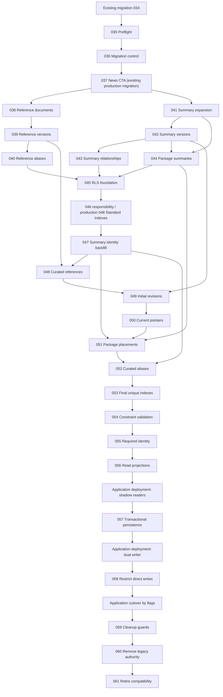

# Sobdai Knowledge Platform — SQL Migration Design v1

**Status:** Proposed for SQL-migration design review  
**Frozen inputs:** Architecture v1, Data Model v1, Database Schema v1, Migration Strategy v1  
**Scope:** Ordered SQL migration-file and deployment-unit design  
**Excluded:** SQL statements, migration implementation, backfill implementation, application code, and architecture changes

# 0. Execution decision

Sequential migration numbers are the canonical migration identity. Batch labels are secondary organizational metadata only.

| Migrations | Batch metadata | Name | Role |
|---|---|---|---|
| 035–036 | A | Migration control | Verify the production baseline and install temporary migration bookkeeping |
| 037 | — | Existing production migration | News CTA migration; outside Knowledge Platform batches and retained unchanged |
| 038–040 | B | Reference Layer | Create ReferenceDocument, versions, and aliases |
| 041–046 | C | Knowledge/Product expansion | Add Summary root fields, versions, source relations, placements, indexes, and RLS |
| 047–055 | D | Lossless backfill and tightening | Populate identities, sources, revisions, pointers, placements, aliases, then validate constraints |
| 056–058 | E | Coexistence and cutover | Add read projections, transactional persistence API, and direct-write restrictions |
| 059–061 | F | Legacy retirement | Prove cleanup readiness, remove legacy authority, retire migration-only objects |

Knowledge Platform files start at `035`. Production migration `037_news_cta_config.sql` was added after migrations 035–036 and is retained unchanged in migration history. The remaining Knowledge Platform files are therefore shifted from the former `037–060` range to `038–061`. Existing duplicate prefixes `019` and `022` are left unchanged; all files after production migration 037 use unique monotonically increasing prefixes.

Two execution classes are intentionally distinguished:

- **Versioned transactional migrations:** ordinary DDL, approved standard index builds, and short data-finalization units applied through the standard migration history.
- **Controlled online units:** concurrent indexes that meet the Concurrent Index Policy below and chunked backfill execution. They are version-controlled and recorded in the migration ledger, but must run through an executor that permits multiple commits or non-transactional index construction.

Long-running production backfills must not be hidden inside one all-or-nothing Supabase migration transaction.

**Approved production reconciliation:** the frozen migration 046 index
responsibility is implemented by production migration
`048_kp_online_indexes.sql` after unrelated production migrations consumed the
intervening identities. Production migration 048 is classified as a
**Standard Transactional Index Migration**, intentionally deployable through
the Supabase SQL Editor transaction workflow. References to migration 046
below retain the frozen responsibility identifier rather than renumbering
later frozen responsibilities.

# 1. Migration file inventory

| Migration | File | Batch metadata | Responsibility |
|---|---|---|---|
| 035 | `035_kp_preflight_guards.sql` | A | Verify the production baseline |
| 036 | `036_kp_migration_control.sql` | A | Install temporary migration bookkeeping |
| 037 | `037_news_cta_config.sql` | — | Existing production News CTA migration; retained unchanged |
| 038 | `038_kp_reference_documents.sql` | B | Create stable ReferenceDocument roots |
| 039 | `039_kp_reference_document_versions.sql` | B | Create immutable source-version storage and lineage |
| 040 | `040_kp_reference_document_aliases.sql` | B | Create alternate document lookup identities |
| 041 | `041_kp_summaries_expand.sql` | C | Expand the existing Summary root compatibly |
| 042 | `042_kp_summary_versions.sql` | C | Create Summary version storage and publishing lineage |
| 043 | `043_kp_summary_relationships.sql` | C | Create Summary aliases and ReferenceDocument relationships |
| 044 | `044_kp_package_summaries.sql` | C | Create Package-to-Summary placements |
| 045 | `045_kp_rls_foundation.sql` | C | Install target-table RLS foundations |
| 046 | `046_kp_online_indexes.sql` (production `048_kp_online_indexes.sql`) | C | Build standard transactional indexes required for reads and backfill |
| 047 | `047_kp_backfill_summary_identity.sql` | D | Backfill Summary business identity |
| 048 | `048_kp_backfill_reference_documents_curated.sql` | D | Apply the approved curated ReferenceDocument mapping; conditional data unit |
| 049 | `049_kp_backfill_initial_summary_versions.sql` | D | Create initial Summary versions from legacy content |
| 050 | `050_kp_backfill_current_pointers.sql` | D | Establish current published-version pointers |
| 051 | `051_kp_backfill_package_summaries.sql` | D | Backfill Package-to-Summary placements |
| 052 | `052_kp_backfill_aliases_curated.sql` | D | Apply approved alias mappings; conditional data unit |
| 053 | `053_kp_final_unique_indexes.sql` | D | Build final uniqueness enforcement indexes |
| 054 | `054_kp_validate_constraints.sql` | D | Validate deferred constraints after reconciliation |
| 055 | `055_kp_enforce_required_identity.sql` | D | Enforce required identity fields |
| 056 | `056_kp_read_projections.sql` | E | Add compatibility and target read projections |
| 057 | `057_kp_transactional_persistence_api.sql` | E | Add transactional target persistence API |
| 058 | `058_kp_restrict_direct_writes.sql` | E | Enforce the approved writer boundary |
| 059 | `059_kp_cleanup_readiness_guards.sql` | F | Prove cleanup readiness and establish the cleanup gate |
| 060 | `060_kp_remove_legacy_summary_authority.sql` | F | Remove legacy Summary authority after approval |
| 061 | `061_kp_retire_migration_compatibility.sql` | F | Retire migration-only compatibility and control objects |

Conditional files 048 and 052 receive their final content only from approved production manifests. If a manifest has zero approved rows, the file performs validation only; it never invents ReferenceDocuments or aliases.

# 2. Organizational batch rationale

## Batch A — Migration control

This batch stops execution if the live schema differs from the audited baseline and creates temporary operational bookkeeping. It prevents a partially compatible production database from entering the migration sequence.

## Batch B — Reference Layer

The Reference Layer has no current production equivalent and can be created independently. It must exist before any curated source backfill or Summary source snapshot is inserted.

## Batch C — Knowledge/Product expansion

This batch creates every target structure while retaining all legacy Summary columns and behavior. Tables are empty or new fields are nullable, so the current application continues operating.

## Batch D — Backfill and tightening

This batch establishes target identity before child rows, source provenance before revision snapshots, revisions before publishing pointers, and placements before legacy URL resolution. Constraints are tightened only after reconciliation.

## Batch E — Coexistence and cutover

Read projections support shadow comparisons first. Transactional persistence is installed dormant. Direct writes are restricted only after the dual-write application is deployed and proven.

## Batch F — Legacy retirement

Cleanup is physically and semantically destructive. It is isolated from rollout, requires an editorial freeze and explicit approval, and is never bundled with application cutover.

# 3. Dependency graph



## 3.1 Rollback dependency

Operational rollback normally traverses application flags, not down-migrations:

```text
Cutover consumer
  → target reader flag off
  → compatibility reader
  → legacy reader

Target writer
  → drain in-flight commands
  → verify legacy mirror
  → writer-authority flag off
  → legacy writer
```

Applied additive schema files remain in place during rollback. Dropping them during an incident adds risk without restoring user behavior.

## 3.2 Forward-only dependencies

The following are forward-only business history:

- allocated Summary/Document business codes;
- canonical slugs once externally registered;
- published SummaryVersions;
- verified ReferenceDocumentVersions;
- aliases and merge audit;
- committed dual-write editorial changes;
- migration 060 legacy-column removal.

Correction uses compensating data or a later forward migration. These records are not “rolled down.”

# 4. Per-migration design

## 035 — `035_kp_preflight_guards.sql`

| Item | Design |
|---|---|
| Purpose | Abort if prerequisite extensions, tables, columns, constraints, or migration versions differ from the audited schema |
| Tables affected | Read-only catalog inspection of Packages, Summaries, Questions, ExamSets, News relations, Profiles, Orders |
| Columns added | None |
| Constraints/indexes | None |
| RLS | None |
| Backfill dependency | Requires Phase 0 production inventory and approved collision report |
| Feature flag | All Knowledge Platform flags off |
| Rollback | Not applicable; correct the prerequisite and rerun |
| Lock risk | None beyond catalog reads |
| Runtime risk | Low; failure is intentional if drift exists |

Required assertions include the current Summary UUID/package/slug/content/publication/order fields, current Package code/slug fields, existing NewsSummary FK, UUID generation capability, and profile roles used by RLS.

## 036 — `036_kp_migration_control.sql`

| Item | Design |
|---|---|
| Purpose | Install temporary private migration-run, batch-progress, checksum, and source-to-target mapping ledger structures |
| Tables affected | New migration-control tables in a non-exposed operational schema |
| Columns added | Run ID, source Summary UUID, revision UUID, Package/placement identity, code, slug, checksum, state, attempt, timestamps, error/provenance |
| Constraints | Unique source Summary per migration run; unique completed unit; controlled state vocabulary |
| Indexes | Run/state, source UUID, target revision UUID, failed/pending batch lookup |
| RLS | No client grants; service-role/operator only |
| Backfill dependency | Phase 0 manifest/checksum policy |
| Feature flag | None |
| Rollback | Leave dormant; remove only in 061 after export |
| Lock risk | Low; creates new operational objects |
| Runtime risk | Low |

This is operational metadata, not a new domain aggregate.

## 038 — `038_kp_reference_documents.sql`

| Item | Design |
|---|---|
| Purpose | Create stable ReferenceDocument roots |
| Tables affected | New `reference_documents`; persistent Document-code allocation primitive |
| Columns added | Frozen schema fields: UUID, document code, titles, type, issuer, jurisdiction, homepage URL, lifecycle, successor pointer, actors/timestamps/archive audit |
| Constraints | PK; lifecycle checks; self-successor check; archive/supersession consistency; successor FK initially deferred/not validated if required by executor |
| Indexes | Code uniqueness may be built on the empty table; lifecycle/type, issuer/status, successor |
| RLS | Enable immediately with no public policies |
| Backfill dependency | None; curated rows arrive in 048 |
| Feature flag | None |
| Rollback | Leave empty/dormant |
| Lock risk | Low; new table |
| Runtime risk | Low |

The allocator follows the approved `DOC-…` policy, is gap-tolerant, and contains no mutable document metadata.

## 039 — `039_kp_reference_document_versions.sql`

| Item | Design |
|---|---|
| Purpose | Create immutable source-version storage and lineage |
| Tables affected | New `reference_document_versions`; `reference_documents` successor FK if not completed in 038 |
| Columns added | Frozen version label/status/dates/source/storage/checksum/media/supersession/verification/audit fields |
| Constraints | PK; unique parent/version label; unique parent/ID pair; parent FK; same-parent supersedes FK; status/date/storage/verification checks |
| Indexes | Parent/status/effective date, supersedes, checksum, verified queue |
| RLS | Enable immediately with no public policies |
| Backfill dependency | 038 |
| Feature flag | None |
| Rollback | Leave empty/dormant |
| Lock risk | Low; new table plus brief referenced-table FK lock |
| Runtime risk | Low |

Published/verified immutability protection is installed before any curated data.

## 040 — `040_kp_reference_document_aliases.sql`

| Item | Design |
|---|---|
| Purpose | Create alternate document code/title/legacy-key lookup |
| Tables affected | New `reference_document_aliases` |
| Columns added | UUID, document FK, alias type/value/normalized value, status/reason, actor/timestamps/retirement |
| Constraints | PK; FK restrict; unique type/normalized value; type/status/retirement checks; direct target only |
| Indexes | Unique alias lookup; document/status |
| RLS | Enable immediately with no public policies |
| Backfill dependency | 038 |
| Feature flag | None |
| Rollback | Leave empty/dormant |
| Lock risk | Low |
| Runtime risk | Low |

## 041 — `041_kp_summaries_expand.sql`

| Item | Design |
|---|---|
| Purpose | Expand the existing Summary root while preserving all legacy columns |
| Tables affected | Existing `summaries`; persistent Summary-code allocation primitive |
| Columns added | `summary_code`, `canonical_slug`, `canonical_title`, `visibility`, `lifecycle_status`, `current_published_version_id`, create/archive actor fields and archive timestamp as defined by the frozen schema |
| Constraints | Add status/visibility/archive checks as not-valid where scanning is avoidable; pointer FK waits for 042 |
| Indexes | No large existing-table index in this transactional file |
| RLS | Existing policies remain; new columns are not yet used publicly |
| Backfill dependency | None |
| Feature flag | All read/write flags off |
| Rollback | Ignore nullable fields; do not drop during incident rollback |
| Lock risk | Brief ACCESS EXCLUSIVE lock to alter the existing table; metadata-only if columns have no rewrite-causing default |
| Runtime risk | Low if deployed as nullable/no volatile defaults; lock wait must be bounded |

The migration must use a short lock timeout and retry window rather than wait indefinitely behind long queries.

The allocator follows the approved `SUM-…` policy, is gap-tolerant, and does not encode Package, Subject, year, title, or slug.

## 042 — `042_kp_summary_versions.sql`

| Item | Design |
|---|---|
| Purpose | Create revisioned Summary content and connect the parent publishing pointer |
| Tables affected | New `summary_versions`; existing `summaries` |
| Columns added | Frozen revision identity, number, status, Markdown/checksum, snapshots, SEO/social storage, read-time policy, schema/change note, editorial actors/timestamps |
| Constraints | PK; unique parent/revision; unique parent/ID; one-open-revision uniqueness; status/content/audit checks; parent FK restrict; same-parent current pointer FK added not-valid/deferred |
| Indexes | Parent/revision, open-revision partial unique, parent/status, publication queue, checksum |
| RLS | Enable immediately with no public policy |
| Backfill dependency | 041 |
| Feature flag | None |
| Rollback | Leave empty/dormant |
| Lock risk | Low for new table; brief lock adding pointer FK to Summaries |
| Runtime risk | Low before backfill |

Published-version immutability protection is installed in this file.

## 043 — `043_kp_summary_relationships.sql`

| Item | Design |
|---|---|
| Purpose | Create Summary aliases, live source relations, and immutable revision source snapshots |
| Tables affected | New `summary_aliases`, `summary_reference_documents`, `summary_version_reference_documents` |
| Columns added | All frozen alias/source/snapshot fields |
| Constraints | PKs; Summary/ReferenceDocument/Version FKs; same-parent source-version FKs; alias vocabulary/collision guard; pinned/unpinned uniqueness; role checks |
| Indexes | Alias slug; Summary/status; source order; reverse document/version lookups |
| RLS | Enable immediately with no public policies |
| Backfill dependency | 038–042 |
| Feature flag | None |
| Rollback | Leave empty/dormant |
| Lock risk | Low; new tables and brief referenced-table locks |
| Runtime risk | Low |

The canonical-slug/alias cross-table collision guard is installed dormant while canonical fields are null.

## 044 — `044_kp_package_summaries.sql`

| Item | Design |
|---|---|
| Purpose | Create reusable Package↔Summary placement storage |
| Tables affected | New `package_summaries` |
| Columns added | Composite IDs, status/version policy/pin, both ordering fields, release, navigation label, legacy slug, actor/lifecycle audit |
| Constraints | Composite PK; Package cascade FK; Summary restrict FK; same-parent pinned-version FK; policy/pin and lifecycle checks; Package/legacy-slug uniqueness |
| Indexes | Package ordered read, reverse Summary, pin lookup, legacy route lookup, release |
| RLS | Enable immediately with no public policies |
| Backfill dependency | 041–042 |
| Feature flag | None |
| Rollback | Leave empty/dormant |
| Lock risk | Low |
| Runtime risk | Low |

## 045 — `045_kp_rls_foundation.sql`

| Item | Design |
|---|---|
| Purpose | Install frozen ownership/read boundaries before target data is queryable |
| Tables affected | All new Reference, revision, alias, source, and placement tables |
| Columns added | None |
| Constraints/indexes | None |
| RLS | Owner/admin/editor mutation through approved paths; staff preview scope; public/entitled base-read rules; no public unrestricted Markdown; migration-control objects remain private |
| Backfill dependency | Tables 038–044 exist |
| Feature flag | Target readers still off |
| Rollback | Replace policies with deny-all forward policy; do not disable RLS |
| Lock risk | Brief table locks while policies are created |
| Runtime risk | Medium security risk; exhaustive persona tests required |

Views/RPCs that need different access are added later; this file does not prematurely expose them.

## 046 responsibility — production `048_kp_online_indexes.sql`

| Item | Design |
|---|---|
| Purpose | Build required indexes on the existing populated Summary table through the standard transactional deployment workflow |
| Tables affected | `summaries`; optionally supporting existing Package lookup |
| Columns added | None |
| Constraints | None yet |
| Indexes | Standard unique-on-non-null `summary_code`, canonical slug, root lifecycle/visibility, classification, current pointer; any required temporary backfill lookup |
| RLS | None |
| Backfill dependency | New columns from 041 |
| Feature flag | None |
| Rollback | Transaction rollback on deployment failure; unused indexes may be removed later through a policy-compliant forward operation |
| Lock risk | Brief write blocking while the five indexes build; accepted for the verified small production Summary table, with lock acquisition bounded by the migration lock timeout |
| Runtime risk | Low at the approved current production scale; reassess before future populated-table index migrations |

Production migration 048 is a Standard Transactional Index Migration. It uses
ordinary `CREATE INDEX` statements so the preflight, five index builds,
assertions, comments, and schema-cache notification execute atomically through
Supabase SQL Editor. This exception is approved from measured current-scale and
operational-workflow facts; it does not waive the Concurrent Index Policy for
future migrations.

## 047 — `047_kp_backfill_summary_identity.sql`

| Item | Design |
|---|---|
| Purpose | Populate stable Summary root identity and canonical metadata |
| Tables affected | `summaries`; migration ledger |
| Columns populated | Summary code, canonical slug/title, visibility, lifecycle, creation provenance |
| Constraints/indexes | Existing nullable unique indexes reject duplicate allocations; no required-column tightening yet |
| RLS | Service/operator execution; client policies unchanged |
| Backfill dependency | Frozen code/slug manifest, 036, 041, 046 |
| Feature flag | All target served-read flags off |
| Rollback | Rebuild target values only before external use; allocated codes/slugs are never reused |
| Lock risk | Row locks in bounded batches, no table-wide lock |
| Runtime risk | Medium; collision or concurrent legacy insert can stop a unit |

Execution is chunked and resumable. The Summary-code allocator is advanced/reconciled beyond every manifest allocation before new target creation can be enabled. Legacy UUID, title, slug, Package ownership, and Markdown are not changed.

## 048 — `048_kp_backfill_reference_documents_curated.sql`

| Item | Design |
|---|---|
| Purpose | Load only human-approved ReferenceDocument identities, verified first versions, aliases, and live Summary relations |
| Tables affected | Reference tables, `summary_reference_documents`, ledger |
| Columns populated | Frozen source identity/version/verification/relationship fields |
| Constraints/indexes | Existing code, alias, parent/version, checksum, and same-parent constraints apply |
| RLS | Service/operator only |
| Backfill dependency | Approved source mapping manifest; 038–040, 043, 047 |
| Feature flag | Reference admin/public readers off |
| Rollback | Correct by compensating reviewed migration; verified codes/history are not reused |
| Lock risk | Row-level inserts and relation locks |
| Runtime risk | Medium semantic risk, low mechanical risk |

If no mappings are approved, this unit inserts no source facts. Free-text Document remains the compatibility fallback.

## 049 — `049_kp_backfill_initial_summary_versions.sql`

| Item | Design |
|---|---|
| Purpose | Create revision 1 and immutable source snapshots for every migrated Summary |
| Tables affected | `summary_versions`, `summary_version_reference_documents`, ledger |
| Columns populated | Markdown/checksum, revision number/status, metadata/SEO/read-time snapshots, migration publication provenance, source snapshots |
| Constraints/indexes | Parent/revision and one-open-revision uniqueness; published-content checks |
| RLS | Service/operator only |
| Backfill dependency | 047; 048 for any approved source mappings |
| Feature flag | Target body readers off |
| Rollback | Target rows can be rebuilt while legacy is authority, but published revision history is retained once accepted |
| Lock risk | Row-level inserts; parent lookup |
| Runtime risk | High relative to other backfills because Markdown volume and checksum work dominate |

Published legacy rows become published revision 1; unpublished rows become draft revision 1. Invalid published rows are quarantined according to the frozen migration truth table.

## 050 — `050_kp_backfill_current_pointers.sql`

| Item | Design |
|---|---|
| Purpose | Set explicit current-published pointers after revisions exist |
| Tables affected | `summaries`, ledger |
| Columns populated | `current_published_version_id` for valid migrated published Summaries |
| Constraints/indexes | Same-parent pointer FK and published-status invariant checked per row |
| RLS | Service/operator only |
| Backfill dependency | 049 complete and reconciled |
| Feature flag | Target reads still shadow/off |
| Rollback | Pointer can be corrected to the verified revision; do not delete revision |
| Lock risk | Bounded row updates |
| Runtime risk | Low/medium |

No pointer is inferred by maximum revision number; it uses the ledger mapping.

## 051 — `051_kp_backfill_package_summaries.sql`

| Item | Design |
|---|---|
| Purpose | Create exactly one compatibility placement per legacy Summary and preserve every legacy route/order |
| Tables affected | `package_summaries`, ledger |
| Columns populated | Package/Summary IDs, active/draft status, latest-published policy, order fields, release, exact legacy slug, audit |
| Constraints/indexes | Composite identity, Package legacy-slug uniqueness, Summary/Package FKs, policy checks |
| RLS | Service/operator only |
| Backfill dependency | 047 and 050; legacy Package FK remains authoritative |
| Feature flag | Package target read off/shadow only after completion |
| Rollback | Ignore/rebuild placements while legacy ownership remains |
| Lock risk | Row-level inserts and Package/Summary FK checks |
| Runtime risk | Medium if slug collisions contradict the current composite uniqueness audit |

## 052 — `052_kp_backfill_aliases_curated.sql`

| Item | Design |
|---|---|
| Purpose | Insert approved former global canonical slugs and approved merge redirects; validate the combined canonical/alias namespace |
| Tables affected | `summary_aliases`; optionally reviewed placement/News repoints from approved consolidation |
| Columns populated | Alias target/type/status/reason/audit; approved repoint audit |
| Constraints/indexes | Global alias uniqueness and cross-table collision guard |
| RLS | Service/operator only |
| Backfill dependency | 047 and 051; approved alias/merge manifest |
| Feature flag | Canonical route remains off |
| Rollback | Compensating alias/repoint operation using merge ledger; aliases are not silently deleted/reused |
| Lock risk | Row-level relation updates |
| Runtime risk | Medium/high semantic risk; no automatic merge |

Package-scoped old slugs remain in `package_summaries.legacy_slug`; they are not inserted as global aliases.

## 053 — `053_kp_final_unique_indexes.sql`

| Item | Design |
|---|---|
| Purpose | Build final uniqueness/access paths that require clean backfilled values |
| Tables affected | `packages`, `summaries`, aliases and any backfilled large relation |
| Columns added | None |
| Constraints | Prepares unique Package code, Summary code/canonical slug, and final route namespaces for attachment as constraints |
| Indexes | Standard transactional unique Package code; rebuild/confirm final unique root/alias/route indexes; measured reverse indexes |
| RLS | None |
| Backfill dependency | 047–052 reconciliation clean; Package code remediation approved |
| Feature flag | None |
| Rollback | Transaction rollback on deployment failure; unused indexes may be removed later through a policy-compliant forward operation |
| Lock risk | Brief write blocking during an approved low-traffic transaction; lock acquisition is bounded by the migration lock timeout |
| Runtime risk | Low at the approved current production scale; duplicate or drift conditions remain fail-closed |

This is a Standard Transactional Index Migration, intentionally deployable through
the normal Supabase SQL Editor transaction workflow. The current-scale exception
does not waive the Concurrent Index Policy for future populated-table indexes.

## 054 — `054_kp_validate_constraints.sql`

| Item | Design |
|---|---|
| Purpose | Validate previously deferred FKs/checks and attach validated unique indexes as constraints where appropriate |
| Tables affected | `summaries`, new Reference/Knowledge/Product tables, `packages` |
| Columns added | None |
| Constraints | Current pointer, same-parent pins/sources, lifecycle/content checks, code/slug uniqueness, Package code uniqueness |
| Indexes | Reuses 053 indexes; no duplicate rebuild |
| RLS | None |
| Backfill dependency | Full reconciliation and 053 |
| Feature flag | Shadow reads may remain on; served target reads off |
| Rollback | Fix violating data and validate forward; do not drop protections during incident |
| Lock risk | Validation permits normal DML but takes validation locks and scans tables |
| Runtime risk | Medium I/O/runtime; may impact replicas and long queries |

Validation is split by table/constraint class if Phase 0 size indicates material load.

## 055 — `055_kp_enforce_required_identity.sql`

| Item | Design |
|---|---|
| Purpose | Make required target Summary/Package identity fields non-null/immutable after proof |
| Tables affected | `summaries`, `packages`; migration ledger finalization |
| Columns changed | Summary code, canonical slug/title, visibility, lifecycle; Package code according to frozen schema |
| Constraints | Required-column enforcement and business-code immutability |
| Indexes | Uses validated indexes/checks |
| RLS | None |
| Backfill dependency | 054 clean; no pending legacy delta |
| Feature flag | Brief Summary editorial freeze; target served reads still off |
| Rollback | Forward relaxation possible but normally unnecessary; data values remain |
| Lock risk | Brief ACCESS EXCLUSIVE locks for required-column metadata changes |
| Runtime risk | Medium if prevalidation is incomplete; low when validated checks avoid a full scan |

Learner reads can remain online, but Summary writers are paused and long transactions are drained.

## 056 — `056_kp_read_projections.sql`

| Item | Design |
|---|---|
| Purpose | Add frozen consumer projections for shadow and cutover reads |
| Tables affected | No domain-table mutation; creates views/functions for Summary Library, Picker, Public Package, Public Summary/resolver, legacy compatibility, News, and Recommendation ContentStore |
| Columns added | Projection outputs only |
| Constraints/indexes | Relies on 046/053 indexes |
| RLS | Security-invoker/base-RLS by default; narrowly scoped resolver functions; no entitlement-blind public Markdown |
| Backfill dependency | 055 and reconciliation success |
| Feature flag | Enables deployment of `kp_shadow_*`; all served target read flags default off |
| Rollback | Disable flags; leave projections installed |
| Lock risk | Low catalog locks |
| Runtime risk | Medium security/performance risk; query plans and persona tests required |

## 057 — `057_kp_transactional_persistence_api.sql`

| Item | Design |
|---|---|
| Purpose | Provide atomic persistence operations used by the Application Service for dual-write and later target authority |
| Tables affected | Legacy `summaries`; target Summary/revision/source/placement/alias tables; audit/outbox if already approved by platform conventions |
| Columns added | No domain columns; persistence functions and bounded grants |
| Constraints/indexes | All target invariants remain database-enforced |
| RLS | Functions use locked search path and least privilege; business permission remains Application Layer plus caller identity; no browser service-role exposure |
| Backfill dependency | 055; read parity established before flag enable |
| Feature flag | Installs support for `kp_dual_write_summary` and `kp_dual_write_publish`, both off |
| Rollback | Keep API dormant; application reverts to legacy actions |
| Lock risk | Low at install; normal row/aggregate locks at runtime |
| Runtime risk | High correctness/concurrency risk; full command and retry testing required |

The database API performs atomic persistence, not Recommendation, publishing-readiness, or migration policy design.

## 058 — `058_kp_restrict_direct_writes.sql`

| Item | Design |
|---|---|
| Purpose | Enforce the single-writer rule after the dual-write application is live |
| Tables affected | Legacy/target Summary-related tables and their RLS/grants |
| Columns added | None |
| Constraints/indexes | Optional write-fence/guard for forbidden direct mutation paths |
| RLS | Remove broad direct client mutation; retain approved transactional persistence and migration operator paths |
| Backfill dependency | Dual-write soak has zero unexplained drift |
| Feature flag | `kp_dual_write_*` on; target-only reuse flags off |
| Rollback | Drain commands, restore prior direct-write policy through a forward compensating migration, then turn dual-write off |
| Lock risk | Brief policy/grant locks |
| Runtime risk | High operational risk if an unknown writer remains |

Requires a short Summary editorial freeze for policy switch and smoke tests; learner reads stay online.

## 059 — `059_kp_cleanup_readiness_guards.sql`

| Item | Design |
|---|---|
| Purpose | Abort cleanup unless target authority, zero legacy dependency, URL parity, and reconciliation criteria are proven |
| Tables affected | Catalog/dependency reads; legacy Summary write fence |
| Columns added | None |
| Constraints/indexes | Final cleanup assertions |
| RLS | Legacy fields become read-only through approved compatibility path |
| Backfill dependency | Rollback window closed; target-only enablement explicitly approved |
| Feature flag | All critical `kp_read_*` and target writer flags on; legacy rollback flags retired operationally |
| Rollback | Remove write fence only through approved forward migration |
| Lock risk | Brief trigger/policy lock if write fence is installed |
| Runtime risk | Medium; intentional abort on any dependency |

## 060 — `060_kp_remove_legacy_summary_authority.sql`

| Item | Design |
|---|---|
| Purpose | Remove Package ownership and mutable root content/publication authority from Summary |
| Tables affected | `summaries`, `news_summaries`, relevant legacy FKs/views |
| Columns removed | Legacy `package_id`, `title`, `slug`, `content_md`, `read_time_minutes`, `sort_order`, `display_order`, `released_at`, `is_published`; free-text `document` only if editorial source migration is independently complete |
| Constraints | Remove legacy Package cascade; change News→Summary behavior to preserve/restrict shared knowledge history; retain target constraints |
| Indexes | Remove obsolete legacy indexes after dependency verification |
| RLS | Replace legacy Summary policies with target root/revision/placement policy model |
| Backfill dependency | 059 passes and full backup/restore rehearsal succeeds |
| Feature flag | Target authority only; no simple legacy rollback |
| Rollback | Forward fix or database restore; no down-migration |
| Lock risk | ACCESS EXCLUSIVE locks on `summaries` and brief locks on dependent relations |
| Runtime risk | High compatibility risk; metadata operations may be fast but lock acquisition is the dominant risk |

This file requires a maintenance window and full Summary editorial freeze. Learner downtime may still be avoided if traffic is drained briefly and lock acquisition is bounded, but no-downtime is not promised for this destructive step.

## 061 — `061_kp_retire_migration_compatibility.sql`

| Item | Design |
|---|---|
| Purpose | Remove obsolete legacy projections/persistence functions and temporary migration-control structures after evidence export |
| Tables affected | Compatibility views/functions; migration-control schema/tables; no domain data |
| Columns added/removed | Operational objects only |
| Constraints/indexes | Remove temporary backfill-only indexes after measured confirmation |
| RLS | Remove obsolete legacy policies/grants; retain final frozen policies |
| Backfill dependency | 060 stable through final observation period; audit/ledger exported |
| Feature flag | Remove stale flags in a corresponding later application deployment |
| Rollback | Recreate compatibility projection through forward migration if operationally required |
| Lock risk | Low/brief catalog locks |
| Runtime risk | Medium if an unobserved consumer still depends on compatibility objects |

# 5. Backfill ordering

## 5.1 Required FK-safe order

```mermaid
flowchart LR
    S0["Preserve existing Summary UUID"]
    S1["Populate Summary code and canonical root fields"]
    R1["Curated ReferenceDocument root"]
    R2["First verified ReferenceDocumentVersion"]
    R3["Reference aliases and live Summary source links"]
    V1["Create SummaryVersion revision 1"]
    V2["Create revision source snapshots"]
    P1["Set Summary current published pointer"]
    PS["Create PackageSummary with legacy slug/order"]
    A1["Create approved global Summary aliases"]
    C1["Build final unique indexes"]
    C2["Validate FKs/checks"]
    C3["Enforce required fields"]

    S0 --> S1
    S1 --> R1 --> R2 --> R3
    S1 --> V1
    R3 --> V2
    V1 --> V2
    V2 --> P1 --> PS --> A1 --> C1 --> C2 --> C3
```



## 5.2 Detailed rules

1. Preserve the existing Summary UUID; never insert a replacement root for ordinary one-to-one backfill.
2. Allocate Summary business code and canonical slug before aliases so namespace collisions fail early.
3. Insert curated ReferenceDocument roots before versions.
4. Insert the first verified ReferenceDocumentVersion in the same reviewed data unit as its new root.
5. Insert document aliases only after the document exists.
6. Create live Summary source relations after both Summary and source targets exist.
7. Insert revision 1 after the Summary root exists.
8. Insert revision source snapshots with revision 1; a migrated published revision is not later mutated to add provenance.
9. Set current-published pointer only after revision 1 is committed and validated as published.
10. Insert PackageSummary only after Summary and version resolution exist; copy the exact old Package/slug/order/release fields.
11. Insert only approved former global aliases after canonical namespace allocation and placements.
12. Build final unique indexes after all collision remediation.
13. Validate deferred FKs/checks.
14. Enforce required/non-null fields last.

## 5.3 Delta handling

While legacy remains writable:

- each backfill run records a source `updated_at`/checksum;
- rows changed after their first pass enter a delta queue;
- final delta catch-up runs after a short editorial freeze;
- 055 cannot execute while any ledger unit is pending, failed, or stale;
- Phase 3 shadow reads begin only after the delta watermark reaches the freeze point.

# 6. SQL safety review

## 6.1 Brief exclusive-lock operations

| Operation | Files | Risk control |
|---|---|---|
| Add nullable columns to populated `summaries` | 041 | No rewrite-causing defaults; short lock timeout; retry off-peak |
| Add/attach constraints on populated tables | 042, 054, 055 | Add unvalidated first where possible; validate separately; attach prebuilt indexes |
| Enable/alter RLS policies | 045, 058 | Short operation, editorial freeze for write-policy switch |
| Set required/not-null fields | 055 | Prevalidated equivalent checks; drained writers; short maintenance window |
| Drop legacy columns/FKs | 060 | Full dependency audit, bounded lock wait, maintenance window |

Any long-running transaction touching Summaries can delay these locks. Pre-deployment monitoring must identify and drain such sessions; the migration must fail fast rather than queue indefinitely.

## 6.2 Table rewrite risks

Avoid:

- adding populated-table columns with volatile/computed defaults;
- changing column types during this migration;
- rewriting Markdown;
- renaming legacy columns before application cutover;
- adding stored derived values to populated tables in the expand phase.

The planned nullable additions and later metadata-only cleanup should not require a full table rewrite on a supported PostgreSQL version, but this must be verified against the actual Supabase PostgreSQL version in Phase 0.

## 6.3 Large indexes

- New-table indexes are built while tables are empty.
- Existing populated-table indexes follow the Concurrent Index Policy below.
- Approved standard builds run transactionally in a controlled low-traffic deployment window.
- Concurrent index failures can leave invalid index artifacts; the operator runbook detects and removes/retries them through a controlled forward operation.
- Indexes are built one at a time or within measured I/O limits.
- Replica lag, WAL growth, CPU, disk, and query latency are monitored.
- A migration classified as concurrent must use an executor that explicitly supports non-transactional concurrent index operations.

### 6.3.1 Concurrent Index Policy

Index execution mode is selected from measured production facts at the time the
migration is approved; future scale targets alone do not force a current
migration into the concurrent execution class.

- Standard transactional `CREATE INDEX` is the default when the target table
  is below both 100,000 rows and 250 MB, the measured or rehearsed build stays
  within a five-second write-lock budget, and a controlled low-traffic
  deployment window is available.
- Tables from 100,000 to 1,000,000 rows or from 250 MB to 1 GB require a
  production-like rehearsal. Use `CREATE INDEX CONCURRENTLY` when the measured
  build is expected to exceed the approved write-lock budget.
- `CREATE INDEX CONCURRENTLY` is required when any target table exceeds
  1,000,000 rows or 1 GB, when an index build is expected to block writes for
  more than ten seconds, or when continuous-write/availability requirements do
  not permit the measured standard-build lock.
- Every future populated-table index migration records row count, total table
  size, write rate, rehearsed duration, lock budget, chosen execution class,
  executor, verification, and rollback procedure in its review evidence.
- Concurrent migrations remain non-transactional controlled online units and
  require the dedicated operational procedure. Standard migrations remain
  atomic and deployable through the normal Supabase SQL Editor workflow.

Production migrations 048 and 055 satisfy the standard-migration criteria and
are approved Standard Transactional Index Migrations for the current Sobdai
scale and Supabase SQL Editor workflow. This approval does not waive the
Concurrent Index Policy for future populated-table index migrations; each one
requires current measurements and an explicit execution-class decision.

## 6.4 Foreign-key and check validation

- Add expensive FKs/checks without immediate historical validation where supported.
- New writes are constrained immediately.
- Backfill and reconcile.
- Validate one constraint family at a time in 054.
- Abort on violation; repair data; resume validation.
- Do not drop a failing constraint merely to advance the schedule.

## 6.5 Online-safe operations

Normally online:

- create new tables;
- enable RLS before grants;
- create indexes on empty new tables;
- add nullable columns without rewrite-causing defaults;
- chunked inserts/updates;
- concurrent index builds;
- add views/functions while dormant;
- constraint validation under monitored load.

## 6.6 Maintenance/freeze operations

Summary editorial freeze required:

- final delta catch-up;
- 055 required-column enforcement;
- 058 direct-write policy switch;
- 059 cleanup write fence;
- 060 destructive cleanup.

Maintenance window strongly recommended:

- 055 if populated-table metadata locks cannot meet the normal lock budget;
- any standard index build whose measured blocking cannot meet the approved lock budget;
- 060 always.

Learner downtime is not expected for migrations 035–058. Migration 060 may require a short traffic drain even if the application remains technically available.

# 7. Deployment and feature-flag mapping

## 7.1 Application deployment identifiers

| Deployment | Responsibility |
|---|---|
| App D0 | Current application; all Knowledge Platform flags absent/off |
| App D1 | Knows target read projections and shadow comparator; serves legacy |
| App D2 | Uses transactional persistence API for dual-write; target-only features off |
| App D3 | Can serve target readers independently and use target writer authority |
| App D4 | Removes legacy field dependencies; required before 060 |
| App D5 | Removes migration/compatibility code and stale flags after 061 |

## 7.2 Migration-to-flag map

| Migration | Application deployment | Flag dependency/state | Rollback |
|---|---|---|---|
| 035 | D0 | All KP flags off | Correct prerequisite; no flag change |
| 036 | D0 | All KP flags off | Leave control objects dormant |
| 037 | D0 | Outside Knowledge Platform flags; existing production News migration | Retain unchanged in production history |
| 038 | D0 | All KP flags off | Leave Reference root table dormant |
| 039 | D0 | All KP flags off | Leave Reference version table dormant |
| 040 | D0 | All KP flags off | Leave Reference alias table dormant |
| 041 | D0 | All KP flags off | Ignore nullable target Summary fields |
| 042 | D0 | All KP flags off | Leave revision table/pointer dormant |
| 043 | D0 | All KP flags off | Leave relationship tables dormant |
| 044 | D0 | All KP flags off | Leave placement table dormant |
| 045 | D0 | All KP flags off | Replace with deny-all policy if required; do not disable RLS |
| 046 | D0 | All KP flags off | Keep indexes or remove them through a later policy-compliant operation |
| 047 | D0 | Served target flags off | Legacy remains authority; rebuild target identity |
| 048 | D0 | Reference reader flags off | Reviewed compensating source correction |
| 049 | D0 | Target body reads off | Legacy Markdown remains authority |
| 050 | D0 | Target reads off | Correct pointer; keep revision |
| 051 | D0 | Package target read off | Rebuild placement from legacy |
| 052 | D0 | Canonical route off | Reviewed compensating alias/repoint |
| 053 | D0 | Target reads off | Keep/remove indexes later |
| 054 | D0 | Shadow may be off/on; served reads off | Repair forward and revalidate |
| 055 | D0 | Served target reads off; editorial freeze | Relax only by forward migration if required |
| 056 | D1 | `kp_shadow_*` selectively on; `kp_read_*` off | Disable shadow/target-read flags |
| 057 | D2 | Dual-write flags initially off, then canary/on | Drain and return to legacy writer if mirror is current |
| 058 | D2 | Dual-write on; direct legacy UI writes removed | Forward policy restoration plus writer-flag rollback |
| 059 | D3/D4 | Target authority on; target-only reuse requires explicit go/no-go | Remove fence only through forward change |
| 060 | D4 | Target-only; legacy rollback unavailable | Forward fix or restore |
| 061 | D5 | Stale migration flags removed | Recreate compatibility through a forward migration |
| Application-only cutover | D3 | Enable admin/count/news/package/summary/recommendation readers in approved order | Flip each consumer flag back |

## 7.3 Consumer flag order

1. `kp_shadow_admin_library`
2. `kp_shadow_package_read`
3. `kp_shadow_summary_read`
4. `kp_shadow_recommendation_store`
5. `kp_dual_write_summary`
6. `kp_dual_write_publish`
7. `kp_read_admin_library`
8. `kp_read_news_summaries`
9. `kp_read_package_summaries`
10. `kp_read_summary_route`
11. `kp_read_recommendation_store`
12. `kp_write_target_authority`
13. `kp_enable_summary_picker` after the rollback-boundary decision
14. `kp_enable_canonical_summary_route` only after separate SEO validation

No database migration changes Assessment Engine, Question, ExamSet, attempt, result, Candidate Discovery, or Recommendation Engine contracts.

# 8. Execution timeline

Relative timing is used because production size and traffic windows remain Phase 0 facts.

| Time | Database | Application/operation | Gate |
|---|---|---|---|
| T-14 to T-7 | Phase 0 only | Inventory, manifest, restore rehearsal | Schema drift/collisions resolved |
| T-7 | 035–037 already applied | D0 | Migrations 035–036 verification and production migration history pass |
| T-7 to T-6 | 038–045 | D0 | Additive schema/RLS tests |
| T-6 | 046 | D0 | Index health and replica load |
| T-6 to T-4 | 047–052 | D0; legacy remains authority | Backfill ledger and checksums clean |
| T-4 | 053–054 | D0 | Unique/constraint validation |
| T-4 | Final delta then 055 | Brief Summary editorial freeze | Zero pending/stale units |
| T-3 | 056 + D1 | Shadow reads | Parity soak |
| T-2 | 057 + D2 | Dual-write canary | Command parity |
| T-1 | 058 | Short editorial freeze | Unknown writers absent |
| T0 onward | D3, no DB change | Per-consumer cutover | Per-flag canary |
| T+rollback window | 059 | D4 prepared | Explicit rollback-boundary approval |
| Approved maintenance | 060 | D4 active | Full backup and dependency-zero proof |
| Stable cleanup period | 061 + D5 | Remove compatibility | Final audit export |

The rollback window duration is an operational approval, not hard-coded by this design.

# 9. Rollback matrix

| Migration number(s) | Classification | Rollback method | Data consequence |
|---|---|---|---|
| 035 | Retryable guard | Correct prerequisite | None |
| 036 | Additive | Leave ledger dormant | None |
| 037 | Existing production migration outside Knowledge Platform | Retain unchanged; no Knowledge Platform rollback action | News CTA production state retained |
| 038–046 | Additive | Disable target access; leave objects | None to legacy |
| 047 | Compensating/forward | Rebuild target identity from manifest | Codes/slugs not reused |
| 048 | Reviewed forward data | Compensating reviewed correction | Verification history retained |
| 049 | Forward content history | Rebuild only before acceptance; never mutate accepted published revision | Revisions retained |
| 050 | Correctable pointer | Point to verified published revision | Revision history unchanged |
| 051 | Correctable placement | Rebuild while legacy FK remains | Legacy routes remain authoritative |
| 052 | Reviewed forward alias/merge | Compensating repoint/retire | Aliases/audit retained |
| 053–055 | Constraint tightening | Forward relaxation only if necessary; normally leave | Target data unchanged |
| 056 | Additive | Disable shadow/target read flags | None |
| 057 | Additive API | Disable writer flags after drain | Committed business edits retained |
| 058 | Policy boundary | Forward policy restoration, then writer rollback | Requires current legacy mirror |
| 059 | Cleanup gate | Forward removal of fence before 060 | None if cleanup not started |
| 060 | Destructive forward-only | Forward fix or database restore | Simple legacy rollback ends |
| 061 | Cleanup | Recreate compatibility through forward migration | Domain data unchanged |

# 10. Deployment checklist

## 10.1 Before migration 035

- [ ] Frozen documents and this design approved.
- [ ] Live schema matches 035 prerequisites.
- [ ] Production counts, size, slug/code collision, checksum, and writer inventories complete.
- [ ] Existing duplicate migration prefixes are understood; new versions are unique.
- [ ] Supabase PostgreSQL version and migration transaction behavior confirmed.
- [ ] Non-transactional concurrent-index executor rehearsed before any migration classified as concurrent.
- [ ] PITR/backup verified and restore rehearsed.
- [ ] Migration owner, DBA/operator, app owner, SEO reviewer, and rollback commander named.
- [ ] Lock, statement, batch, and retry thresholds approved.

## 10.2 Before migrations 038–046 — additive schema

- [ ] D0 proven tolerant of added nullable fields/tables.
- [ ] RLS tests prepared before any target policy is exposed.
- [ ] Long transactions monitored.
- [ ] PostgREST schema-cache refresh procedure ready.

## 10.3 Before migrations 047–052 — backfill

- [ ] Code and canonical-slug manifests frozen.
- [ ] Markdown checksum algorithm frozen and independently tested.
- [ ] Migration ledger initialized.
- [ ] Curated ReferenceDocument/alias manifests approved or explicitly empty.
- [ ] Batch interruption/resume tested.
- [ ] New legacy writes/deltas observable.

## 10.4 Before migrations 053–055 — constraint tightening

- [ ] One root/revision/placement result per legacy Summary.
- [ ] Zero unexplained checksum, pointer, status, order, or route mismatches.
- [ ] Package code duplicates resolved.
- [ ] Canonical and alias namespaces collision-free.
- [ ] Final delta queue empty.
- [ ] Editorial freeze active for 055.

## 10.5 Before migrations 056–058 — dual read/write

- [ ] D1/D2 deployed with flags default-off.
- [ ] Shadow telemetry contains digests, not Markdown.
- [ ] Persona/RLS matrix passes.
- [ ] Transactional command retry/concurrency/failure injection passes.
- [ ] Legacy mirror reconciliation is immediate and periodic.
- [ ] Central cache invalidation resolves Package slugs, legacy/canonical Summary URLs, and News impact.
- [ ] Unknown/direct writers removed or onboarded.

## 10.6 Before application-only cutover after migration 058

- [ ] Required shadow soak has zero unexplained mismatches.
- [ ] Per-consumer rollback rehearsed.
- [ ] Existing Summary URL manifest passes exhaustively.
- [ ] Recommendation ContentStore/target parity passes.
- [ ] Assessment regression suite passes unchanged.
- [ ] Summary remains noindex and Package canonical behavior remains stable.

## 10.7 Before migrations 059–061 — cleanup

- [ ] Rollback window formally closed.
- [ ] Target-only state explicitly approved.
- [ ] D4 contains no legacy field access.
- [ ] Production query/write telemetry shows zero legacy dependency.
- [ ] All legacy URLs and aliases resolve through target.
- [ ] Free-text Document removal is either independently complete or omitted from 060.
- [ ] Package deletion test preserves shared Summary.
- [ ] Fresh backup and restore rehearsal completed.
- [ ] Maintenance/editorial freeze announced.
- [ ] Forward-fix and restore runbooks approved.

# 11. Freeze criteria

This SQL Migration Design may be frozen when reviewers approve:

- the 035–061 file inventory and naming;
- policy-based treatment of standard and concurrent index builds, plus controlled-online backfills;
- exact FK-safe backfill order;
- conditional curated source/alias units;
- constraint validation before required-column enforcement;
- dormant read/write APIs before flag enablement;
- the 058 single-writer enforcement point;
- the Phase 060 destructive rollback boundary;
- lock-risk and maintenance classifications;
- application deployment and feature-flag choreography.

Freezing this document authorizes SQL implementation planning for these files. It does not authorize writing, applying, or deploying SQL.
